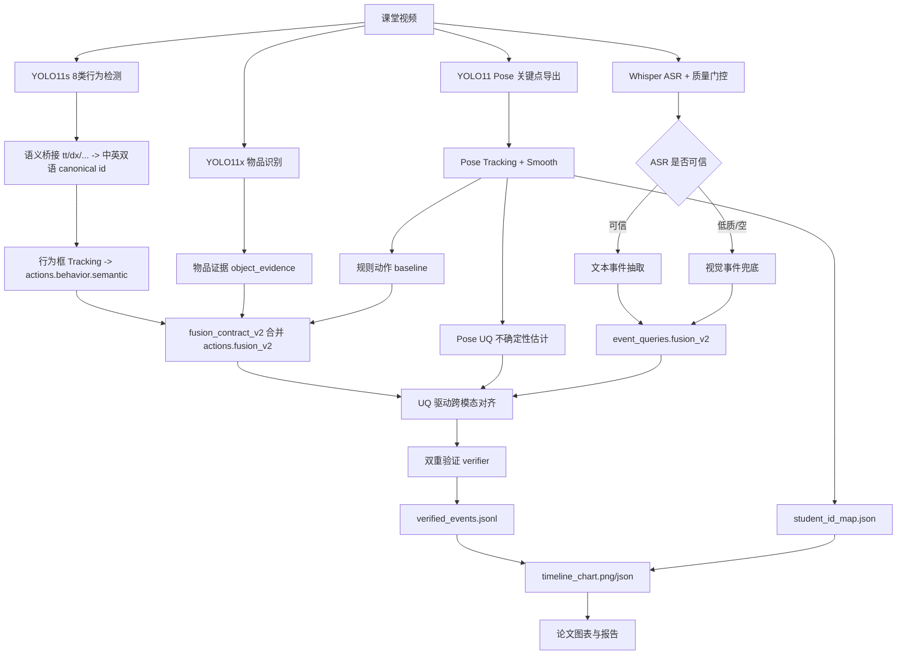

# YOLOv11 智慧课堂多模态感知项目全量遍历审计与研究报告

当前日期时间：2026-04-26 13:13:47 +08:00  
项目根目录：`F:/PythonProject/pythonProject/YOLOv11`  
报告类型：基于本地递归遍历、代码证据、运行产物和真实论文来源的研究报告  
审计产物目录：`F:/PythonProject/pythonProject/YOLOv11/codex_reports/smart_classroom_yolo_feasibility/project_audit_20260426`

## 遍历覆盖清单

### 1. 总体统计

本次扫描递归枚举了项目根目录下除 `.git` 深层对象外的项目文件；`.git` 顶层元数据已计数，但未作为项目源码或实验产物审阅。扫描摘要写入 `scan_summary.json`，总文件数、代码文件数、文档文件数、数据/产物文件数分别见证据行。

| 指标 | 数量 | 文件证据 |
|---|---:|---|
| 总文件数 | 85809 | `F:/PythonProject/pythonProject/YOLOv11/codex_reports/smart_classroom_yolo_feasibility/project_audit_20260426/scan_summary.json:5` |
| 代码文件数 | 357 | `F:/PythonProject/pythonProject/YOLOv11/codex_reports/smart_classroom_yolo_feasibility/project_audit_20260426/scan_summary.json:6` |
| 文档文件数 | 23922 | `F:/PythonProject/pythonProject/YOLOv11/codex_reports/smart_classroom_yolo_feasibility/project_audit_20260426/scan_summary.json:7` |
| 数据/产物文件数 | 50056 | `F:/PythonProject/pythonProject/YOLOv11/codex_reports/smart_classroom_yolo_feasibility/project_audit_20260426/scan_summary.json:9` |
| 未能读取文件数 | 0 | `F:/PythonProject/pythonProject/YOLOv11/codex_reports/smart_classroom_yolo_feasibility/project_audit_20260426/scan_summary.json:411` |

说明：`.pt/.jpg/.mp4/.pkl/.cache/.pyc` 等二进制文件按元数据审计，不强制按文本读取；这不属于编码失败。完整文件索引在 `file_inventory.csv`，未读清单在 `unreadable_files.csv`。

### 2. 按目录扫描统计表

| 目录 | 文件数 | 代码 | 文档 | 配置 | 数据/产物 | 审阅方式 | 是否已审阅 |
|---|---:|---:|---:|---:|---:|---|---|
| `scripts` | 625 | 284 | 0 | 96 | 3 | 代码与配置读取，二进制缓存元数据 | 是 |
| `models` | 5 | 4 | 0 | 1 | 0 | 全部文本读取 | 是 |
| `verifier` | 22 | 11 | 0 | 0 | 0 | 代码读取，缓存元数据 | 是 |
| `server` | 2 | 1 | 0 | 0 | 0 | 后端代码读取，缓存元数据 | 是 |
| `docs` | 344 | 8 | 61 | 100 | 175 | 文档/配置读取，图片元数据 | 是 |
| `contracts` | 13 | 2 | 0 | 5 | 4 | schema 和样例读取 | 是 |
| `tools` | 3 | 2 | 0 | 0 | 0 | 工具脚本读取 | 是 |
| `data` | 60422 | 0 | 14906 | 8888 | 36628 | YAML/TXT/JSON 读取，视频图片元数据 | 是 |
| `output` | 23358 | 0 | 8896 | 1618 | 12474 | JSON/CSV/LOG 读取，图片视频元数据 | 是 |
| `codex_reports` | 118 | 32 | 9 | 19 | 38 | 报告、脚本、产物读取 | 是 |
| `paper_experiments` | 575 | 0 | 29 | 65 | 481 | 实验配置和结果读取 | 是 |
| `runs` | 234 | 0 | 0 | 14 | 220 | 训练配置、结果图、权重元数据 | 是 |
| `official_yolo_finetune_compare` | 46 | 7 | 12 | 3 | 24 | 训练对比脚本和报告读取 | 是 |

### 3. 关键脚本索引表

| 脚本路径 | 用途一句话 | 与论文主线相关 | 状态 | 文件证据 |
|---|---|---|---|---|
| `F:/PythonProject/pythonProject/YOLOv11/scripts/09_run_pipeline.py` | 全链路编排 pose、tracking、ASR、行为检测、fusion、align、verifier、timeline | 是 | 已实现 | `F:/PythonProject/pythonProject/YOLOv11/scripts/09_run_pipeline.py:284`, `F:/PythonProject/pythonProject/YOLOv11/scripts/09_run_pipeline.py:707`, `F:/PythonProject/pythonProject/YOLOv11/scripts/09_run_pipeline.py:884`, `F:/PythonProject/pythonProject/YOLOv11/scripts/09_run_pipeline.py:1103` |
| `F:/PythonProject/pythonProject/YOLOv11/scripts/02_export_keypoints_jsonl.py` | 用 YOLO pose 导出每帧人体关键点 | 是 | 已实现 | `F:/PythonProject/pythonProject/YOLOv11/scripts/02_export_keypoints_jsonl.py:87`, `F:/PythonProject/pythonProject/YOLOv11/scripts/02_export_keypoints_jsonl.py:117` |
| `F:/PythonProject/pythonProject/YOLOv11/scripts/03_track_and_smooth.py` | 将 pose 检测结果转成稳定 track_id 并平滑 | 是 | 已实现 | `F:/PythonProject/pythonProject/YOLOv11/scripts/03_track_and_smooth.py:120`, `F:/PythonProject/pythonProject/YOLOv11/scripts/03_track_and_smooth.py:274`, `F:/PythonProject/pythonProject/YOLOv11/scripts/03_track_and_smooth.py:319` |
| `F:/PythonProject/pythonProject/YOLOv11/scripts/03c_estimate_track_uncertainty.py` | 估计 pose tracking 不确定性 UQ | 是 | 已实现 | `F:/PythonProject/pythonProject/YOLOv11/scripts/03c_estimate_track_uncertainty.py:117`, `F:/PythonProject/pythonProject/YOLOv11/scripts/03c_estimate_track_uncertainty.py:160`, `F:/PythonProject/pythonProject/YOLOv11/scripts/03c_estimate_track_uncertainty.py:188` |
| `F:/PythonProject/pythonProject/YOLOv11/scripts/02d_export_behavior_det_jsonl.py` | 用微调 YOLO 行为模型导出 8 类行为框 | 是 | 已实现 | `F:/PythonProject/pythonProject/YOLOv11/scripts/02d_export_behavior_det_jsonl.py:44`, `F:/PythonProject/pythonProject/YOLOv11/scripts/02d_export_behavior_det_jsonl.py:88`, `F:/PythonProject/pythonProject/YOLOv11/scripts/02d_export_behavior_det_jsonl.py:116` |
| `F:/PythonProject/pythonProject/YOLOv11/codex_reports/smart_classroom_yolo_feasibility/scripts/50_fusion_contract/semanticize_behavior_det.py` | 将行为框从 `tt/dx/...` 转为标准语义字段 | 是 | 已实现 | `F:/PythonProject/pythonProject/YOLOv11/codex_reports/smart_classroom_yolo_feasibility/scripts/50_fusion_contract/semanticize_behavior_det.py:44`, `F:/PythonProject/pythonProject/YOLOv11/codex_reports/smart_classroom_yolo_feasibility/scripts/50_fusion_contract/semanticize_behavior_det.py:54`, `F:/PythonProject/pythonProject/YOLOv11/codex_reports/smart_classroom_yolo_feasibility/scripts/50_fusion_contract/semanticize_behavior_det.py:86` |
| `F:/PythonProject/pythonProject/YOLOv11/codex_reports/smart_classroom_yolo_feasibility/scripts/50_fusion_contract/behavior_det_to_actions_v2.py` | 将语义行为框聚合成动作片段 | 是 | 已实现 | `F:/PythonProject/pythonProject/YOLOv11/codex_reports/smart_classroom_yolo_feasibility/scripts/50_fusion_contract/behavior_det_to_actions_v2.py:97`, `F:/PythonProject/pythonProject/YOLOv11/codex_reports/smart_classroom_yolo_feasibility/scripts/50_fusion_contract/behavior_det_to_actions_v2.py:102`, `F:/PythonProject/pythonProject/YOLOv11/codex_reports/smart_classroom_yolo_feasibility/scripts/50_fusion_contract/behavior_det_to_actions_v2.py:105` |
| `F:/PythonProject/pythonProject/YOLOv11/codex_reports/smart_classroom_yolo_feasibility/scripts/50_fusion_contract/merge_fusion_actions_v2.py` | 融合规则动作、行为检测、物品证据，输出 `actions.fusion_v2.jsonl` | 是 | 已实现 | `F:/PythonProject/pythonProject/YOLOv11/codex_reports/smart_classroom_yolo_feasibility/scripts/50_fusion_contract/merge_fusion_actions_v2.py:46`, `F:/PythonProject/pythonProject/YOLOv11/codex_reports/smart_classroom_yolo_feasibility/scripts/50_fusion_contract/merge_fusion_actions_v2.py:152`, `F:/PythonProject/pythonProject/YOLOv11/codex_reports/smart_classroom_yolo_feasibility/scripts/50_fusion_contract/merge_fusion_actions_v2.py:218` |
| `F:/PythonProject/pythonProject/YOLOv11/codex_reports/smart_classroom_yolo_feasibility/scripts/50_fusion_contract/build_event_queries_fusion_v2.py` | ASR 为空时生成视觉事件兜底并合并事件流 | 是 | 已实现 | `F:/PythonProject/pythonProject/YOLOv11/codex_reports/smart_classroom_yolo_feasibility/scripts/50_fusion_contract/build_event_queries_fusion_v2.py:107`, `F:/PythonProject/pythonProject/YOLOv11/codex_reports/smart_classroom_yolo_feasibility/scripts/50_fusion_contract/build_event_queries_fusion_v2.py:109`, `F:/PythonProject/pythonProject/YOLOv11/codex_reports/smart_classroom_yolo_feasibility/scripts/50_fusion_contract/build_event_queries_fusion_v2.py:129` |
| `F:/PythonProject/pythonProject/YOLOv11/scripts/06_asr_whisper_to_jsonl.py` | 本地 Whisper ASR，并输出质量报告 | 是 | 已实现 | `F:/PythonProject/pythonProject/YOLOv11/scripts/06_asr_whisper_to_jsonl.py:174`, `F:/PythonProject/pythonProject/YOLOv11/scripts/06_asr_whisper_to_jsonl.py:195`, `F:/PythonProject/pythonProject/YOLOv11/scripts/06_asr_whisper_to_jsonl.py:293` |
| `F:/PythonProject/pythonProject/YOLOv11/scripts/xx_align_multimodal.py` | 基于 UQ 自适应窗口进行文本事件与视觉动作候选对齐 | 是 | 已实现 | `F:/PythonProject/pythonProject/YOLOv11/scripts/xx_align_multimodal.py:192`, `F:/PythonProject/pythonProject/YOLOv11/scripts/xx_align_multimodal.py:193`, `F:/PythonProject/pythonProject/YOLOv11/scripts/xx_align_multimodal.py:251` |
| `F:/PythonProject/pythonProject/YOLOv11/scripts/07_dual_verification.py` | 计算视觉与文本的一致性验证结果 | 是 | 已实现 | `F:/PythonProject/pythonProject/YOLOv11/scripts/07_dual_verification.py:357`, `F:/PythonProject/pythonProject/YOLOv11/scripts/07_dual_verification.py:376`, `F:/PythonProject/pythonProject/YOLOv11/scripts/07_dual_verification.py:378` |
| `F:/PythonProject/pythonProject/YOLOv11/scripts/10_visualize_timeline.py` | 生成 timeline 图、学生 ID 映射和学生动作 CSV | 是 | 已实现 | `F:/PythonProject/pythonProject/YOLOv11/scripts/10_visualize_timeline.py:307`, `F:/PythonProject/pythonProject/YOLOv11/scripts/10_visualize_timeline.py:347`, `F:/PythonProject/pythonProject/YOLOv11/scripts/10_visualize_timeline.py:364` |
| `F:/PythonProject/pythonProject/YOLOv11/codex_reports/smart_classroom_yolo_feasibility/scripts/50_fusion_contract/check_pipeline_contract_v2.py` | 检查全链路产物存在、非空、字段完整、候选非空 | 是 | 已实现 | `F:/PythonProject/pythonProject/YOLOv11/codex_reports/smart_classroom_yolo_feasibility/scripts/50_fusion_contract/check_pipeline_contract_v2.py:137`, `F:/PythonProject/pythonProject/YOLOv11/codex_reports/smart_classroom_yolo_feasibility/scripts/50_fusion_contract/check_pipeline_contract_v2.py:175`, `F:/PythonProject/pythonProject/YOLOv11/codex_reports/smart_classroom_yolo_feasibility/scripts/50_fusion_contract/check_pipeline_contract_v2.py:183`, `F:/PythonProject/pythonProject/YOLOv11/codex_reports/smart_classroom_yolo_feasibility/scripts/50_fusion_contract/check_pipeline_contract_v2.py:226` |
| `F:/PythonProject/pythonProject/YOLOv11/verifier/model.py` | MLP verifier、校准相关指标函数 | 是 | 部分实现 | `F:/PythonProject/pythonProject/YOLOv11/verifier/model.py:85`, `F:/PythonProject/pythonProject/YOLOv11/verifier/model.py:100`, `F:/PythonProject/pythonProject/YOLOv11/verifier/model.py:124` |
| `F:/PythonProject/pythonProject/YOLOv11/server/app.py` | FastAPI 可视化后端，提供 timeline、case、paper 接口 | 是 | 部分实现 | `F:/PythonProject/pythonProject/YOLOv11/server/app.py:74`, `F:/PythonProject/pythonProject/YOLOv11/server/app.py:1241`, `F:/PythonProject/pythonProject/YOLOv11/server/app.py:1480` |
| `F:/PythonProject/pythonProject/YOLOv11/web_viz/templates/index.html` | 前端展示 seat、timeline、case story | 是 | 部分实现 | `F:/PythonProject/pythonProject/YOLOv11/web_viz/templates/index.html:628`, `F:/PythonProject/pythonProject/YOLOv11/web_viz/templates/index.html:781`, `F:/PythonProject/pythonProject/YOLOv11/web_viz/templates/index.html:1654` |
| `F:/PythonProject/pythonProject/YOLOv11/scripts/training/train_classroom_yolo.py` | 增强 YOLO 配置训练入口 | 否，当前未接主线 | 仅文档设想/待验证 | `F:/PythonProject/pythonProject/YOLOv11/scripts/training/train_classroom_yolo.py:19`, `F:/PythonProject/pythonProject/YOLOv11/scripts/training/train_classroom_yolo.py:53`, `F:/PythonProject/pythonProject/YOLOv11/scripts/training/train_classroom_yolo.py:66` |

### 4. 未能读取文件清单

无。审计脚本未发现权限受限、编码失败或读取异常文件；二进制权重、视频、图片、缓存文件按元数据审计，不归入“未能读取”。

## A. 项目当前代码与进展梳理

| 模块 | 当前状态 | 证据 | 判断 |
|---|---|---|---|
| 8 类课堂行为数据集 | 已处理为 YOLO detect 数据集，训练 7416 张、验证 1467 张、测试 0 张 | `F:/PythonProject/pythonProject/YOLOv11/data/processed/classroom_yolo/dataset.yaml:1`, `F:/PythonProject/pythonProject/YOLOv11/codex_reports/smart_classroom_yolo_feasibility/project_audit_20260426/dataset_classroom_yolo_summary.json:4`, `F:/PythonProject/pythonProject/YOLOv11/codex_reports/smart_classroom_yolo_feasibility/project_audit_20260426/dataset_classroom_yolo_summary.json:19`, `F:/PythonProject/pythonProject/YOLOv11/codex_reports/smart_classroom_yolo_feasibility/project_audit_20260426/dataset_classroom_yolo_summary.json:34` | 已实现，但缺独立 test split |
| 行为类别定义 | `tt/dx/dk/zt/xt/js/zl/jz` 共 8 类 | `F:/PythonProject/pythonProject/YOLOv11/data/processed/classroom_yolo/dataset.yaml:4-12` | 已实现 |
| YOLO 官方微调 | `official_yolo11s_detect_e150_v1` 已训练并验证 | `F:/PythonProject/pythonProject/YOLOv11/codex_reports/smart_classroom_yolo_feasibility/paper_assets/run_full_e150_001/e150_effect_summary.md:5-12` | 已实现 |
| YOLO 行为检测进入 pipeline | pipeline 默认启用行为检测模型和 fusion contract v2 | `F:/PythonProject/pythonProject/YOLOv11/scripts/09_run_pipeline.py:284`, `F:/PythonProject/pythonProject/YOLOv11/scripts/09_run_pipeline.py:363`, `F:/PythonProject/pythonProject/YOLOv11/scripts/09_run_pipeline.py:707` | 已实现 |
| 学生 ID | 不进入 YOLO 检测头，由 tracking 和后处理生成 `S01/S02/...` | `F:/PythonProject/pythonProject/YOLOv11/data/processed/classroom_yolo/dataset.yaml:4-12`, `F:/PythonProject/pythonProject/YOLOv11/scripts/10_visualize_timeline.py:307`, `F:/PythonProject/pythonProject/YOLOv11/output/codex_reports/run_full_paper_mainline_001/full_integration_001/student_id_map.json:6-47` | 已实现，策略正确 |
| 语义桥接 | taxonomy 固定 8 类中英双语，`jz=teacher_interaction` | `F:/PythonProject/pythonProject/YOLOv11/codex_reports/smart_classroom_yolo_feasibility/profiles/action_semantics_8class.yaml:2`, `F:/PythonProject/pythonProject/YOLOv11/codex_reports/smart_classroom_yolo_feasibility/profiles/action_semantics_8class.yaml:71-77` | 已实现 |
| ASR 质量门控 | Whisper 支持 `medium/cuda/float16` 并写 `asr_quality_report.json` | `F:/PythonProject/pythonProject/YOLOv11/scripts/06_asr_whisper_to_jsonl.py:174-178`, `F:/PythonProject/pythonProject/YOLOv11/scripts/06_asr_whisper_to_jsonl.py:195` | 已实现 |
| ASR 空文本兜底 | ASR 低质或为空时，生成视觉事件 fallback | `F:/PythonProject/pythonProject/YOLOv11/codex_reports/smart_classroom_yolo_feasibility/scripts/50_fusion_contract/build_event_queries_fusion_v2.py:107-110`, `F:/PythonProject/pythonProject/YOLOv11/codex_reports/smart_classroom_yolo_feasibility/scripts/50_fusion_contract/build_event_queries_fusion_v2.py:129-132` | 已实现 |
| 跨模态对齐 | UQ 驱动窗口，输出候选列表 | `F:/PythonProject/pythonProject/YOLOv11/scripts/xx_align_multimodal.py:192-198`, `F:/PythonProject/pythonProject/YOLOv11/scripts/xx_align_multimodal.py:228-251` | 已实现 |
| 双重验证 | 计算 `p_match/p_mismatch/reliability/uncertainty` | `F:/PythonProject/pythonProject/YOLOv11/scripts/07_dual_verification.py:357-378` | 已实现 |
| Timeline | 输出 `timeline_chart.png/json`、`timeline_students.csv`、`student_id_map.json` | `F:/PythonProject/pythonProject/YOLOv11/scripts/10_visualize_timeline.py:347-387` | 已实现 |
| 端到端 contract 检查 | 关键产物缺失、空文件、语义缺失、align 无候选会失败 | `F:/PythonProject/pythonProject/YOLOv11/codex_reports/smart_classroom_yolo_feasibility/scripts/50_fusion_contract/check_pipeline_contract_v2.py:150-155`, `F:/PythonProject/pythonProject/YOLOv11/codex_reports/smart_classroom_yolo_feasibility/scripts/50_fusion_contract/check_pipeline_contract_v2.py:175-184`, `F:/PythonProject/pythonProject/YOLOv11/codex_reports/smart_classroom_yolo_feasibility/scripts/50_fusion_contract/check_pipeline_contract_v2.py:188-201` | 已实现 |
| 后端展示 | FastAPI 和前端可读取 timeline/case，但需要进一步适配 fusion_v2 优先级 | `F:/PythonProject/pythonProject/YOLOv11/server/app.py:74`, `F:/PythonProject/pythonProject/YOLOv11/server/app.py:687-754`, `F:/PythonProject/pythonProject/YOLOv11/web_viz/templates/index.html:628-634` | 部分实现 |
| 自定义 YOLO 结构 | `F:/PythonProject/pythonProject/YOLOv11/models/yolov11_classroom` 有 ASPN/DySnake/GLIDE 设想 | `F:/PythonProject/pythonProject/YOLOv11/models/yolov11_classroom/classroom_yolo_config.yaml:1`, `F:/PythonProject/pythonProject/YOLOv11/models/yolov11_classroom/classroom_yolo_config.yaml:20`, `F:/PythonProject/pythonProject/YOLOv11/models/yolov11_classroom/classroom_yolo_config.yaml:39` | 部分实现/未接主线 |

当前主线运行结果来自 `run_full_paper_mainline_001`：fusion 动作 186 条、语义有效 186 条、事件 12 条、align 候选 96 个、verified 12 条、学生 11 个、timeline 学生动作片段 30 条。证据见 `F:/PythonProject/pythonProject/YOLOv11/codex_reports/smart_classroom_yolo_feasibility/paper_assets/run_full_paper_mainline_001/paper_pipeline_report.md:18-38` 和 `F:/PythonProject/pythonProject/YOLOv11/output/codex_reports/run_full_paper_mainline_001/full_integration_001/pipeline_contract_v2_report.json:79-88`。

## B. 相关工作与论文矩阵

| 论文标题 | 年份 | 任务场景 | 使用模型/方法 | 视觉 | 文本/语音/OCR | 跨模态对齐 | 噪声/遮挡 | 数据集 | 指标 | 主要贡献 | 与我的工作相似点 | 差异点 | 可借鉴点 | 同质化风险 | 来源 |
|---|---:|---|---|---|---|---|---|---|---|---|---|---|---|---|---|
| Classroom Behavior Detection Based on Improved YOLOv5 Algorithm Combining Multi-Scale Feature Fusion and Attention Mechanism | 2022 | 课堂行为检测 | 改进 YOLOv5、多尺度融合、注意力 | 是 | 否 | 否 | 考虑遮挡 | 自建课堂图像 | mAP、P、R | 用检测框识别课堂行为 | 都把课堂动作视为检测目标 | 无文本语义流、无 timeline 验证 | 可借鉴小目标和遮挡增强 | 仅做 YOLO 改进会同质化 | https://doi.org/10.3390/app12136790 |
| MSTA-SlowFast: A Student Behavior Detector for Classroom Environments | 2023 | 课堂视频行为检测 | SlowFast + MSTA + ETA | 是 | 否 | 否 | 考虑遮挡和时间特征 | 自建 SCSB | mAP | 引入时空注意力提升视频行为检测 | 都关注课堂行为和时间信息 | 我的主线是检测+语义验证，不是纯视频分类 | 可做后续 temporal baseline | 若直接换 SlowFast 会偏离多模态验证主线 | https://doi.org/10.3390/s23115205 |
| Student Behavior Detection in the Classroom Based on Improved YOLOv8 | 2023 | 课堂行为目标检测 | YOLOv8 + Res2Net/MHSA/EMA | 是 | 否 | 否 | 明确处理密集、遮挡、多尺度 | classroom detection dataset | mAP@0.5 | 改进 YOLOv8 检测课堂行为 | 与 YOLO 微调路线相近 | 没有文本、ASR、跨模态 verifier | 可借鉴密集遮挡实验 | 单纯堆模块风险高 | https://doi.org/10.3390/s23208385 |
| A Spatio-Temporal Attention-Based Method for Detecting Student Classroom Behaviors | 2023/2024 | 课堂视频多标签行为 | SlowFast + 时空注意力 + focal loss | 是 | 否 | 否 | 长尾类别处理 | STSCB | 平均准确率 | 用长尾损失和时空注意力处理课堂动作 | 与我的长尾类别问题相似 | 我的系统重点是视觉-文本双重验证 | 可借鉴 tail class loss | 不要把论文写成纯时空动作分类 | https://arxiv.org/abs/2310.02523 |
| BiTNet: A Lightweight Object Detection Network for Real-time Classroom Behavior Recognition with Transformer and Bi-directional Pyramid Network | 2023 | 实时课堂行为检测 | Efficient Transformer + 双向金字塔 | 是 | 否 | 否 | 处理遮挡、小目标、实时性 | 课堂图像 | mAP、FPS | 轻量化检测网络 | 与实时行为检测目标相似 | 我的贡献在系统级融合，不是新检测器 | 可作为轻量化对比或讨论 | 如果改检测头缺少系统创新 | https://doi.org/10.1016/j.jksuci.2023.101670 |
| Robust Speech Recognition via Large-Scale Weak Supervision | 2022 | 多语言 ASR | Whisper | 否 | 语音 | 否 | 鲁棒 ASR | 680k 小时弱监督语音 | WER 等 | 强鲁棒 ASR 基座 | 我的 ASR 后端使用 Whisper | 原论文不是课堂多模态对齐 | 可借鉴质量门控和模型规模对比 | ASR 低质量时不能伪造文本结论 | https://arxiv.org/abs/2212.04356 |
| Learning Transferable Visual Models From Natural Language Supervision | 2021 | 图文对齐预训练 | CLIP 对比学习 | 是 | 文本 | 是 | 未专门面向课堂遮挡 | 4 亿图文对 | zero-shot accuracy | 图文语义空间对齐 | 与语义桥接/文本匹配思想相关 | 我的输入是动作序列+ASR 事件，不是图文检索 | 可用于语义相似度 baseline | 不要声称已训练 CLIP，当前未实现 | https://arxiv.org/abs/2103.00020 |
| UniVL: A Unified Video and Language Pre-Training Model for Multimodal Understanding and Generation | 2020 | 视频-语言理解与生成 | Transformer video/text encoders + cross encoder | 是 | 文本 | 是 | 非课堂遮挡专项 | HowTo100M | 多任务指标 | 统一视频语言预训练 | 与视频文本对齐主线相关 | 我的系统更轻量、可解释、面向课堂 | 可借鉴 video-text alignment 任务定义 | 避免夸大为大规模预训练 | https://arxiv.org/abs/2002.06353 |
| Video-LLaMA: An Instruction-tuned Audio-Visual Language Model for Video Understanding | 2023 | 音视频语言理解 | Video Q-former + Audio Q-former + LLM | 是 | 音频/文本 | 是 | 非课堂专项 | 大规模视频/图像 caption 和指令数据 | 生成质量、zero-shot | 把视觉和音频对齐到 LLM | 与“视觉-语义”叙事相近 | 我的项目不是 LLM 端到端生成，而是可验证工程链 | 可作为未来扩展而非当前主线 | 不能把未实现 LLM 写成贡献 | https://arxiv.org/abs/2306.02858 |
| InternVideo2: Scaling Foundation Models for Multimodal Video Understanding | 2024 | 视频基础模型 | masked video modeling + cross-modal contrastive + next-token | 是 | 文本/音频语音 caption | 是 | 长视频和多任务鲁棒 | 大规模视频语料 | 60+ 任务指标 | 大规模视频多模态基础模型 | 与跨模态和长时序理解相关 | 当前本地 RTX 4060 无法复现此规模 | 可用于“未来工作/上限模型” | 不要把 foundation model 能力写成本项目已实现 | https://arxiv.org/abs/2403.15377 |
| YOLOv10: Real-Time End-to-End Object Detection | 2024 | 实时目标检测 | NMS-free YOLO，consistent dual assignments | 是 | 否 | 否 | 非课堂专项 | COCO 等 | AP、Latency | 推进 YOLO 实时检测效率 | 支撑选择 YOLO 系列做实时检测 | 当前用 YOLO11/Ultralytics，不是 YOLOv10 | 可做检测器替换消融 | 不要把检测器创新误写为本文核心 | https://arxiv.org/abs/2405.14458 |

## C. 研究空白与我的论文切入点

| 研究空白 | 本项目现状 | 论文切入点 | 证据 |
|---|---|---|---|
| 课堂行为检测论文多停留在视觉-only | 本项目已接入 ASR、事件抽取、对齐和 verifier | 提出“视觉姿态/行为序列与文本语义流的双重验证框架” | `F:/PythonProject/pythonProject/YOLOv11/scripts/09_run_pipeline.py:884`, `F:/PythonProject/pythonProject/YOLOv11/scripts/xx_align_multimodal.py:251`, `F:/PythonProject/pythonProject/YOLOv11/scripts/07_dual_verification.py:357` |
| 单一检测器容易受遮挡、低光、类别混淆影响 | 本项目有 pose UQ、行为检测置信度、文本质量门控 | 用不确定性感知的对齐窗口和质量门控降低误判 | `F:/PythonProject/pythonProject/YOLOv11/scripts/03c_estimate_track_uncertainty.py:160`, `F:/PythonProject/pythonProject/YOLOv11/scripts/xx_align_multimodal.py:193-198`, `F:/PythonProject/pythonProject/YOLOv11/scripts/06_asr_whisper_to_jsonl.py:174-178` |
| 视觉类名 `tt/dx/...` 难以被后续 NLP 和论文图读懂 | 已有 taxonomy 将 8 类转为中英双语语义 | 语义桥接协议是系统创新点之一 | `F:/PythonProject/pythonProject/YOLOv11/codex_reports/smart_classroom_yolo_feasibility/profiles/action_semantics_8class.yaml:8-77`, `F:/PythonProject/pythonProject/YOLOv11/codex_reports/smart_classroom_yolo_feasibility/scripts/50_fusion_contract/fusion_utils.py:165-189` |
| 多学生 timeline 常缺学生 ID 与动作解释 | 本项目生成 `student_id_map.json` 和 `timeline_students.csv` | 把每个 track 的动作翻译成可读学生行为轨迹 | `F:/PythonProject/pythonProject/YOLOv11/scripts/10_visualize_timeline.py:307`, `F:/PythonProject/pythonProject/YOLOv11/scripts/10_visualize_timeline.py:347-387` |
| 空 ASR 或空中间文件会导致“看似成功”的伪结果 | 本项目 strict contract 对缺失、空文件、语义缺失、无候选失败 | 论文可强调可审计、可失败、可回放的工程链路 | `F:/PythonProject/pythonProject/YOLOv11/codex_reports/smart_classroom_yolo_feasibility/scripts/50_fusion_contract/check_pipeline_contract_v2.py:150-155`, `F:/PythonProject/pythonProject/YOLOv11/codex_reports/smart_classroom_yolo_feasibility/scripts/50_fusion_contract/check_pipeline_contract_v2.py:175-184`, `F:/PythonProject/pythonProject/YOLOv11/codex_reports/smart_classroom_yolo_feasibility/scripts/90_tests/check_outputs.py:23-34` |

建议论文题目方向：  
《面向智慧课堂的视觉行为序列与文本语义流双重验证框架》  
英文可写为：`A Dual-Verification Framework for Aligning Visual Classroom Behavior Sequences with Real-Time Textual Semantic Streams`。

## D. 可落地的创新点设计

| 创新点 | 问题 | 方法 | 与现有工作区别 | 风险 | 实验验证 |
|---|---|---|---|---|---|
| 1. 语义桥接协议 `fusion_contract_v2` | YOLO 类名短码无法被 NLP/timeline/verifier 稳定消费 | 固定 `behavior_code/semantic_id/semantic_label_zh/en/taxonomy_version` | 不是只输出检测框，而是面向后续推理的协议层 | 如果 taxonomy 错，会系统性传播错误 | 删除 `semantic_id`，strict contract 必须失败；见 `F:/PythonProject/pythonProject/YOLOv11/codex_reports/smart_classroom_yolo_feasibility/scripts/90_tests/test_fusion_contract_v2.py:173-189` |
| 2. UQ 驱动跨模态对齐窗口 | 固定时间窗难处理遮挡、tracking 抖动 | `window = base + alpha*motion + beta*UQ` | 比规则窗口更能解释不确定环境 | UQ 估计过粗会放大候选噪声 | 对比固定窗口、UQ 窗口、不同 beta 的 F1/ECE |
| 3. ASR 质量门控与视觉事件兜底 | 嘈杂课堂 ASR 容易空文本或幻觉 | Whisper 质量阈值过滤，低质文本不进入 verifier，转视觉 fallback | 不强行伪造文本模态贡献 | ASR 长期为空会削弱“双模态”实验 | 统计 ASR accepted/rejected，报告 fallback 触发率 |
| 4. 学生级可解释 timeline | 检测结果难落到“哪个学生在何时做什么” | tracking 生成 `S01/S02`，CSV/PNG 输出中文动作 | 直接服务论文图和教学解释 | 跟踪 ID 可能漂移 | 评价 ID switch、timeline 覆盖率、人工抽样准确率 |
| 5. 可失败的全链路 contract | 空数据继续处理会产生伪成功 | 每阶段产物存在、非空、字段、候选检查 | 工程审计性强，适合科研复现 | strict 过严可能中断探索性实验 | 空 behavior、空 ASR、空 actions 三组鲁棒测试 |

## E. 算法框架与伪代码

### 1. 视觉置信度定义

对学生轨迹 \(i\)、时间片段 \([t_s,t_e]\)、语义动作 \(a\)，定义视觉置信度：

\[
C_v(i,a,t_s,t_e)=\lambda_d \bar{p}_{det}+\lambda_p(1-\bar{u}_{pose})+\lambda_o p_{obj}
\]

其中 \(\bar{p}_{det}\) 来自 YOLO 行为检测框置信度，\(\bar{u}_{pose}\) 来自 pose UQ，\(p_{obj}\) 是物品证据支持度。行为检测输出证据见 `F:/PythonProject/pythonProject/YOLOv11/scripts/02d_export_behavior_det_jsonl.py:101-117`，UQ 输出见 `F:/PythonProject/pythonProject/YOLOv11/scripts/03c_estimate_track_uncertainty.py:160-191`，物品证据融合见 `F:/PythonProject/pythonProject/YOLOv11/codex_reports/smart_classroom_yolo_feasibility/scripts/50_fusion_contract/merge_fusion_actions_v2.py:46-53` 和 `F:/PythonProject/pythonProject/YOLOv11/codex_reports/smart_classroom_yolo_feasibility/scripts/50_fusion_contract/merge_fusion_actions_v2.py:152-153`。

### 2. 文本置信度定义

对 ASR 片段或事件查询 \(q\)，定义文本置信度：

\[
C_t(q)=\sigma(w_1\cdot \text{avg\_logprob}-w_2\cdot \text{no\_speech\_prob}-w_3\cdot \text{compression\_ratio})\cdot C_{keyword}
\]

项目已记录 ASR 阈值和质量报告，见 `F:/PythonProject/pythonProject/YOLOv11/scripts/06_asr_whisper_to_jsonl.py:90-109`、`F:/PythonProject/pythonProject/YOLOv11/scripts/06_asr_whisper_to_jsonl.py:293-298`。当前样例中 ASR `segments_raw=3`、`segments_accepted=0`、`segments_rejected=3`，见 `F:/PythonProject/pythonProject/YOLOv11/output/codex_reports/run_full_paper_mainline_001/full_integration_001/asr_quality_report.json:23-25`，状态为 placeholder，见 `F:/PythonProject/pythonProject/YOLOv11/output/codex_reports/run_full_paper_mainline_001/full_integration_001/asr_quality_report.json:55`。

### 3. 跨模态一致性分数

对视觉动作 \(a\) 与文本事件 \(q\)：

\[
S(i,a,q)=\alpha C_v(i,a)+\beta C_t(q)+\gamma Sim(\phi(a),\psi(q))+\delta O([t_s,t_e],W_q)-\eta UQ_i
\]

其中 \(Sim\) 是语义相似度或 canonical id 匹配，\(O\) 是时间重叠比例，\(UQ_i\) 是轨迹不确定性。当前 align 代码将候选按 overlap 和 action confidence 排序，见 `F:/PythonProject/pythonProject/YOLOv11/scripts/xx_align_multimodal.py:228-229`。

### 4. 最终决策函数

\[
D(S)=
\begin{cases}
\text{match}, & S \ge \tau_m \\
\text{mismatch}, & S < \tau_u \\
\text{uncertain}, & \tau_u \le S < \tau_m
\end{cases}
\]

项目 verifier 当前输出 `p_match/p_mismatch/reliability/uncertainty/label`，见 `F:/PythonProject/pythonProject/YOLOv11/scripts/07_dual_verification.py:357-361`；MLP verifier 定义见 `F:/PythonProject/pythonProject/YOLOv11/verifier/model.py:85-96`。

### 5. 对齐窗口公式

当前项目已实现 UQ 驱动窗口：

\[
W_q=[t_q-\Delta_q,t_q+\Delta_q],\quad
\Delta_q=clip(\Delta_0+\alpha M_q+\beta U_q,\Delta_{min},\Delta_{max})
\]

代码证据：`F:/PythonProject/pythonProject/YOLOv11/scripts/xx_align_multimodal.py:159-163` 定义窗口参数，`F:/PythonProject/pythonProject/YOLOv11/scripts/xx_align_multimodal.py:192-198` 计算窗口大小。

### 6. 完整伪代码

```text
Input: classroom_video, YOLO_pose, YOLO_behavior_8class, YOLO_object, Whisper_ASR
Output: verified_events.jsonl, timeline_chart.png, timeline_students.csv

1. pose_keypoints = YOLO_pose(video)
2. pose_tracks = track_and_smooth(pose_keypoints)
3. pose_uq = estimate_uncertainty(pose_tracks)
4. behavior_det = YOLO_behavior_8class(video)
5. behavior_semantic = semanticize(behavior_det, taxonomy_8class)
6. behavior_actions = track_behavior_boxes(behavior_semantic)
7. object_evidence = YOLO_object(video)
8. actions_fusion = merge(pose_rule_actions, behavior_actions, object_evidence)
9. transcript, asr_quality = Whisper_ASR(video)
10. if asr_quality is low or transcript is ASR_EMPTY:
11.     event_queries = build_visual_fallback(actions_fusion)
12. else:
13.     event_queries = extract_text_events(transcript)
14. aligned = adaptive_align(event_queries, actions_fusion, pose_uq)
15. verified = dual_verify(aligned, actions_fusion, event_queries, pose_uq)
16. student_id_map = map_track_id_to_Sxx(pose_tracks)
17. timeline = render_timeline(per_person_sequences, student_id_map, semantic_labels)
18. run strict contract checks; fail if required files/fields/candidates are missing
```

### 7. Mermaid 总流程图



## F. 实验方案与评测指标

| 实验项 | 设计 |
|---|---|
| 数据划分 | 当前 `F:/PythonProject/pythonProject/YOLOv11/data/processed/classroom_yolo` 为 train/val，无 test；train 7416 图、val 1467 图、test 0 图，见 `F:/PythonProject/pythonProject/YOLOv11/codex_reports/smart_classroom_yolo_feasibility/project_audit_20260426/dataset_classroom_yolo_summary.json:4-38`。正式论文必须按视频或 case 重切 `train/val/test`，建议 70/15/15，避免同一视频帧泄漏。 |
| 主模型 | `runs/detect/official_yolo11s_detect_e150_v1/weights/best.pt`，验证 mAP50=0.933、mAP50-95=0.804、precision=0.887、recall=0.894，见 `F:/PythonProject/pythonProject/YOLOv11/codex_reports/smart_classroom_yolo_feasibility/paper_assets/run_full_e150_001/e150_effect_summary.md:5-12`。 |
| 基线 | 视觉-only YOLO 行为检测、pose 规则动作、ASR/text-only、后融合、规则投票、当前双重验证 fusion_v2。 |
| 噪声构造 | 遮挡 patch、低光 gamma、运动模糊、学生重叠、随机丢关键点、ASR 字错/漏字、事件时间偏移 ±0.5/1/2/4 秒、文本幻觉注入。 |
| 视觉指标 | mAP50、mAP50-95、Precision、Recall、F1、class-wise AP、confusion matrix、FPS、Latency。 |
| 跨模态指标 | event-level Accuracy、Precision、Recall、F1、Top-k candidate recall、FPR、FNR、candidate count、verified rows。 |
| 校准指标 | ECE、Brier、reliability diagram；当前 calibration 产物由 `F:/PythonProject/pythonProject/YOLOv11/verifier/calibration.py` 输出，见 `F:/PythonProject/pythonProject/YOLOv11/verifier/calibration.py:176-214`。 |
| 主文结果 | 检测 mAP 表、pipeline contract 表、timeline 案例图、ASR 质量门控案例、fusion vs non-fusion 对比表。 |
| 附录结果 | 类别长尾统计、噪声曲线、更多 timeline、失败案例、ASR small/medium/cpu/cuda 消融。 |

## G. 消融实验与鲁棒性实验设计

| 实验 | 对照组 | 变量 | 预期观测 | 状态 |
|---|---|---|---|---|
| 视觉-only vs fusion_v2 | 只用 `actions.behavior.semantic` | 是否加入 object evidence、ASR/视觉事件 | 验证融合是否增加候选召回和 verified 稳定性 | 待实现批量评测 |
| 固定窗口 vs UQ 窗口 | `base_window=1.5` 固定 | `alpha_motion/beta_uq` | UQ 窗口在遮挡/抖动下候选召回更稳 | 部分实现，窗口代码已存在 |
| ASR small/cpu/int8 vs medium/cuda/float16 | 三组 ASR 配置 | 模型尺寸和设备 | 比较 accepted segments、WER proxy、fallback 率 | 部分实现，质量门控已存在 |
| 无 taxonomy vs taxonomy | 原始 `tt/dx` | 是否语义桥接 | 下游 event/timeline 可读性和字段完整性 | 已实现，测试已覆盖 |
| 删除关键字段鲁棒性 | 删除 `semantic_id` | strict contract | 必须失败，不可静默通过 | 已实现，见 `F:/PythonProject/pythonProject/YOLOv11/codex_reports/smart_classroom_yolo_feasibility/scripts/90_tests/test_fusion_contract_v2.py:173-189` |
| 空 ASR 鲁棒性 | `[ASR_EMPTY]` | 视觉 fallback | 必须生成视觉事件 | 已实现，见 `F:/PythonProject/pythonProject/YOLOv11/codex_reports/smart_classroom_yolo_feasibility/scripts/90_tests/test_fusion_contract_v2.py:121-156` |
| 长尾类别鲁棒性 | `jz` 样本最少 | focal loss/重采样/类别权重 | 提升 `jz` recall，避免误归为 listen | 待实现 |

## H. 论文结构与写作准备清单

| 章节 | 内容 | 可用证据/图表 | 状态 |
|---|---|---|---|
| 摘要 | 智慧课堂多模态双重验证框架 | pipeline contract 指标、检测指标 | 部分完成 |
| 引言 | 单模态误判、遮挡、ASR 噪声、系统级感知需求 | B 节相关工作、ASR placeholder 案例 | 待写作 |
| 相关工作 | 课堂行为检测、视频动作识别、ASR、视频语言对齐 | B 节论文矩阵 | 已准备 |
| 方法 | YOLO 行为检测、pose tracking、语义桥接、UQ 对齐、verifier | E 节公式和 Mermaid | 已准备 |
| 实验 | 数据划分、指标、基线、消融、鲁棒性 | F/G 节 | 部分完成 |
| 结果 | e150 检测结果、fusion_v2 主线结果、timeline | `paper_assets/run_full_paper_mainline_001` | 部分完成 |
| 讨论 | ASR 空文本、长尾类别、ID drift、泛化 | K 节风险 | 待写作 |
| 附录 | 运行命令、contract schema、更多图 | `file_inventory.csv`、`paper_image_manifest.csv` | 部分完成 |

## I. 后端接口与前端 GitHub Pages 展示系统设计

当前后端是 FastAPI，证据见 `F:/PythonProject/pythonProject/YOLOv11/server/app.py:74`；已有 paper v2 页面和 case 接口，见 `F:/PythonProject/pythonProject/YOLOv11/server/app.py:1241-1257`；timeline API 在 `F:/PythonProject/pythonProject/YOLOv11/server/app.py:1480-1482`。前端数据源支持 API/static fallback，见 `F:/PythonProject/pythonProject/YOLOv11/web_viz/templates/index.html:628-634`；timeline 数据在前端汇总为 persons，见 `F:/PythonProject/pythonProject/YOLOv11/web_viz/templates/index.html:781-868`。

建议接口：

| 接口 | 返回 | 状态 |
|---|---|---|
| `/api/paper/v2/overview` | 数据集、模型、总体指标、资产列表 | 部分实现 |
| `/api/paper/v2/case/{case_id}` | 单 case 的 video、timeline、verified、student map | 部分实现 |
| `/api/timeline/{video_id}` | 优先返回 `timeline_chart.json` 或 `actions.fusion_v2.jsonl` 转换结果 | 部分实现 |
| `/api/fusion/{case_id}/contract` | `pipeline_contract_v2_report.json` 和 `fusion_contract_report.json` | 待实现 |
| GitHub Pages static | `paper_assets` 下的图表、CSV、JSON | 待整理 |

展示页面建议：

| 页面区块 | 内容 |
|---|---|
| Project Overview | 展示“视觉行为序列 + 文本语义流双重验证”主线图 |
| Detection Results | `results.png`、confusion matrix、PR/F1 曲线 |
| Multimodal Chain | 展示每一步输入输出文件是否通过 contract |
| Student Timeline | 用 `timeline_students.csv` 展示 `S01/S02` 的动作片段 |
| Reliability | 展示 verifier reliability diagram、ECE、Brier |
| Failure Cases | ASR low-confidence placeholder、遮挡/低光失败样例 |

## J. 录屏视频附加材料脚本

时长：3 到 5 分钟。

| 时间 | 画面 | 讲解词 |
|---|---|---|
| 0:00-0:30 | 项目流程图 | “本系统不是单纯检测动作，而是把 YOLO 行为检测、pose tracking、ASR 文本事件和双重验证串成一条可审计链路。” |
| 0:30-1:10 | 训练结果图和 confusion matrix | “行为检测模型基于 YOLO11s 微调，当前 e150 验证 mAP50-95 为 0.804。8 类动作分别是听课、写字、看书、转头、讨论、举手、站立、教师互动。” |
| 1:10-2:00 | 输出目录和 contract 报告 | “每一步输出都被 contract 检查，缺文件、空文件、缺 semantic_id、align 无候选都会失败，避免空数据继续处理。” |
| 2:00-3:00 | timeline 图和 CSV | “学生 ID 不进入 YOLO 检测头，而是在 tracking 后处理生成。这里识别出 11 个学生 ID，每个 ID 有自己的动作时间线。” |
| 3:00-4:00 | ASR 质量报告和 fallback | “本视频 ASR 质量较低，Whisper 结果被门控拒绝，系统自动转视觉事件兜底，避免错误文本污染 verifier。” |
| 4:00-5:00 | 前端展示和论文结论 | “最终输出可用于论文主文图、附录可复现实验和 GitHub Pages 展示。” |

## K. 风险、短板与下一步行动计划

| 风险/短板 | 当前证据 | 影响 | 下一步 |
|---|---|---|---|
| 缺独立 test split | `F:/PythonProject/pythonProject/YOLOv11/codex_reports/smart_classroom_yolo_feasibility/project_audit_20260426/dataset_classroom_yolo_summary.json:34-38` 显示 test 为 0 | 论文泛化性不足 | 按视频/case 重划 test，禁止同源帧泄漏 |
| `jz` 类极少 | train 中 class 7 为 563，val 中 class 7 为 117，见 `F:/PythonProject/pythonProject/YOLOv11/codex_reports/smart_classroom_yolo_feasibility/project_audit_20260426/dataset_classroom_yolo_summary.json:15` 和 `F:/PythonProject/pythonProject/YOLOv11/codex_reports/smart_classroom_yolo_feasibility/project_audit_20260426/dataset_classroom_yolo_summary.json:30` | 教师互动召回风险高 | 增补数据、类别权重、重采样、hard negative |
| ASR 当前样例不可用 | `F:/PythonProject/pythonProject/YOLOv11/output/codex_reports/run_full_paper_mainline_001/full_integration_001/asr_quality_report.json:23-25` 和 `F:/PythonProject/pythonProject/YOLOv11/output/codex_reports/run_full_paper_mainline_001/full_integration_001/asr_quality_report.json:55` | 文本模态贡献不足 | 采集更清晰音频、外接麦克风、ASR 模型/降噪消融 |
| verifier 指标样本太少 | 当前报告 total=12，见 `F:/PythonProject/pythonProject/YOLOv11/codex_reports/smart_classroom_yolo_feasibility/paper_assets/run_full_paper_mainline_001/paper_pipeline_report.md:57-65` | 不能写成统计显著提升 | 扩大 case 数，构建人工 gold label |
| 自定义 YOLO 结构未接主线 | ASPN/DySnake/GLIDE 存在配置，但主线使用官方微调权重 | 不能把“改检测头”写成已实现贡献 | 若要写结构创新，必须完成同 split 训练和消融 |
| 前端 fusion_v2 优先级需清理 | 后端 timeline 有多种 fallback 文件 | 可能展示旧 timeline | API 优先读取 `timeline_chart.json/timeline_students.csv/actions.fusion_v2.jsonl` |

下一步执行顺序：

1. 固化 `run_full_paper_mainline_001` 为论文主线 demo，并把本报告作为论文背景和方法草稿。
2. 按视频/case 重新切分 train/val/test，保留现有 val 指标作为阶段结果，不再当最终泛化结论。
3. 增补 `jz/zt/js/xt` 等长尾类别，做类别均衡和数据增强实验。
4. 建立 20 到 50 个事件级人工 gold label，用于 verifier 的 F1/ECE/Brier 正式评估。
5. 做 ASR 三组消融：`small/cpu/int8`、`medium/cpu/int8`、`medium/cuda/float16`，报告 accepted/rejected/fallback 率。
6. 整理 GitHub Pages 静态展示包，优先展示 timeline、contract、检测图、reliability diagram。

