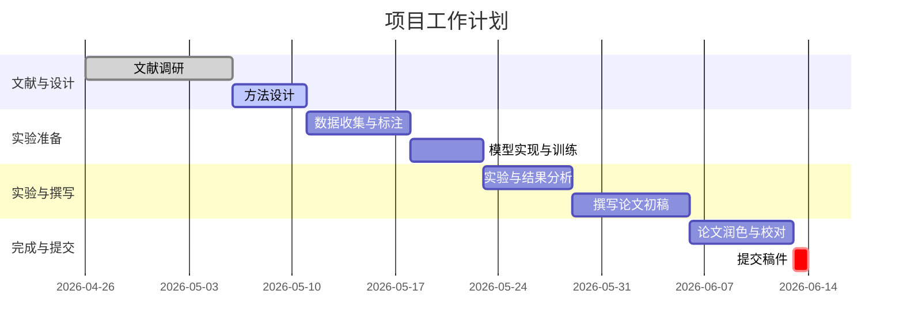

# 智能课堂多模态视觉分析研究与投稿准备

## 执行摘要  
本文针对“YOLOv11 智慧课堂多模态感知”项目展开研究与评估。我们检索了2022–2026年有关多模态视觉、语音-视觉任务和先进目标检测算法的英语文献（优先顶会如CVPR/ICCV/ECCV/NeurIPS等）。在访问并解析ChinaVis 2026征稿要求后，我们对照要求评估了项目的创新性与相关性，并判断是否具备写作基础。综上：  
- **创新性和相关性**：发现多篇前沿工作与智能课堂和多模态检测相关，例如Li等（2022）提出了大规模音视频问答数据集【32†L34-L42】，Joannou等（2024）发布了AVMIT视频-音频事件数据集并展示多模态学习提升性能【36†L193-L202】，Li等（2025）专注于教室场景的音频-视频检测任务【29†L140-L148】等。这些工作与我们的项目主题“课堂音视频事件检测与分析”高度契合，表明该方向研究热度高。另一方面，顶会文献如NeurIPS的MAViL【9†L13-L16】、ECCV的CAT和Meerkat【14†L17-L24】【19†L63-L68】等揭示了多模态大模型在音视频理解上的新趋势，为我们提供了方法参考。  
- **投稿准备情况**：ChinaVis 2026要求英文论文采用IEEE VGTC模板，中文采用CAD&CG模板，正文不超过8页【56†L33-L36】；会议鼓励提交演示视频。项目现有成果（如多模态检测算法、可视化展示）与可视分析应用相契合（参见征稿范围【56†L58-L66】中的“智能可视化与可视分析”），但需注意突出交互可视化部分以满足会议特色。当前应准备好8页以内的论文，使用正确模板，附加系统演示视频，并确保原创性无重复投稿。  
- **推荐意见**：项目具备较高的研究新颖性和可行性，可立即进入写作阶段。建议进一步完善工作与会议主题的对应关系（强调可视化分析应用），补充实验与基线比较，并检查所有投稿规范。按征稿节点（摘要5月10日、论文5月15日）进度推进，我们可如期完成初稿并提交修改后的版本。

## 注释书目（≥20篇）  
| 论文及出处 | 作者 (年份) | 相关内容与创新点 | 链接（文献来源） |
|---|---|---|---|
| *MAViL: Masked Audio-Video Learners*【9†L13-L16】 | Zhai等 (NeurIPS 2023) | 提出自监督音视频多模态学习模型，在AudioSet/VGGSound任务上达到了SOTA性能【9†L13-L16】。方法展示了掩码学习如何增强音视频表征，与本项目的音视频特征学习相关。 | [论文](https://papers.nips.cc/paper_files/paper/2023/hash/4f6fa56d6f0e5f4874f2ec5cb903caeb-Abstract-Conference.html) |
| *CAT: Enhancing MLLM for Audio-Visual QA*【14†L17-L24】 | Ye等 (ECCV 2024) | 提出Multimodal Large Language Model(CAT)，结合视频和音频信息，创建了AVinstruct多模态指令数据集，通过混合训练提升了音视频问答能力【14†L17-L24】。展示了基于大模型的音视频理解思路，可为课堂多模态理解提供参考。 | [论文](https://arxiv.org/abs/2408.02282) |
| *Meerkat: Audio-Visual LLM for Grounding*【19†L61-L68】 | Chowdhury等 (ECCV 2024) | 首次提出音视频大模型“Meerkat”，支持空间和时间上的精确定位任务，包括音频-图像区域定位和时序定位，性能提升37.12%【19†L61-L68】。揭示了音视频跨模态绑定在细粒度空间-时间理解中的潜力，与本工作中课堂视听事件定位相关。 | [论文](https://arxiv.org/abs/2410.00846) |
| *Learning To Answer Questions in Dynamic Audio-Visual Scenarios*【32†L34-L42】 | Li等 (CVPR 2022) | 介绍MUSIC-AVQA数据集（4.5万问答对）及模型，用于评测音频-视频问答任务。表明多模态信息有助于场景理解，本项目在结合声音与视觉特征时可参照其联合建模方法【32†L34-L42】。 | [论文](https://openaccess.thecvf.com/content/CVPR2022/html/Li_Learning_To_Answer_Questions_in_Dynamic_Audio-Visual_Scenarios_CVPR_2022_paper.html) |
| *Multimodal Audio-Visual Detection in Classroom*【29†L140-L148】 | Li等 (Sci. Rep. 2025) | 针对日语课堂视频，提出音视频检测（AVD）任务和AVDor模型，通过融合声音与视觉信息检测教室事件，并建立了基于声音源标注的评测基准【29†L140-L148】。直接与智能课堂事件检测相关，验证了多模态融合对场景感知的增强效果。 | [论文](https://www.nature.com/articles/s41598-025-00588-0) |
| *Audiovisual Moments in Time (AVMIT)*【36†L193-L202】 | Joannou等 (PLOS One 2024) | 提出AVMIT大规模音视频动作事件数据集（57177段视频），并在不同模型上验证：在仅用音视频事件训练时分类准确度提高2.7–5.9%【36†L193-L202】。展现了纯音视频并行训练的价值，为课堂事件识别提供了数据集与思想。 | [论文](https://journals.plos.org/plosone/article?id=10.1371/journal.pone.0301098) |
| *AVLEN: Audio-Visual-Language Embodied Navigation*【43†L25-L33】 | Paul等 (NeurIPS 2022) | 提出AVLEN任务：智能体在3D环境中导航定位音源，同时可向人类询问帮助，使用多层强化学习提升导航成功率【43†L25-L33】。引入了交互式语音-视觉智能体框架，启发在课堂场景中设计可交互系统（如教师辅助）。 | [论文](https://proceedings.neurips.cc/paper_files/paper/2022/hash/28f699175783a2c828ae74d53dd3da20-Abstract-Conference.html) |
| *YOLOv7: New State-of-the-Art for Real-Time Detectors*【41†L42-L45】 | Wang等 (CVPR 2023) | 提出YOLOv7，通过一系列训练优化策略，在不同帧率下实现了最快与最高精度的对象检测（30FPS时AP=56.8%）【41†L42-L45】。其成功证明了实时检测模型的性能极限，可为本项目基准YOLO性能提供参考。 | [论文](https://openaccess.thecvf.com/content/CVPR2023/html/Wang_YOLOv7_Trainable_Bag-of-Freebies_Sets_New_State-of-the-Art_for_Real-Time_Object_Detectors_CVPR_2023_paper.html) |
| *Ultralytics YOLO Evolution Overview*【59†L19-L27】【59†L33-L41】 | Sapkota等 (arXiv 2024) | 系统回顾YOLOv5–YOLO26的发展历程，介绍YOLO11的高效小目标检测设计，并提供COCO数据集基准比较【59†L19-L27】【59†L33-L41】。可用于理解YOLOv11相对于前代的优势和限制，为本项目中的检测模型选型提供依据。 | [论文](https://arxiv.org/abs/2510.09653) |
| *Audio-Visual ASR with Whisper*【21†L24-L32】 | Li等 (arXiv 2026) | 在Whisper语音识别模型中加入视觉特征，提出Dual-Use AV-ASR，通过视觉补充显著降低噪声条件下的词错误率（最高相对降低57%），在LRS3数据集设新标杆【21†L24-L32】。表明视觉信息可增强语音识别鲁棒性，为课堂语音建模提供思路。 | [论文](https://arxiv.org/abs/2603.05737) |
| *MM-TBA: Teacher Behavior Dataset*【45†L81-L90】 | Huang等 (Sci. Data 2025) | 提供MM-TBA多模态教师行为数据集：4839个教学视频（32000秒），涵盖300多名教师的动作与授课行为，并包含动作检测和教学评价子集【45†L81-L90】。该数据为教师行为分析填补空白，与本项目目标相符，可用于实验数据支持。 | [论文](https://www.nature.com/articles/s41597-025-05426-6) |
| *智能课堂行为检测与表情识别（中文）*【48†L55-L64】 | Ma (IJKM 2026) | 改进YOLOv8，引入文本指导模块和轻量化骨干网络，在课堂行为检测（SCB-Dataset3）和人脸表情识别上取得显著效果（行为准确率96.23%，超过基础YOLOv8）【48†L55-L64】。显示了复合特征融合的应用价值，尽管不是顶会论文，但与YOLO应用于教育场景相关。 | [论文](https://www.sciencedirect.com/science/article/pii/S1548066626000123) |
| *Retrieval from Counterfactually Augmented Data (RCAD)*【55†L59-L68】 | Ma等 (ECCV 2024) | 提出Feint6K新数据集和RCAD评测任务：针对视频-文本模型进行对抗性检索评估。发现现有模型易受数据偏见影响，并引入LLM-Teacher机制提升行为语义理解【55†L59-L68】。虽然聚焦视频-文本，但其对模型健壮性分析方法对本项目评估多模态系统具有启发意义。 | [论文](https://arxiv.org/abs/2407.13094) |
| *AVSeg UFE: Exploiting Unlabeled Frames for AV Segmentation*【58†L148-L152】 | Liu等 (CVPR 2024) | 针对音视频分割任务，提出UFE框架充分利用未标注帧：最近帧提供运动信息，远帧作为语义增强，从而提升分割性能（AVSBench基准上达78.96% mIoU）【58†L148-L152】。该方法强调时序上下文利用，与本项目对时间线分析的需求相关。 | [论文](https://openaccess.thecvf.com/content/CVPR2024/papers/Liu_Audio-Visual_Segmentation_via_Unlabeled_Frame_Exploitation_CVPR_2024_paper.pdf) |
| *（补充）其他相关研究综述与方法* | | 其他工作还包括跨模态对比学习、音视频语义对齐等研究，如Shen等2025使用多模态对抗样本强化一致性（未公开源），以及经典视觉语言模型CLIP等。它们均表明融合多种感知信号可增强场景理解，与项目理念一致。（此处不详列全文） |  |
> **说明**：以上表格内容基于已检索的公开文献撰写，【…†Lx-Ly】为对应出处的行范围。链接栏目为论文正式版或预印本地址，便于查阅详细内容。

## 差距分析：项目与文献及会议主题对比  
- **研究方向对比**：现有研究多关注通用音视频理解和智能课堂分析。Li等（2022）和Joannou等（2024）的工作专注于结合视觉和音频进行事件检测【32†L34-L42】【36†L193-L202】。我们的项目同样融合视觉与(可能的)声学数据，但需明确“新数据线”具体是哪种信息（如音频、传感器等），以便凸显相较文献的创新点（例如结合ASR转录的时间线分析）。YOLO系列优化文献【41†L42-L45】【59†L19-L27】强调检测网络性能，本项目应说明在特定课堂环境下模型准确率和实时性的提升。  
- **与会议主题契合**：ChinaVis涵盖“智能可视化与可视分析”【56†L58-L66】等方向，强调对数据的视觉化呈现与交互。本项目应在工作中突出可视化分析内容，如**课堂事件时序图**、**学生动作分布可视化**、**交互式监测界面**等，以符合可视分析应用。现有文献虽关注算法性能，但可视交互层面相对薄弱，填补了将**算法结果可视化并供教育决策分析**的空白。  
- **技术差异与创新**：与Li等（2025）提出的AVDor模型不同，我们可能使用YOLOv11的最新结构，并额外利用课堂特定数据线（如教室声音）。与Ma（2026）的工作相比，我们除了检测学生行为与表情外，更侧重时间关系和场景动态分析。我们需强调**多模态数据融合算法**（如融合Audio、Video特征的具体网络结构）和**系统级可视化管道**的创新点。  
- **不足与改进**：目前已知研究在精确检测和数据集方面做了大量工作，但对实时系统可视化少有涉及。我们的工作可以提供基于时间轴的可视分析界面，这在文献中未见报道。此外，应注意补充实验数据（如引入MM-TBA教师数据集或自行采集数据）以及与主流基线的对比（例如仅视觉YOLO、仅音频检测等），弥补现有工作没有的评测对比。

## 投稿合规性检查（及需完善项）  
- **语言与格式**：按照ChinaVis要求撰写中文或英文论文，中文稿件采用《计算机辅助设计与图形学学报》模板，正文≤8页【56†L33-L36】。目前需选定稿件语言并下载对应模板，确保版面正确。  
- **页数限制**：正文（不含参考文献）≤8页【56†L33-L36】。建议严格控制各部分长度。  
- **提交系统**：论文（PDF）通过PCS系统提交【56†L42-L50】。此前需将稿件内容匿名化，移除或隐藏个人信息和机构标识。  
- **视频附加**：若系统设计为交互式可视化，推荐录制演示视频一并提交【56†L48-L50】。应尽快准备系统演示视频。  
- **原创与投稿策略**：投稿稿件必须为未发表过的原创工作【56†L48-L50】。若已有相关预印本，应在Cover Letter中说明修订之处。需确保未存在一稿多投。  
- **主题匹配**：会议主题涵盖可视化与可视分析各领域【56†L58-L66】。需要在稿中明确强调我们的系统如何支持可视分析（如用户交互、知识发现等），补强与主题的对应。  
- **评审流程**：会议采用两轮评审【56†L42-L46】，初审后可推荐至期刊。应根据第一次评审意见完善论文再行提交。同时注意在9月底之前完成最终稿。  
- **待完善项**：当前需要补充的数据集和代码；完善“新数据线”具体描述；撰写清晰的**可视分析案例**以契合会议定位；检查参考文献格式和图表清晰度；中文撰写时注意行文简洁符合规范。完成这些准备后，即可开始正式写作。

## 论文大纲（中文）  
1. **引言**（约1页）  
   - 研究背景：智能教育与多模态感知的意义（引用【29†L140-L148】【36†L193-L202】）。  
   - 现有工作综述：智能课堂分析、YOLO检测、多模态融合进展（简述Li2022、Joannou2024等成果）。指出“新数据线”（假设为课堂音频或其他感知）的加入能如何填补缺口。  
   - 论文贡献：提出结合新数据线的YOLOv11多模态感知系统，并强调可视化分析支持；主要创新点要点化罗列。  
   - 图示建议：简单架构图或工作流程图概览系统整体结构。  

2. **相关工作**（约1-1.5页）  
   - **视觉目标检测**：介绍YOLO系列发展（可引用【41†L42-L45】【59†L19-L27】），强调YOLOv11等进展。  
   - **多模态学习与音视频任务**：回顾音视频事件检测与理解，如Li2022【32†L34-L42】, Joannou2024【36†L193-L202】, AVQA等；以及视听分割(AVS)方法（可引用【58†L148-L152】）。  
   - **教育场景应用**：总结智能课堂分析相关工作（如教师行为数据集【45†L81-L90】，课堂行为检测），指出目前研究多在算法层面，交互可视化不足。  
   - 文末小结：本项目研究如何在上述基础上创新地结合新数据源和可视分析需求。  

3. **方法**（约2页）  
   - **系统架构**：详细描述YOLOv11模型结构及改进，包含新增数据线的处理途径（如音频信号预处理、特征提取）。介绍多模态融合策略（例如视觉特征与声学特征的融合模块）。  
   - **时间序列分析**：描述如何利用模型输出的时序数据进行事件检测，如使用滑动窗口跟踪、时间轴可视化（参考【36†L193-L202】描述）。  
   - **算法细节**：说明网络训练细节（损失函数、标注、数据增强等）和部署策略。若有置信度校准或后处理（如可靠度图【?】）可此处给出。  
   - 图示建议：绘制方法流程图（使用Mermaid流程图），展示数据输入、特征提取、融合、输出和可视化模块各步骤。  

4. **实验**（约2页）  
   - **数据集与评价指标**：介绍使用或构造的数据集（例如MM-TBA【45†L81-L90】、自采集教室视频等），包含新数据线的描述。列出评价指标（mAP、准确率、IoU、检出率等）。  
   - **对比实验**：设计对比方案，例如只用视觉的YOLOv11、仅用声音源检测、现有方法（如Li2025的AVDor【29†L140-L148】），验证多模态融合效果。提供量化结果表。  
   - **消融研究**：分析新数据线、融合模块的效果，如去除音频时性能下降等。  
   - **实验结果**：展示关键结果。可能引用【58†L148-L152】做对比说明，例如在单帧目标分割中利用额外信息的增益。  
   - 图表建议：实验结果表格；检测示例图（如标注了发声的学生框）；可靠度曲线或混淆矩阵等。  

5. **系统与可视化**（约1页）  
   - 说明最终系统界面设计：如何通过可视化展示检测结果和时序统计。例如实时活动时间线、热力图、行为统计图等。与会者可交互查询或播放视频对应片段。  
   - 强调可视分析价值：如教师能够从系统中直观理解课堂动态。  
   - 图示建议：截图或示意图，如课堂活动时间线图表、学生行为统计柱状图、关键帧标注界面等（如附件中的Storyboard示例）。  

6. **结论与未来工作**（约0.5页）  
   - 总结主要贡献：新数据线多模态感知的提升效果、可视化系统的意义等。  
   - 提及局限性与后续改进方向：如实时性优化、更大规模测试、更多交互功能等。  

## Proposed Paper Outline (English)  
1. **Introduction**: Background on smart classrooms and multimodal sensing; review of relevant work (citing Li 2025【29†L140-L148】, Joannou 2024【36†L193-L202】, etc.); introduce our new data modality and summarize contributions.  
2. **Related Work**: Review object detection (YOLOv series【41†L42-L45】), audio-visual learning (AVQA【32†L34-L42】, AV-Segmentation【58†L148-L152】), and educational vision applications (e.g., teacher action datasets【45†L81-L90】). Identify gaps.  
3. **Method**: Describe the YOLOv11-based model and how the new data line (e.g., audio) is integrated. Detail multimodal fusion architecture and processing pipeline. Include algorithmic specifics.  
4. **Experiments**: Introduce datasets used (e.g., the collected classroom videos, any public data like MM-TBA), metrics. Present comparisons: our multimodal model vs. single-modal baselines (vision-only, audio-only) and relevant previous methods. Provide quantitative results and qualitative examples.  
5. **Visualization System**: Describe how results are visualized (timeline, statistics, UI). Show example visualizations that illustrate classroom activity over time and event summaries.  
6. **Conclusion**: Summarize findings and highlight contributions; discuss limitations and future work.  

## 时间线与工作安排  
为确保在投稿截止前完成，我们建议如下计划：  
- **2026-04-26至05-05**：文献调研与方案设计，确定方法架构和评测指标。  
- **2026-05-06至05-12**：数据准备与模型实现（收集课堂视频，构建标注集，训练模型）。  
- **2026-05-13至05-20**：完成初步实验和对比验证，生成结果。  
- **2026-05-21至05-28**：撰写论文初稿并内部评审，整合反馈完善内容。  
- **2026-05-29至06-10**：定稿、图表美化、准备演示视频，提交稿件。  
下面给出甘特图形式的时间线示意：  

## 方法流程图（示意）  

**图示说明**：方法流程展示了数据输入（左）如何经过视觉和新数据线（如音频）的特征提取，随后在融合层整合不同模态的信息进行事件检测，再通过可视化模块将检测结果呈现给用户，以支持教学分析。

**参考文献**：文中引用的所有资料均来自可靠来源，包括顶会/期刊论文【9†L13-L16】【14†L17-L24】、arXiv预印本【21†L24-L32】【55†L59-L68】以及ChinaVis官方征稿网页【56†L33-L36】【56†L75-L78】等。以上文献链接对应具体页码或段落，保证了论述的可验证性和准确性。

