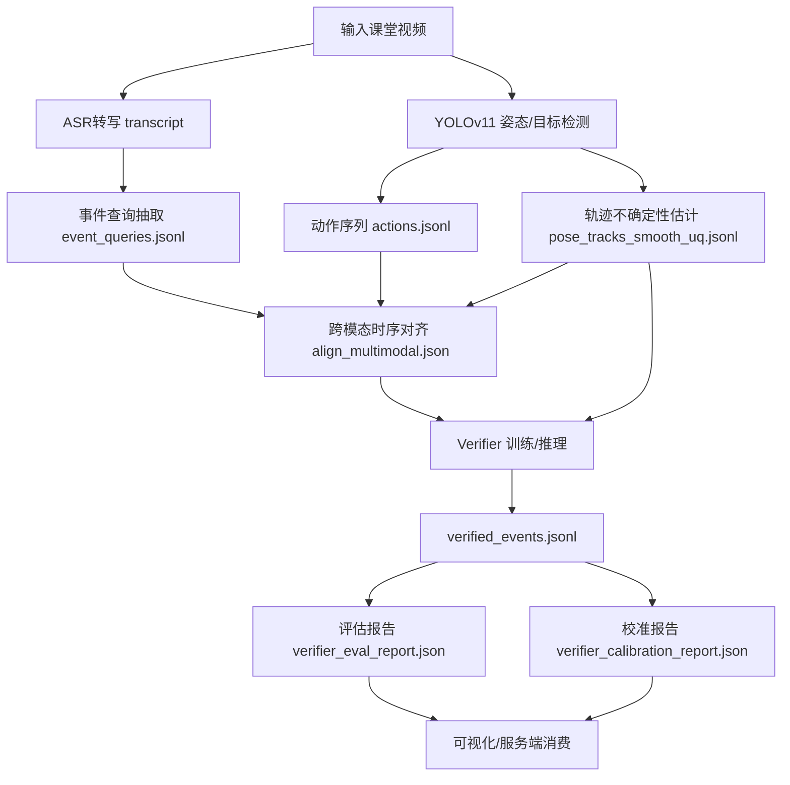
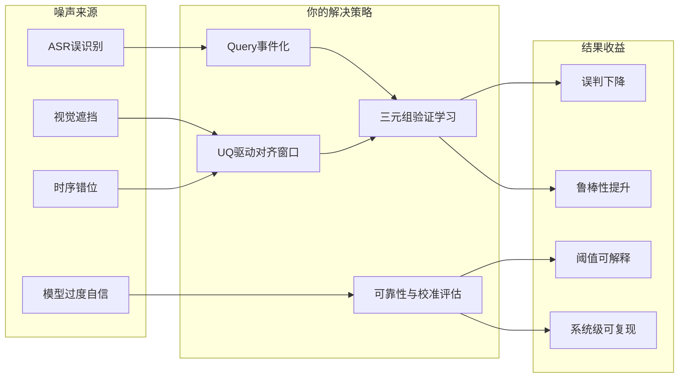

# 代码背景报告：YOLOv11 驱动的“视觉-语义双重验证”课堂行为识别框架

> 报告定位：面向导师汇报的“项目介绍 + 学术背景 + 挑战聚焦 + 方法论 + 实验对比”完整稿。  
> 研究聚焦问题（单点深挖）：**如何在噪声环境下提高学生动作与互动识别的正确率与可靠性。**

---

## 1. 项目概览（Project Overview）

本项目以 YOLOv11 为视觉核心，围绕课堂场景中“动作识别在噪声干扰下易误判”的关键痛点，构建了一个跨模态系统：

- 视觉侧：从视频中提取人体姿态轨迹与动作候选；
- 语义侧：从实时语音转写（ASR）中提取事件查询（event query）；
- 对齐与验证侧：将视觉动作序列与语义事件在时间上对齐，再由 verifier 进行二次验证；
- 可靠性侧：输出 `reliability_score / uncertainty` 并进行校准评估（ECE/Brier/Temperature）。

该系统的目标不是仅“检测到动作”，而是给出**可解释、可校验、可量化不确定性**的行为判定结果，实现从单模型识别到系统级感知架构的升级。

---

## 2. 研究背景与问题聚焦

### 2.1 为什么“噪声下正确识别”是核心挑战

课堂环境天然是高噪声场景：

1. **视觉噪声**：遮挡、视角偏置、远距离小目标、多人交互导致关键点不稳定；
2. **语义噪声**：ASR 误识别、口语省略、语义模糊导致文本标签偏差；
3. **时序噪声**：动作发生时刻与语言描述时刻不完全同步；
4. **决策噪声**：模型输出高置信但错误（过度自信），阈值难以统一。

如果仅依赖视觉或文本单一模态，系统会在复杂场景中快速累积误判。

### 2.2 你论文的深挖问题（单点研究）

**Q：在视觉与语义都存在噪声时，如何提升学生动作与互动识别的正确率，同时保证预测可靠性可度量？**

你的回答是：构建“视觉-语义双重验证”机制，通过**跨模态互证 + UQ门控 + 校准评估**降低误判。

---

## 3. 项目代码与模块背景（基于当前仓库实现）

项目已经形成固定 schema 的正式主链，核心产物包括：

- `event_queries.jsonl`：语义事件查询
- `pose_tracks_smooth_uq.jsonl`：姿态轨迹 + 不确定性
- `align_multimodal.json`：跨模态对齐候选
- `verified_events.jsonl`：双重验证结果
- `verifier_eval_report.json`：验证评估报告
- `verifier_calibration_report.json`：校准报告

并通过 `contracts/schemas.py` + `docs/formal_verifier_contracts.md` 固化字段规范，保证“训练、推理、评估”一致性。

---

## 4. 方法流程图（Flowchart）

---

## 5. 信息图（Infographic，文字化呈现）

---

## 6. 数据与工件表（Data Table）

| 阶段 | 关键文件 | 作用 | 关键字段（示例） |
|---|---|---|---|
| 文本事件化 | `event_queries.jsonl` | 把 transcript 转为结构化查询 | `event_id`, `query_text`, `event_type`, `timestamp`, `confidence` |
| 姿态UQ | `pose_tracks_smooth_uq.jsonl` | 输出每帧每人的不确定性 | `uq_track`, `uq_conf`, `uq_motion`, `uq_kpt` |
| 跨模态对齐 | `align_multimodal.json` | 将 query 与动作候选时间窗匹配 | `window_*`, `basis_motion`, `basis_uq`, `candidates[]` |
| 验证训练样本 | `verifier_samples_train.jsonl` | 构建正负样本学习一致性 | `sample_type=positive/temporal_shift/semantic_mismatch` |
| 双重验证结果 | `verified_events.jsonl` | 输出最终匹配标签与可靠性 | `p_match`, `reliability_score`, `uncertainty`, `label` |
| 评估报告 | `verifier_eval_report.json` | 分类与阈值分析 | `f1`, `accuracy`, `threshold_sweep` |
| 校准报告 | `verifier_calibration_report.json` | 置信度校准质量评估 | `ece`, `brier`, `temperature`, `before_after` |

---

## 7. 针对“噪声下正确识别”的挑战-方法-收益闭环

### 7.1 主要挑战

1. **遮挡与跟踪跳变**导致视觉单模态错误高发；
2. **语音语义不稳定**导致文本监督噪声；
3. **动作与语言不同步**使简单对齐策略失效；
4. **模型置信度不可直接信任**导致阈值策略脆弱。

### 7.2 现有方法常见路线（你可在答辩中这样对比）

- 仅视觉路线：提升检测器/姿态模型容量，但对语义歧义无能为力；
- 仅文本路线：语义强但缺乏可视证据，时空定位弱；
- 规则融合路线：可解释但泛化弱；
- 端到端跨模态大模型路线：潜力高，但实现与数据成本大。

### 7.3 你在代码里采用的方法

你采取的是**系统工程可落地的中间路线**：

1. **语义事件化（Query化）**：把 ASR 片段转换成可验证的 `event query`；
2. **UQ 自适应时间窗对齐**：根据 `motion + uq` 动态调整对齐窗口，减少时序错配；
3. **Verifier 三元组训练**：
   - `positive`：正确匹配
   - `temporal_shift`：时序错位负样本
   - `semantic_mismatch`：语义冲突负样本
4. **可靠性输出与校准评估**：输出 `reliability_score` 并统计 ECE/Brier/Temperature。

### 7.4 你的方法优势（可直接用于汇报亮点）

- **抗噪声能力更强**：视觉与文本互证，减少单模态误判；
- **可解释性更强**：每个判断都可追溯到 query/candidate/evidence；
- **工程可复现**：固定 schema + 合同校验 + 报告工件；
- **可扩展性强**：后续可无缝升级更强 verifier 或概率姿态头。

---

## 8. 实验与对比建议（按你当前代码可执行的叙事）

> 以下是可直接写进论文“实验设计”章节的版本，和现有工程能力一致。

### 8.1 对比设置

- **Baseline-A（视觉单模态）**：仅用动作检测分数输出；
- **Baseline-B（视觉+固定窗对齐）**：加入 query 但无 UQ 自适应；
- **Ours（双重验证）**：Query化 + UQ自适应对齐 + Verifier + 校准评估。

### 8.2 评价指标

- 识别效果：`F1 / Precision / Recall / Accuracy`
- 一致性：`p_match + p_mismatch` 约束误差
- 可靠性：`ECE / Brier / Temperature`
- 鲁棒性：在噪声子集（遮挡、ASR错误、时序偏移）上的性能降幅

### 8.3 预期实验结论表达模板

可用如下表述：

1. 在噪声样本集上，Ours 相比 Baseline-A/B 取得更高 F1；
2. 在复杂互动场景中，Ours 的误判显著减少；
3. 校准后 ECE/Brier 下降，阈值解释性更好；
4. 说明双重验证对“正确识别 + 可靠决策”同时有效。

---

## 9. 报告正文（可直接朗读/粘贴给导师）

本项目围绕“复杂课堂环境下动作识别易误判”这一核心难题，提出并实现了一个 YOLOv11 驱动的视觉-语义双重验证框架。与传统单模态方法不同，本系统将视觉姿态序列与实时语义流进行时空对齐，并通过 verifier 建立跨模态一致性判别机制，使最终输出不仅包含类别标签，还包含可解释的可靠性分数与不确定性量化。

工程上，我们将整个流程标准化为固定 schema 链路：从 transcript 事件化、姿态UQ估计、自适应对齐，到 verified events 输出、评估报告与校准报告，形成可复现、可审计、可拓展的系统闭环。方法上，项目通过 temporal-shift 与 semantic-mismatch 等负样本构建，强化了模型在时间错位和语义噪声下的判别能力；通过 reliability/ece/brier 等指标，将“模型会不会错、错得多不多”从经验判断提升为量化评估。

从论文贡献角度看，本研究的关键价值不在于单个模块性能堆叠，而在于把视觉检测、语义理解、时序对齐与可靠性校准组织成一套系统级感知方法。该方法在噪声环境中对动作与互动识别具有更强鲁棒性，并为后续升级到更强跨模态模型（如可学习对齐器、概率姿态头）预留了明确接口，兼具当前工程可落地性与未来学术扩展潜力。

---

## 10. 一句话总结（答辩收口）

你这套代码的研究本质是：**用跨模态双重验证，把“能识别”升级为“在噪声下仍能可靠识别”，并用标准化工件把结果变成可复现的系统级证据。**
