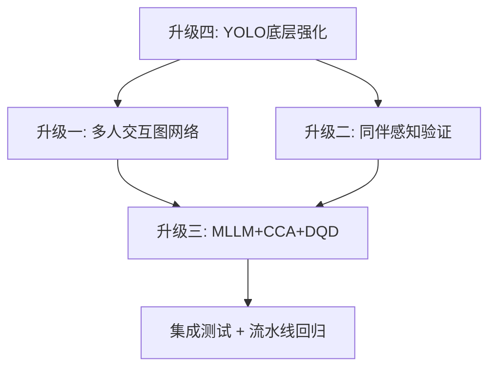

# 课堂行为分析流水线四大升级 — 逐文件执行大纲

> **目标**：在不破坏现有解耦架构的前提下，将系统从"独立个体动作识别"升维至"上下文感知的多人交互语义理解"。  
> **约束**：本文档只给出精确到文件/函数/数据结构层面的执行计划，**不直接修改代码**。

---

## 升级一：多人交互图网络（ST-GCN → DSIG + SDIG + IGFormer）

> **现状**：[11_group_stgcn.py](file:///f:/PythonProject/pythonProject/YOLOv11/scripts/11_group_stgcn.py) 仅用 bbox 中心距离构建稀疏邻接矩阵 + 2层 GCN-TCN → 3类分类（lecture/discussion/break），无姿态语义、无多尺度交互建模。

### 1.1 新建 `scripts/models/interaction_graph.py`

| 子模块 | 内容 |
|--------|------|
| `DSIGBuilder` | **基于距离的稀疏交互图**：复用现有 [build_graph_from_frame()](file:///f:/PythonProject/pythonProject/YOLOv11/scripts/11_group_stgcn.py#71-111) 的距离逻辑，但增加 K-NN 阈值自适应（按帧人数动态调整 `dist_thres`），输出 `A_dsig: (V, V)` |
| `SDIGBuilder` | **基于语义的密集交互图**：读取每人 17 个关键点 + 已识别动作标签，计算姿态向量余弦相似度 → 语义亲和矩阵 `A_sdig: (V, V)` |
| `DualGraphFusion` | 将 `A_dsig` 和 `A_sdig` 通过可学习 α 系数加权融合：`A_fused = α * A_dsig + (1-α) * A_sdig` |

### 1.2 新建 `scripts/models/igformer.py`

| 组件 | 说明 |
|------|------|
| `IGFormerBlock` | 交互图 Transformer 块：Multi-Head Self-Attention + Graph-guided Attention Mask（用 `A_fused` 作为 attention mask），输入 [(B, T, V, C)](file:///f:/PythonProject/pythonProject/YOLOv11/scripts/02_export_keypoints_jsonl.py#8-96) |
| `IGFormerEncoder` | 堆叠 L 层 `IGFormerBlock`（建议 L=4），包含时间位置编码 + 节点位置编码 |
| `InteractionClassifier` | 分类头：Global Pool → MLP → 细粒度交互类别（扩展为 6 类：`lecture / group_discuss / pair_chat / individual_work / break / transition`） |

### 1.3 修改 [11_group_stgcn.py](file:///f:/PythonProject/pythonProject/YOLOv11/scripts/11_group_stgcn.py)

| 改动点 | 具体内容 |
|--------|----------|
| 导入 | 添加 `from models.interaction_graph import DSIGBuilder, SDIGBuilder, DualGraphFusion` 和 `from models.igformer import IGFormerEncoder, InteractionClassifier` |
| [build_graph_from_frame()](file:///f:/PythonProject/pythonProject/YOLOv11/scripts/11_group_stgcn.py#71-111) | 重构为调用 `DSIGBuilder`，并新增参数接收关键点数据以同时构建 SDIG |
| 节点特征 | 当前仅 [(cx, cy, conf)](file:///f:/PythonProject/pythonProject/YOLOv11/scripts/02_export_keypoints_jsonl.py#8-96) 共 3 维 → 扩展为 [(cx, cy, conf, action_code_onehot[9], pose_angle_features[5])](file:///f:/PythonProject/pythonProject/YOLOv11/scripts/02_export_keypoints_jsonl.py#8-96) 共 17 维 |
| 邻接矩阵构建 | 双图并行构建：`A_dsig` + `A_sdig` → `DualGraphFusion` → `A_fused` |
| 模型实例化 | [ClassroomSTGCN](file:///f:/PythonProject/pythonProject/YOLOv11/scripts/11_group_stgcn.py#33-67) → `IGFormerEncoder + InteractionClassifier`（保留旧模型作为 `--legacy_stgcn` fallback） |
| 输出 schema | `group_events.jsonl` 扩展字段：增加 `interaction_pairs: [{id_a, id_b, type, score}]`、`graph_density`、`semantic_similarity_avg` |
| 命令行参数 | 新增 `--interaction_model`（igformer/legacy）、`--dsig_k`（K-NN 参数）、`--sdig_threshold`（语义阈值） |

### 1.4 修改 [03_track_and_smooth.py](file:///f:/PythonProject/pythonProject/YOLOv11/scripts/03_track_and_smooth.py)

| 改动点 | 具体内容 |
|--------|----------|
| 输出 schema | 在每个 person 记录中保留完整 17 点关键点（当前已有），确保 `keypoints` 字段含 `x, y, c` 三元组，供下游 SDIG 构建使用 |

### 1.5 修改 [09_run_pipeline.py](file:///f:/PythonProject/pythonProject/YOLOv11/scripts/09_run_pipeline.py)

| 改动点 | 具体内容 |
|--------|----------|
| Step 11 调用 | 传入新参数 `--interaction_model igformer`，并将 `actions.jsonl` 也作为输入（供 SDIG 使用） |
| 新增依赖 | Step 11 的 inputs 增加 `actions_for_downstream`（动作标签作为语义特征源） |

---

## 升级二：同伴感知（Peer-Aware）上下文验证

> **现状**：[07_dual_verification.py](file:///f:/PythonProject/pythonProject/YOLOv11/scripts/07_dual_verification.py) 仅做视觉动作 + ASR 语音的时间戳对齐，**不考虑周围人的行为上下文**。

### 2.1 新建 `scripts/modules/peer_context.py`

| 函数/类 | 说明 |
|---------|------|
| `build_spatial_neighbor_index(pose_tracks)` | 根据 `pose_tracks_smooth.jsonl` 中的 bbox 位置，为每个 track_id 构建时空邻居索引：`{track_id: {frame_range: [neighbor_ids]}}` |
| `extract_peer_features(target_id, neighbors, actions)` | 提取目标学生周围邻居在同一时间窗口内的行为分布向量：`[listen_ratio, note_ratio, distract_ratio, ...]` |
| `PeerAwareClassifier` | 构建拼接特征 `[self_action_emb ‖ peer_context_vec]` → 轻量 MLP/Transformer → 修正后的行为标签 |
| `apply_peer_correction(person_actions, peer_features, threshold)` | 规则 + 模型混合修正：如自身 `distract` 但 peer_context 全部为 `note` → 降低 distract 置信度并升高 note 置信度 |

### 2.2 修改 [07_dual_verification.py](file:///f:/PythonProject/pythonProject/YOLOv11/scripts/07_dual_verification.py)

| 改动点 | 具体内容 |
|--------|----------|
| 新增参数 | `--pose_tracks`（用于构建空间邻居索引）、`--enable_peer_aware`（开关）、`--peer_radius`（邻居搜索半径，归一化坐标，默认 0.15） |
| [build_per_person_sequences()](file:///f:/PythonProject/pythonProject/YOLOv11/scripts/07_dual_verification.py#185-239) | 在构建每个人的 `visual_sequence` 后，调用 `extract_peer_features()` 附加 `peer_context` 字段 |
| 新增处理阶段 | 在 [normalize_visual_actions()](file:///f:/PythonProject/pythonProject/YOLOv11/scripts/07_dual_verification.py#52-142) 之后、[build_per_person_sequences()](file:///f:/PythonProject/pythonProject/YOLOv11/scripts/07_dual_verification.py#185-239) 之前，插入同伴感知修正阶段 |
| 输出 schema | 每个 person 增加 `peer_context: {neighbor_count, dominant_peer_action, peer_agreement_score, correction_applied}` |

### 2.3 修改 [12_export_features.py](file:///f:/PythonProject/pythonProject/YOLOv11/scripts/12_export_features.py)

| 改动点 | 具体内容 |
|--------|----------|
| 新增特征维度 | 读取 `peer_context` 字段，计算：`Peer Agreement`（与邻居行为一致性 0~1）、`Social Isolation`（无邻居的时间比例） |
| `ATTENTION_WEIGHTS` | 同伴修正后的 action_code 使用修正后的权重 |

### 2.4 修改 [09_run_pipeline.py](file:///f:/PythonProject/pythonProject/YOLOv11/scripts/09_run_pipeline.py)

| 改动点 | 具体内容 |
|--------|----------|
| Step 07 调用 | 新增 `--pose_tracks`、`--enable_peer_aware 1`、`--peer_radius 0.15` 参数 |

---

## 升级三：多模态大语言模型（MLLM）+ CCA + DQD

> **现状**：[05_slowfast_actions.py](file:///f:/PythonProject/pythonProject/YOLOv11/scripts/05_slowfast_actions.py) 使用 SlowFast R50 做单流动作识别，[07_dual_verification.py](file:///f:/PythonProject/pythonProject/YOLOv11/scripts/07_dual_verification.py) 仅做简单时间戳对齐，无深度多模态融合。

### 3.1 新建 `scripts/models/mllm_inference.py`

| 组件 | 说明 |
|------|------|
| `MLLMWrapper` | 封装 VisualGLM-6B（或 Qwen-VL）的推理接口：[infer(image, prompt) → str](file:///f:/PythonProject/pythonProject/YOLOv11/scripts/05_slowfast_actions.py#117-145) |
| `load_mllm(model_name, device, quantize)` | 加载函数，支持 4-bit/8-bit 量化以适配显存 |
| `format_classroom_prompt(actions, transcript, context)` | 构建课堂分析专用 prompt 模板：将时间窗口内的动作序列 + ASR 文本 + 同伴上下文 组织为结构化提示词 |

### 3.2 新建 `scripts/models/cca_module.py`

| 组件 | 说明 |
|------|------|
| `CascadedCoAttention` | **级联协同注意力**：接收时序特征 `F_temporal: (B, T, D)` 和视觉语义特征 `F_visual: (B, N, D)` → Cross-Attention → 双向融合输出 `F_fused: (B, T+N, D)` |
| `DynamicQueryDriver` | **动态查询驱动**：将 ASR 语义关键词（如"讨论"、"提问"）编码为 query → 引导视觉 attention 聚焦于对应时空区域 |

### 3.3 新建 `scripts/14_mllm_semantic_verify.py`（新流水线步骤）

| 功能 | 说明 |
|------|------|
| 输入 | `per_person_sequences.json` + `embeddings.pkl` + `transcript.jsonl` + 原始视频关键帧 |
| 处理 | 对每个时间窗口：① SlowFast embeddings 作为 `F_temporal` ② 从视频中抽取关键帧经 MLLM 视觉编码器得到 `F_visual` ③ `CascadedCoAttention` 融合 ④ `DynamicQueryDriver` 根据 ASR 关键词引导注意力 ⑤ MLLM 做最终语义判定 |
| 输出 | `mllm_verified_sequences.json`：每个行为片段附加 `mllm_label`、`mllm_confidence`、`attention_region`、`reasoning_text` |
| 参数 | `--mllm_model`（模型名）、`--quantize`（量化位数）、`--keyframe_interval`（关键帧采样间隔）、`--enable_cca`、`--enable_dqd` |

### 3.4 修改 [09_run_pipeline.py](file:///f:/PythonProject/pythonProject/YOLOv11/scripts/09_run_pipeline.py)

| 改动点 | 具体内容 |
|--------|----------|
| 新增 Step 14 | 在 Step 07 之后、Step 12 之前插入 MLLM 语义验证步骤 |
| 新增参数 | `--enable_mllm`（开关，默认 0）、`--mllm_model`、`--mllm_quantize` |
| 下游依赖 | Step 12/13 的输入从 `per_person_sequences.json` 切换为 `mllm_verified_sequences.json`（当 MLLM 启用时） |

### 3.5 修改 [05_slowfast_actions.py](file:///f:/PythonProject/pythonProject/YOLOv11/scripts/05_slowfast_actions.py)

| 改动点 | 具体内容 |
|--------|----------|
| embedding 导出 | 确保 `embeddings.pkl` 中包含时间戳索引 `{track_id: [(frame_range, embedding_vector), ...]}` 以供 CCA 模块使用 |
| 关键帧保存 | 新增 `--save_keyframes` 参数，按推理步长保存关键帧图片到 `keyframes/` 目录供 MLLM 使用 |

---

## 升级四：YOLOv11 底层特征强化（ASPN + DySnakeConv + GLIDE）

> **现状**：[02_export_keypoints_jsonl.py](file:///f:/PythonProject/pythonProject/YOLOv11/scripts/02_export_keypoints_jsonl.py) 和 [02b_export_objects_jsonl.py](file:///f:/PythonProject/pythonProject/YOLOv11/scripts/02b_export_objects_jsonl.py) 直接调用 Ultralytics 标准 YOLO11 模型，未做课堂场景优化。

### 4.1 新建 `models/yolov11_classroom/` 目录

| 文件 | 内容 |
|------|------|
| `aspn.py` | **自适应空间金字塔网络**：在 YOLO backbone 的 C2f 模块后插入多尺度特征融合层，保留细粒度特征（用于区分"阅读"vs"书写"等高相似行为） |
| `dysnake_conv.py` | **动态蛇形卷积**：替换 neck 部分的标准 Conv 为 DySnakeConv，处理课桌椅遮挡产生的管状拓扑结构（手臂从桌面伸出等场景） |
| `glide_loss.py` | **动态损失函数**：实现 GLIDE（Generalized Lightweight IoDE）损失，在遮挡区域自适应调整关键点回归权重 |
| `classroom_yolo_config.yaml` | 自定义 YOLO 模型配置文件：基于 `yolo11s-pose.yaml` 修改，集成 ASPN + DySnakeConv |

### 4.2 新建 `scripts/training/train_classroom_yolo.py`

| 功能 | 说明 |
|------|------|
| 数据准备 | 从 `data/custom_classroom_data/` 加载课堂图像 + 关键点标注 |
| 模型构建 | 使用 `classroom_yolo_config.yaml` 构建增强版 YOLO11 |
| 训练配置 | 冻结 backbone 前 N 层 → 训练 ASPN/DySnakeConv/关键点头 → 使用 GLIDE 损失 |
| 输出 | `models/classroom_yolo_enhanced.pt` |

### 4.3 修改 [02_export_keypoints_jsonl.py](file:///f:/PythonProject/pythonProject/YOLOv11/scripts/02_export_keypoints_jsonl.py)

| 改动点 | 具体内容 |
|--------|----------|
| 模型加载 | 支持加载自定义配置的增强模型（通过 `--model` 参数指向 `classroom_yolo_enhanced.pt`）|
| 后处理 | 新增遮挡置信度过滤：当关键点置信度 < 阈值但周围关键点存在时，使用插值补全（新增 `--interpolate_occluded` 参数） |
| 输出扩展 | 每个 person 增加 `occlusion_score` 字段（基于可见关键点比例估计遮挡程度） |

### 4.4 修改 [02b_export_objects_jsonl.py](file:///f:/PythonProject/pythonProject/YOLOv11/scripts/02b_export_objects_jsonl.py)

| 改动点 | 具体内容 |
|--------|----------|
| 模型加载 | 同样支持增强版目标检测模型 |
| 细粒度物体类别 | 扩展检测类别：在现有 COCO 类别基础上增加课堂专属类别（书本、笔、笔记本电脑，与自训练 Case 检测器统一） |

### 4.5 修改 [09_run_pipeline.py](file:///f:/PythonProject/pythonProject/YOLOv11/scripts/09_run_pipeline.py)

| 改动点 | 具体内容 |
|--------|----------|
| 默认模型路径 | `--pose_model` 默认值可切换为增强模型（当检测到 `classroom_yolo_enhanced.pt` 存在时） |
| 新增训练步骤引用 | 在 `--help` 信息中提示用户先运行 `train_classroom_yolo.py` 获取增强模型权重 |

---

## 跨升级共享变更

### [09_run_pipeline.py](file:///f:/PythonProject/pythonProject/YOLOv11/scripts/09_run_pipeline.py) 总体改动

```
新增步骤顺序：
  02 → 21 → 03 → 04 → 05 → 55 → 06 → 07(+Peer) → [14 MLLM] → 11(+IGFormer) → 12 → 13 → 08 → 10

新增命令行参数：
  --enable_mllm / --mllm_model / --mllm_quantize
  --enable_peer_aware / --peer_radius
  --interaction_model (igformer/legacy)
  --interpolate_occluded
```

### [10_visualize_timeline.py](file:///f:/PythonProject/pythonProject/YOLOv11/scripts/10_visualize_timeline.py)

| 改动点 | 具体内容 |
|--------|----------|
| 交互事件可视化 | 读取新版 `group_events.jsonl` 中的 `interaction_pairs` 字段，绘制成对交互弧线 |
| 同伴感知标记 | 用不同颜色标识经同伴修正的行为片段 |
| MLLM 语义层 | 新增一行展示 MLLM 最终语义判定结果 |

### [08_overlay_sequences.py](file:///f:/PythonProject/pythonProject/YOLOv11/scripts/08_overlay_sequences.py)

| 改动点 | 具体内容 |
|--------|----------|
| 交互线绘制 | 当 `group_events.jsonl` 包含 `interaction_pairs` 时，在视频中绘制学生间的交互连线 |
| MLLM 标注 | 如果存在 `mllm_verified_sequences.json`，叠加显示 MLLM 推理结论 |

### 新建 `scripts/models/__init__.py`

- 空文件，使 `models/` 成为 Python 包

### 新建 `scripts/modules/__init__.py`

- 空文件，使 `modules/` 成为 Python 包

---

## 新增文件总览

| 路径 | 类型 | 所属升级 |
|------|------|----------|
| `scripts/models/__init__.py` | 包初始化 | 通用 |
| `scripts/models/interaction_graph.py` | 双图构建器 | 升级一 |
| `scripts/models/igformer.py` | IGFormer 模型 | 升级一 |
| `scripts/models/mllm_inference.py` | MLLM 封装 | 升级三 |
| `scripts/models/cca_module.py` | CCA + DQD | 升级三 |
| `scripts/modules/__init__.py` | 包初始化 | 通用 |
| `scripts/modules/peer_context.py` | 同伴感知模块 | 升级二 |
| `scripts/14_mllm_semantic_verify.py` | MLLM 验证步骤 | 升级三 |
| `models/yolov11_classroom/aspn.py` | ASPN 模块 | 升级四 |
| `models/yolov11_classroom/dysnake_conv.py` | 蛇形卷积 | 升级四 |
| `models/yolov11_classroom/glide_loss.py` | 动态损失 | 升级四 |
| `models/yolov11_classroom/classroom_yolo_config.yaml` | 模型配置 | 升级四 |
| `scripts/training/train_classroom_yolo.py` | 增强模型训练 | 升级四 |

## 修改文件总览

| 文件 | 涉及升级 |
|------|----------|
| [11_group_stgcn.py](file:///f:/PythonProject/pythonProject/YOLOv11/scripts/11_group_stgcn.py) | 升级一 |
| [03_track_and_smooth.py](file:///f:/PythonProject/pythonProject/YOLOv11/scripts/03_track_and_smooth.py) | 升级一 |
| [07_dual_verification.py](file:///f:/PythonProject/pythonProject/YOLOv11/scripts/07_dual_verification.py) | 升级二 |
| [12_export_features.py](file:///f:/PythonProject/pythonProject/YOLOv11/scripts/12_export_features.py) | 升级二 |
| [05_slowfast_actions.py](file:///f:/PythonProject/pythonProject/YOLOv11/scripts/05_slowfast_actions.py) | 升级三 |
| [02_export_keypoints_jsonl.py](file:///f:/PythonProject/pythonProject/YOLOv11/scripts/02_export_keypoints_jsonl.py) | 升级四 |
| [02b_export_objects_jsonl.py](file:///f:/PythonProject/pythonProject/YOLOv11/scripts/02b_export_objects_jsonl.py) | 升级四 |
| [09_run_pipeline.py](file:///f:/PythonProject/pythonProject/YOLOv11/scripts/09_run_pipeline.py) | 升级一 + 二 + 三 + 四 |
| [10_visualize_timeline.py](file:///f:/PythonProject/pythonProject/YOLOv11/scripts/10_visualize_timeline.py) | 升级一 + 二 + 三 |
| [08_overlay_sequences.py](file:///f:/PythonProject/pythonProject/YOLOv11/scripts/08_overlay_sequences.py) | 升级一 + 三 |

---

## 推荐实施顺序



| 阶段 | 预计工作量 | 理由 |
|------|-----------|------|
| **Phase 1: 升级四** | 先行 | 底层特征质量直接影响上层所有模块的上限；ASPN/DySnakeConv 是独立的模型层修改，不影响流水线接口 |
| **Phase 2: 升级一** | 中等 | 依赖更好的关键点质量（来自 Phase 1），IGFormer 模型可与现有 ST-GCN 并行开发 |
| **Phase 3: 升级二** | 较轻 | 主要是逻辑层改造，不涉及新模型训练，可与 Phase 2 并行 |
| **Phase 4: 升级三** | 最重 | MLLM 依赖前序所有模块的输出，需要显存管理和推理优化，放在最后 |

---

## 数据流变更对照

```
           现有流水线                              升级后流水线
           ─────────                              ──────────
video → YOLO-Pose → keypoints              video → YOLO-Pose+ASPN+DySnake → keypoints(+occlusion_score)
      → YOLO-Det  → objects                       → YOLO-Det(enhanced)  → objects(+classroom_classes)
      → Track&Smooth → pose_tracks                → Track&Smooth → pose_tracks(确保含完整关键点)
      → SlowFast  → actions + embeddings          → SlowFast → actions + embeddings(+timestamps) + keyframes/
      → ObjectFuse → actions_fused                 → ObjectFuse → actions_fused
      → ASR → transcript                          → ASR → transcript
      → DualVerify → per_person_seq                → DualVerify+PeerAware → per_person_seq(+peer_context)
                                                   → MLLM+CCA+DQD → mllm_verified_seq
      → ST-GCN → group_events                     → IGFormer(DSIG+SDIG) → group_events(+interaction_pairs)
      → Features → student_features                → Features(+peer_agreement) → student_features
      → UMAP → projection                         → UMAP → projection
      → Timeline + Overlay                         → Timeline(+交互弧线+MLLM层) + Overlay(+交互连线)
```

---

## 依赖与环境变更

| 新增依赖 | 用途 | 安装方式 |
|----------|------|----------|
| `torch-geometric` 或 `dgl` | 图神经网络操作（IGFormer） | `pip install torch-geometric` |
| `transformers` + `accelerate` | MLLM (VisualGLM/Qwen-VL) 加载 | `pip install transformers accelerate` |
| `bitsandbytes` | MLLM 4-bit/8-bit 量化 | `pip install bitsandbytes` |
| `einops` | Transformer 维度操作 | `pip install einops` |

> [!IMPORTANT]
> 所有新增模块均通过命令行开关（`--enable_mllm`、`--enable_peer_aware`、`--interaction_model`）控制，**关闭时流水线行为与当前完全一致**，实现渐进式升级。
