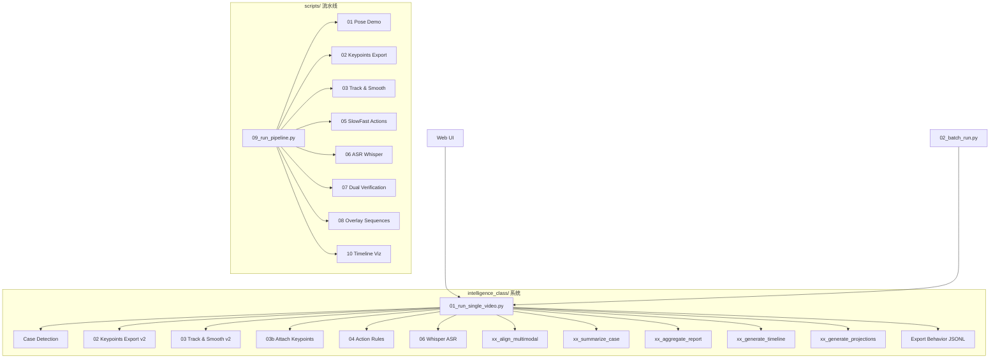

# intelligence_class 子系统 — 完整脚本审查

> 位置: `scripts/intelligence_class/`
> 共 **31 个 Python 文件**，分布在 5 个子目录中

---

## 目录总览

| 子目录 | 文件数 | 职责 |
|---|---|---|
| `_utils/` | 2 | 公共工具：动作映射 + 路径查找 |
| `pipeline/` | 13 | 核心流水线：单视频/批量处理 |
| `tools/` | 8 | 后处理：报告、对齐、可视化、投影 |
| `training/` | 3 | YOLO行为检测器的训练流程 |
| `web_ui/` | 2 | Flask Web UI（结果展示） |

---

## 一、`_utils/` — 公共工具

### [action_map.py](file:///f:/PythonProject/pythonProject/YOLOv11/scripts/intelligence_class/_utils/action_map.py)
- 定义 `ACTION_MAP`（动作 → ID）、`ALL_ACTIONS` 列表、`LABEL_NORMALIZE`（中英文标签归一化）
- 被 `xx_generate_timeline_viz.py` 和 `xx_generate_static_projections.py` 引用

### [pathing.py](file:///f:/PythonProject/pythonProject/YOLOv11/scripts/intelligence_class/_utils/pathing.py)
- `find_project_root()` — 向上查找含 `data/` + `scripts/` 的目录
- `find_sibling_script()` — 在同级或整个 pipeline 目录下查找兄弟脚本
- `resolve_under_project()` — 支持相对/绝对路径统一解析
- 被几乎所有 IC 脚本引用

---

## 二、`pipeline/` — 核心流水线 (13 files)

### 数据集扫描
| 脚本 | 功能 |
|---|---|
| [000.py](file:///f:/PythonProject/pythonProject/YOLOv11/scripts/intelligence_class/pipeline/000.py) | 扫描 `data/` 下所有视角的 mp4，生成 `dataset_index.json`（含视角、时长、FPS） |

### 单视频编排器
| 脚本 | 行数 | 功能 |
|---|---|---|
| [01_run_single_video.py](file:///f:/PythonProject/pythonProject/YOLOv11/scripts/intelligence_class/pipeline/01_run_single_video.py) | 890 | **核心调度器**，9步流水线：Case检测 → 姿态估计 → 跟踪平滑 → 关键点附着 → 动作规则 → ASR → 对齐/报告/时间轴 |

> **与 `scripts/09_run_pipeline.py` 的对比**：IC 版本增加了 Case检测（课堂物件YOLO）、行为导出、多模态对齐、案例摘要、聚合报告、PCA投影 等步骤，功能更完善。

### 批量处理
| 脚本 | 功能 |
|---|---|
| [02_batch_run.py](file:///f:/PythonProject/pythonProject/YOLOv11/scripts/intelligence_class/pipeline/02_batch_run.py) | 基于 `dataset_index.json` 的批量调度器，支持视角筛选、断点续跑、旧→新目录迁移、失败日志、最终报告 |
| [run_batch_all.py](file:///f:/PythonProject/pythonProject/YOLOv11/scripts/intelligence_class/pipeline/run_batch_all.py) | 硬编码遍历 6 个视角×6 个编号的快速批量脚本（Case 1-6） |

### 独立流水线步骤
| 脚本 | 对应步骤 | 功能 |
|---|---|---|
| [02_export_keypoints_jsonl.py](file:///f:/PythonProject/pythonProject/YOLOv11/scripts/intelligence_class/pipeline/02_export_keypoints_jsonl.py) | Step 2 | YOLO Pose 逐帧提取关键点 → `pose_keypoints_v2.jsonl` |
| [03_track_and_smooth_v2.py](file:///f:/PythonProject/pythonProject/YOLOv11/scripts/intelligence_class/pipeline/03_track_and_smooth_v2.py) | Step 3 | **v2 跟踪器**：IoU+中心距贪婪匹配 + EMA平滑 + 生命周期管理，输出 `pose_tracks_smooth.jsonl` |
| [03b_attach_keypoints.py](file:///f:/PythonProject/pythonProject/YOLOv11/scripts/intelligence_class/pipeline/03b_attach_keypoints.py) | Step 3b | 将原始关键点通过 IoU 匹配附着回平滑后的轨迹 |
| [03b_run_tracks_smooth_all.py](file:///f:/PythonProject/pythonProject/YOLOv11/scripts/intelligence_class/pipeline/03b_run_tracks_smooth_all.py) | 批量 | 批量对所有视频执行跟踪平滑（兼容多种索引格式） |
| [04_action_rules.py](file:///f:/PythonProject/pythonProject/YOLOv11/scripts/intelligence_class/pipeline/04_action_rules.py) | Step 4 | 基于关键点的规则检测：举手、低头、站立，输出 `actions.jsonl` |
| [06_run_whisper_asr.py](file:///f:/PythonProject/pythonProject/YOLOv11/scripts/intelligence_class/pipeline/06_run_whisper_asr.py) | Step 5 | OpenAI Whisper ASR，输出 `transcript.jsonl` |
| [batch_process_videos.py](file:///f:/PythonProject/pythonProject/YOLOv11/scripts/intelligence_class/pipeline/batch_process_videos.py) | 独立 | 独立的批量处理器，支持 `pose` 和 `behavior_det`(8类行为YOLO) 两种任务分支 |

### 调试工具
| 脚本 | 功能 |
|---|---|
| [debug_pose_chain.py](file:///f:/PythonProject/pythonProject/YOLOv11/scripts/intelligence_class/pipeline/debug_pose_chain.py) | 对比 `pose_keypoints_v2.jsonl` 和 `pose_tracks_smooth.jsonl` 的 schema/数据质量 |
| [debug_pose_tracks.py](file:///f:/PythonProject/pythonProject/YOLOv11/scripts/intelligence_class/pipeline/debug_pose_tracks.py) | 深度审查 tracks：关键点缺失率、per-track覆盖率、异常样本展示 |

---

## 三、`tools/` — 后处理与报告 (8 files)

| 脚本 | 功能 |
|---|---|
| [xx_align_multimodal.py](file:///f:/PythonProject/pythonProject/YOLOv11/scripts/intelligence_class/tools/xx_align_multimodal.py) | 多模态时序对齐：压缩逐帧检测为事件段 + 视觉事件与ASR文本交叉匹配 → `align.json` |
| [xx_summarize_case.py](file:///f:/PythonProject/pythonProject/YOLOv11/scripts/intelligence_class/tools/xx_summarize_case.py) | 单案例质量摘要：缺失率、连续空帧、置信度统计、质量标签 → `*_summary.json` |
| [xx_aggregate_dataset_report.py](file:///f:/PythonProject/pythonProject/YOLOv11/scripts/intelligence_class/tools/xx_aggregate_dataset_report.py) | 聚合所有案例摘要 → 数据集级报告，含推荐样本评分(倒U型)、分位数统计 |
| [xx_generate_timeline_viz.py](file:///f:/PythonProject/pythonProject/YOLOv11/scripts/intelligence_class/tools/xx_generate_timeline_viz.py) | 将动作数据压缩为 Gantt 时间段 → `timeline_viz.json`（供 Web UI 使用） |
| [xx_generate_static_projections.py](file:///f:/PythonProject/pythonProject/YOLOv11/scripts/intelligence_class/tools/xx_generate_static_projections.py) | PCA 降维投影：基于动作分布特征向量 → `static_projection.json` |
| [summarize_results.py](file:///f:/PythonProject/pythonProject/YOLOv11/scripts/intelligence_class/tools/summarize_results.py) | 旧版汇总报告：遍历每个视角，统计 JSONL 行数/box数/persons数 |
| [dataset_service.py](file:///f:/PythonProject/pythonProject/YOLOv11/scripts/intelligence_class/tools/dataset_service.py) | `DatasetService` 类：为 Web UI 提供只读数据聚合接口（索引/视角统计/失败诊断） |
| [check.py](file:///f:/PythonProject/pythonProject/YOLOv11/scripts/intelligence_class/tools/check.py) | 调试启动器：硬编码测试视频路径，快速运行 `01_run_single_video.py` |
| [move.py](file:///f:/PythonProject/pythonProject/YOLOv11/scripts/intelligence_class/tools/move.py) | 整理输出目录：按视角前缀(`front`, `rear`, `top1`)分类移动文件夹 |

---

## 四、`training/` — 行为检测器训练 (3 files)

| 脚本 | 功能 |
|---|---|
| [01_dataset_convert_case_to_yolo.py](file:///f:/PythonProject/pythonProject/YOLOv11/scripts/intelligence_class/training/01_dataset_convert_case_to_yolo.py) | 将"案例"标注 (jpg+json pixel coords) 转为 YOLO 格式 (归一化 cx,cy,w,h)，8类: dx/dk/tt/zt/js/zl/xt/jz |
| [02_dataset_augment_yolo_labels.py](file:///f:/PythonProject/pythonProject/YOLOv11/scripts/intelligence_class/training/02_dataset_augment_yolo_labels.py) | 数据增强：水平翻转、亮度对比度随机、小角度旋转 |
| [03_train_case_yolo.py](file:///f:/PythonProject/pythonProject/YOLOv11/scripts/intelligence_class/training/03_train_case_yolo.py) | 调用 Ultralytics YOLO.train() 训练 → `runs/detect/case_yolo_train/weights/best.pt` |

---

## 五、`web_ui/` — Flask Web UI (2 files)

| 脚本 | 功能 |
|---|---|
| `app.py` | Flask 服务器：提供 API 接口(`/api/index`, `/api/views_stats`, `/api/case/<id>` 等) + 静态文件服务 |
| `index.html` | 前端单页面：展示案例列表、视频回放（带叠加层）、Gantt 时间轴、PCA 投影散点图 |

---

## 六、两套系统对比

| 维度 | `scripts/` 流水线 | `intelligence_class/` 系统 |
|---|---|---|
| **编排器** | `09_run_pipeline.py` | `01_run_single_video.py` (更完善) |
| **批量处理** | 无 | `02_batch_run.py` + `run_batch_all.py` |
| **动作识别** | SlowFast 深度学习 + 规则双路 | 纯规则 + 8类YOLO行为检测器(自训练) |
| **ASR** | faster-whisper / DashScope API | openai-whisper |
| **数据融合** | `07_dual_verification.py` | `xx_align_multimodal.py` (更灵活) |
| **报告/摘要** | 无 | 案例摘要 + 数据集聚合 + 推荐样本 |
| **可视化** | Matplotlib 时间轴 / 视频叠加 | JSON 时间轴 + PCA投影 + Web UI |
| **训练支持** | 无 | 数据格式转换 + 增强 + YOLO训练 |
| **Web 展示** | 无 | Flask + 单页面前端 |

---

## 七、发现的问题

> [!WARNING]
> ### `xx_summarize_case.py` 中 `_pick_prefix_from_case_dir` 函数重复定义了 **7 次**
> 行 288-391 之间有 6 份完全相同的副本。Python 只会使用最后一个定义，其余是死代码。建议删除重复。

> [!NOTE]
> ### `batch_process_videos.py` 定义了独立的8类行为名 `BEHAVIOR_NAMES`
> 与 `_utils/action_map.py` 中的映射不共享。如果类别有变化需要同步两处。

> [!NOTE]
> ### ASR 引擎不同
> `scripts/06_asr_whisper_to_jsonl.py` 使用 `faster-whisper`，而 IC 的 `06_run_whisper_asr.py` 使用 `openai-whisper`。接口和模型加载方式不同，部署时需要选择一个。

> [!TIP]
> ### 融合建议
> - IC 系统更完善、更适合生产。考虑将 `scripts/` 流水线中 SlowFast 动作识别融入 IC 系统作为可选步骤
> - 统一 ASR 引擎选择（`faster-whisper` 速度更快，`openai-whisper` 兼容性更好）
> - `summarize_results.py`（旧版）可被 `xx_aggregate_dataset_report.py` 替代
