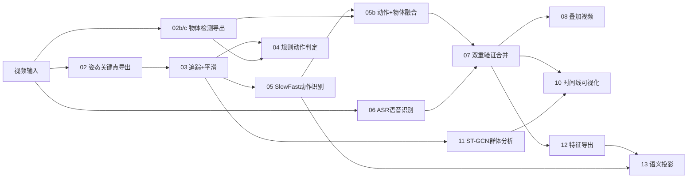

# 📋 Scripts 目录完整检查报告

> 共 **26** 个 Python 脚本，构成一个完整的**课堂行为分析流水线**。

## 🏗️ 流水线架构总览

---

## 📝 各脚本详细说明

| # | 文件名 | 行数 | 用途 | 状态 |
|---|--------|------|------|------|
| 0 | [000.py](file:///f:/PythonProject/pythonProject/YOLOv11/scripts/000.py) | 152 | 数据归一化：合并 `actions.jsonl` + `transcript.jsonl` → `per_person_sequences.json` | ⚠️ 被 07 替代 |
| 1 | [01_pose_video_demo.py](file:///f:/PythonProject/pythonProject/YOLOv11/scripts/01_pose_video_demo.py) | 104 | YOLO11-Pose 逐帧推理 → 骨骼可视化视频 | ✅ 正常 |
| 2 | [02_export_keypoints_jsonl.py](file:///f:/PythonProject/pythonProject/YOLOv11/scripts/02_export_keypoints_jsonl.py) | 100 | YOLO11-Pose → 每帧关键点导出 `pose_keypoints_v2.jsonl` | ✅ 正常 |
| 2b | [02b_check_jsonl_schema.py](file:///f:/PythonProject/pythonProject/YOLOv11/scripts/02b_check_jsonl_schema.py) | 22 | 调试工具：检查 jsonl 前3行的 schema | ✅ 辅助 |
| 2b' | [02b_export_objects_jsonl.py](file:///f:/PythonProject/pythonProject/YOLOv11/scripts/02b_export_objects_jsonl.py) | 187 | YOLO11 目标检测 → `objects.jsonl` (手机/书/笔记本等) | ✅ 正常 |
| 2c | [02c_export_objects_jsonl_custom.py](file:///f:/PythonProject/pythonProject/YOLOv11/scripts/02c_export_objects_jsonl_custom.py) | 169 | 自定义模型物体检测（支持批量推理） | ✅ 正常 |
| 2c' | [02c_objects_video_demo.py](file:///f:/PythonProject/pythonProject/YOLOv11/scripts/02c_objects_video_demo.py) | 130 | 物体检测可视化 + jsonl 同步输出 | ✅ 正常 |
| 3 | [03_track_and_smooth.py](file:///f:/PythonProject/pythonProject/YOLOv11/scripts/03_track_and_smooth.py) | 288 | 人物追踪 + EMA 平滑（课堂先验：横向位置约束） | ✅ 核心 |
| 3b | [03b_objects_video_demo.py](file:///f:/PythonProject/pythonProject/YOLOv11/scripts/03b_objects_video_demo.py) | 151 | 物体检测结果叠加到原视频（含 ffmpeg 音频合并） | ✅ 正常 |
| 4a | [04_action_rules.py](file:///f:/PythonProject/pythonProject/YOLOv11/scripts/04_action_rules.py) | 193 | 基于骨骼关键点的规则引擎：举手/低头/站立 | ✅ 备选路径 |
| 4b | [04_complex_logic.py](file:///f:/PythonProject/pythonProject/YOLOv11/scripts/04_complex_logic.py) | 201 | 复合逻辑：姿态 + 物品 → 细粒度动作（玩手机/看书/写字等） | ✅ 备选路径 |
| 5 | [05_overlay_action_video.py](file:///f:/PythonProject/pythonProject/YOLOv11/scripts/05_overlay_action_video.py) | 238 | 动作标签叠加到视频 | ✅ 正常 |
| 5sf | [05_slowfast_actions.py](file:///f:/PythonProject/pythonProject/YOLOv11/scripts/05_slowfast_actions.py) | 346 | **SlowFast R50** 时序动作识别（9类课堂行为） + 嵌入向量导出 | ✅ 核心 |
| 5b | [05b_fuse_actions_with_objects.py](file:///f:/PythonProject/pythonProject/YOLOv11/scripts/05b_fuse_actions_with_objects.py) | 161 | SlowFast 动作 + 物体检测证据 → 融合判定 | ✅ 核心 |
| 6a | [06_api_asr_realtime.py](file:///f:/PythonProject/pythonProject/YOLOv11/scripts/06_api_asr_realtime.py) | 311 | DashScope API 实时 ASR → `transcript.jsonl` | ✅ 正常 |
| 6b | [06_asr_whisper_to_jsonl.py](file:///f:/PythonProject/pythonProject/YOLOv11/scripts/06_asr_whisper_to_jsonl.py) | 124 | Whisper 本地 ASR → `transcript.jsonl`（中文优化） | ✅ 正常 |
| 7 | [07_dual_verification.py](file:///f:/PythonProject/pythonProject/YOLOv11/scripts/07_dual_verification.py) | 321 | 双重验证合并：动作 + 语音 → `per_person_sequences.json` | ✅ 核心 |
| 8 | [08_overlay_sequences.py](file:///f:/PythonProject/pythonProject/YOLOv11/scripts/08_overlay_sequences.py) | 405 | 最终叠加视频：动作标签 + 字幕 + HUD + H.264转码 | ✅ 核心 |
| 9 | [09_run_pipeline.py](file:///f:/PythonProject/pythonProject/YOLOv11/scripts/09_run_pipeline.py) | 426 | **流水线编排器**：一键运行所有步骤 | ✅ 核心 |
| 10 | [10_visualize_timeline.py](file:///f:/PythonProject/pythonProject/YOLOv11/scripts/10_visualize_timeline.py) | 460 | Matplotlib 行为时间线图 + JSON 数据导出 | ✅ 核心 |
| 11d | [11_debug_pipeline_check.py](file:///f:/PythonProject/pythonProject/YOLOv11/scripts/11_debug_pipeline_check.py) | 228 | 调试工具：检查输出目录所有文件的 schema 完整性 | ✅ 辅助 |
| 11 | [11_group_stgcn.py](file:///f:/PythonProject/pythonProject/YOLOv11/scripts/11_group_stgcn.py) | 252 | **轻量 ST-GCN** 群体交互分析（听讲/讨论/课间） | ✅ 核心 |
| 12 | [12_export_features.py](file:///f:/PythonProject/pythonProject/YOLOv11/scripts/12_export_features.py) | 125 | 学生行为特征工程（注意力/活跃度/互动/分心） | ✅ 正常 |
| 13 | [13_semantic_projection.py](file:///f:/PythonProject/pythonProject/YOLOv11/scripts/13_semantic_projection.py) | 158 | UMAP/PCA 降维 + KMeans 聚类 → 学生画像投影 | ✅ 正常 |
| 99 | [99_debug_objects_stats.py](file:///f:/PythonProject/pythonProject/YOLOv11/scripts/99_debug_objects_stats.py) | 130 | 调试工具：物体检测统计（类别/置信度/面积分布） | ✅ 辅助 |
| — | [export_code.py](file:///f:/PythonProject/pythonProject/YOLOv11/scripts/export_code.py) | 66 | 将所有 .py 文件合并导出为单个 txt 文件 | ✅ 工具 |

---

## 🔍 代码质量检查

### ✅ 优点
- **路径处理统一**：所有脚本使用 `Path(__file__).resolve().parents[1]` 作为项目根，支持相对/绝对路径
- **防御性编程**：JSON 解析有 try/except、空文件检查、FPS 默认值处理
- **Schema 兼容**：多处[safe_get](file:///f:/PythonProject/pythonProject/YOLOv11/scripts/08_overlay_sequences.py#49-54)/`normalize_*` 函数兼容不同字段名
- **增量执行**：[09_run_pipeline.py](file:///f:/PythonProject/pythonProject/YOLOv11/scripts/09_run_pipeline.py) 有缓存检查（[file_is_fresh](file:///f:/PythonProject/pythonProject/YOLOv11/scripts/09_run_pipeline.py#30-43)），避免重复计算
- **模块化设计**：每步独立脚本，可单独调试也可流水线运行

### ⚠️ 潜在问题

| 问题 | 位置 | 严重程度 |
|------|------|----------|
| [000.py](file:///f:/PythonProject/pythonProject/YOLOv11/scripts/000.py) 与 [07_dual_verification.py](file:///f:/PythonProject/pythonProject/YOLOv11/scripts/07_dual_verification.py) 功能重叠 | [000.py](file:///f:/PythonProject/pythonProject/YOLOv11/scripts/000.py) | 低（可删除） |
| [04_action_rules.py](file:///f:/PythonProject/pythonProject/YOLOv11/scripts/04_action_rules.py) 和 [04_complex_logic.py](file:///f:/PythonProject/pythonProject/YOLOv11/scripts/04_complex_logic.py) 未被 [09_run_pipeline.py](file:///f:/PythonProject/pythonProject/YOLOv11/scripts/09_run_pipeline.py) 调用 | pipeline | 低（备选路径） |
| [05_slowfast_actions.py](file:///f:/PythonProject/pythonProject/YOLOv11/scripts/05_slowfast_actions.py) 无自定义权重时使用随机分类头 | L82 | 中 — 结果不可靠 |
| [06_api_asr_realtime.py](file:///f:/PythonProject/pythonProject/YOLOv11/scripts/06_api_asr_realtime.py) API Key 硬编码为空字符串 | L13 | 低 — 有环境变量 fallback |
| [11_debug_pipeline_check.py](file:///f:/PythonProject/pythonProject/YOLOv11/scripts/11_debug_pipeline_check.py) 使用 `int \| None` 类型注解 | L8,38 | 低 — 需 Python 3.10+ |
| `bare except` 在多处（[04_complex_logic.py](file:///f:/PythonProject/pythonProject/YOLOv11/scripts/04_complex_logic.py) L129,144）| 多处 | 低 — 建议改为 `except Exception` |
| [02c_objects_video_demo.py](file:///f:/PythonProject/pythonProject/YOLOv11/scripts/02c_objects_video_demo.py) 使用 `global COCO_NAMES` | L50 | 低 — 可重构 |
| `cv2.VideoCapture` 路径传 `Path` 对象（部分脚本）| [03_track_and_smooth.py](file:///f:/PythonProject/pythonProject/YOLOv11/scripts/03_track_and_smooth.py) L73 | 低 — OpenCV 可能不接受 Path |

---

## 🧪 09 流水线实际执行顺序

[09_run_pipeline.py](file:///f:/PythonProject/pythonProject/YOLOv11/scripts/09_run_pipeline.py) 编排的步骤如下：

| Step | 调用脚本 | 输入 | 输出 |
|------|---------|------|------|
| 02 | [02_export_keypoints_jsonl.py](file:///f:/PythonProject/pythonProject/YOLOv11/scripts/02_export_keypoints_jsonl.py) | 视频 | `pose_keypoints_v2.jsonl` |
| 21 | [01_pose_video_demo.py](file:///f:/PythonProject/pythonProject/YOLOv11/scripts/01_pose_video_demo.py) | 视频 | `pose_demo_out.mp4` |
| 03 | [02b_export_objects_jsonl.py](file:///f:/PythonProject/pythonProject/YOLOv11/scripts/02b_export_objects_jsonl.py) | 视频 | `objects.jsonl` |
| 04 | [03_track_and_smooth.py](file:///f:/PythonProject/pythonProject/YOLOv11/scripts/03_track_and_smooth.py) | keypoints | `pose_tracks_smooth.jsonl` |
| 05 | [05_slowfast_actions.py](file:///f:/PythonProject/pythonProject/YOLOv11/scripts/05_slowfast_actions.py) | 视频+tracks | `actions.jsonl` + `embeddings.pkl` |
| 55 | [05b_fuse_actions_with_objects.py](file:///f:/PythonProject/pythonProject/YOLOv11/scripts/05b_fuse_actions_with_objects.py) | actions+objects | `actions_fused.jsonl` |
| 06 | [06_api_asr_realtime.py](file:///f:/PythonProject/pythonProject/YOLOv11/scripts/06_api_asr_realtime.py) | 视频 | `transcript.jsonl` |
| 07 | [07_dual_verification.py](file:///f:/PythonProject/pythonProject/YOLOv11/scripts/07_dual_verification.py) | actions+transcript | `per_person_sequences.json` |
| 08 | [08_overlay_sequences.py](file:///f:/PythonProject/pythonProject/YOLOv11/scripts/08_overlay_sequences.py) | 视频+actions+transcript | `overlay.mp4` |
| 09 | [03b_objects_video_demo.py](file:///f:/PythonProject/pythonProject/YOLOv11/scripts/03b_objects_video_demo.py) | 视频+objects | `objects_demo_out.mp4` |
| 11 | [11_group_stgcn.py](file:///f:/PythonProject/pythonProject/YOLOv11/scripts/11_group_stgcn.py) | tracks | `group_events.jsonl` |
| 12 | [12_export_features.py](file:///f:/PythonProject/pythonProject/YOLOv11/scripts/12_export_features.py) | per_person | `student_features.json` |
| 13 | [13_semantic_projection.py](file:///f:/PythonProject/pythonProject/YOLOv11/scripts/13_semantic_projection.py) | embeddings+features | `student_projection.json` |
| 10 | [10_visualize_timeline.py](file:///f:/PythonProject/pythonProject/YOLOv11/scripts/10_visualize_timeline.py) | per_person+group | `timeline_chart.png` |

---

## 📊 未被流水线调用的脚本

| 脚本 | 用途 | 建议 |
|------|------|------|
| [000.py](file:///f:/PythonProject/pythonProject/YOLOv11/scripts/000.py) | 早期版本的数据合并 | 可删除（已被 `07` 替代） |
| [02b_check_jsonl_schema.py](file:///f:/PythonProject/pythonProject/YOLOv11/scripts/02b_check_jsonl_schema.py) | jsonl 格式检查 | 保留为调试工具 |
| [02c_export_objects_jsonl_custom.py](file:///f:/PythonProject/pythonProject/YOLOv11/scripts/02c_export_objects_jsonl_custom.py) | 自定义模型物体检测 | 保留备用 |
| [02c_objects_video_demo.py](file:///f:/PythonProject/pythonProject/YOLOv11/scripts/02c_objects_video_demo.py) | 物体检测可视化 | 保留备用 |
| [04_action_rules.py](file:///f:/PythonProject/pythonProject/YOLOv11/scripts/04_action_rules.py) | 规则引擎动作判定 | 保留（轻量替代 SlowFast） |
| [04_complex_logic.py](file:///f:/PythonProject/pythonProject/YOLOv11/scripts/04_complex_logic.py) | 复合逻辑动作判定 | 保留（可作为规则 baseline） |
| [05_overlay_action_video.py](file:///f:/PythonProject/pythonProject/YOLOv11/scripts/05_overlay_action_video.py) | 简单动作叠加 | 保留（已被 `08` 增强替代） |
| [06_asr_whisper_to_jsonl.py](file:///f:/PythonProject/pythonProject/YOLOv11/scripts/06_asr_whisper_to_jsonl.py) | Whisper 本地 ASR | 保留（离线 ASR 方案） |
| [11_debug_pipeline_check.py](file:///f:/PythonProject/pythonProject/YOLOv11/scripts/11_debug_pipeline_check.py) | 调试检查 | 保留 |
| [99_debug_objects_stats.py](file:///f:/PythonProject/pythonProject/YOLOv11/scripts/99_debug_objects_stats.py) | 物体统计 | 保留 |
| [export_code.py](file:///f:/PythonProject/pythonProject/YOLOv11/scripts/export_code.py) | 代码导出 | 保留 |
