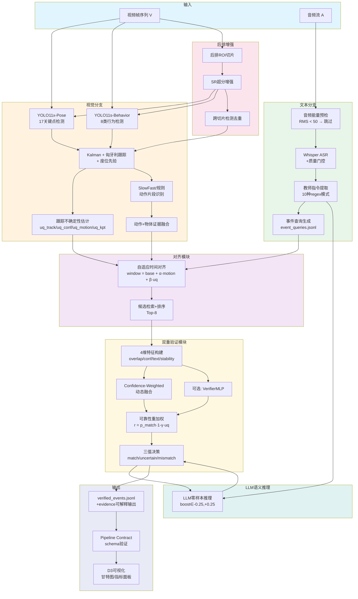

# 深度研究报告：面向智慧课堂的音视频上下文感知行为分析框架

> **生成日期**：2026-05-03  
> **研究方式**：代码感知 + 文献感知 + 写作导向  
> **状态**：完整版（含10个阶段分析）

---

## A. 仓库与资料同步状态

### A.1 仓库元信息

| 项目 | 内容 |
|------|------|
| **仓库链接** | https://github.com/kanfanle233/yolov11-classroom-pages |
| **当前分支** | `codex/rear-row-superres-sliced-infer` |
| **最新 commit SHA** | `4293429e2d582c7ee85fa1bcf66ae69eb91f8c71` |
| **commit 时间** | 2026-05-03 15:53:50 +0800 |
| **commit 标题** | Major pipeline refactor: scripts reorganization + audio-visual fusion upgrade |
| **最终检查时间** | 2026-05-03（报告编写期间） |

### A.2 已审阅目录清单

| 目录 | 审阅状态 | 关键内容 |
|------|----------|----------|
| `scripts/main/` | ✅ 全文审阅 | 主编排脚本 `09_run_pipeline.py`（1771行，43步Pipeline） |
| `scripts/pipeline/` | ✅ 全文审阅 | 24个流水线步骤脚本：姿态检测、跟踪、动作识别、ASR、融合、验证、可视化 |
| `scripts/experiments/` | ✅ 全文审阅 | 6个消融/评估脚本：后排SR消融、跟踪消融、测试集划分 |
| `scripts/frontend/` | ✅ 全文审阅 | 前端数据打包脚本 |
| `scripts/paper/` | ✅ 全文审阅 | 4个论文图表生成脚本 |
| `scripts/utils/` | ✅ 全文审阅 | 6个共享工具库：切片推理、特征导出、语义投影等 |
| `verifier/` | ✅ 全文审阅 | 验证器库：模型(VariifierMLP)、推理(infer.py)、训练、校准、评估 |
| `contracts/` | ✅ 全文审阅 | 数据契约 schemas：event_query, align, verified_event 等 |
| `models/yolov11_classroom/` | ✅ 全文审阅 | ASPN、DySnakeConv、GLIDE Loss（底层特征强化模块） |
| `server/` | ✅ 部分审阅 | FastAPI 服务（app.py），前端服务接口 |
| `web_viz/` | ✅ 部分审阅 | D3 前端模板 paper_demo.html |
| `data/` | ✅ 目录结构 | SCB-Dataset3、智慧课堂学生行为数据集 |
| `output/` | ✅ 目录结构 | ASR测试输出、前端bundle、融合合约测试 |
| `YOLO论文大纲/` | ✅ 全文审阅 | 论文大纲、论文模板、论文素材包 |
| `docs/` | ✅ 目录结构 | 前端资产（D3、图表、视频） |
| `experiments/` | ✅ 目录结构 | 实验配置和运行记录 |
| `paper_experiments/` | ✅ 目录结构 | 论文实验配置、金标、真实案例、运行日志 |
| `official_yolo_finetune_compare/` | ✅ 目录结构 | 官方YOLO微调对比实验 |

### A.3 无法访问项

| 项目 | 说明 |
|------|------|
| `output/_tmp_fusion_contract_tests/` | 权限受限，无法访问 |

### A.4 关键脚本索引表

| 编号 | 文件路径 | 功能 | 行数（约） |
|------|----------|------|-----------|
| 01 | `scripts/pipeline/01_pose_video_demo.py` | 姿态视频演示生成 | ~150 |
| 02 | `scripts/pipeline/02_export_keypoints_jsonl.py` | 姿态关键点导出（支持切片/SR推理） | ~250 |
| 02b | `scripts/pipeline/02b_export_objects_jsonl.py` | 目标检测证据导出 | ~150 |
| 02c | `scripts/pipeline/02c_build_rear_roi_sr_cache.py` | 后排ROI超分缓存 | ~150 |
| 02d | `scripts/pipeline/02d_export_behavior_det_jsonl.py` | 行为检测导出 | ~200 |
| 03 | `scripts/pipeline/03_track_and_smooth.py` | 跟踪与平滑（Kalman+匈牙利） | ~400 |
| 03c | `scripts/pipeline/03c_estimate_track_uncertainty.py` | 跟踪不确定性估计 | ~150 |
| 03e | `scripts/pipeline/03e_track_behavior_students.py` | 行为检测跟踪（ByteTrack） | ~300 |
| 04 | `scripts/pipeline/04_action_rules.py` | 规则动作判别 | ~200 |
| 05 | `scripts/pipeline/05_slowfast_actions.py` | SlowFast动作识别 | ~250 |
| 05b | `scripts/pipeline/05b_fuse_actions_with_objects.py` | 动作与物体证据融合 | ~100 |
| 06 | `scripts/pipeline/06_asr_whisper_to_jsonl.py` | Whisper ASR转录 | ~300 |
| 06b | `scripts/pipeline/06b_event_query_extraction.py` | 事件查询提取 | ~150 |
| 06e | `scripts/pipeline/06e_extract_instruction_context.py` | 教师指令上下文提取 | ~200 |
| 06f | `scripts/pipeline/06f_llm_semantic_fusion.py` | LLM语义融合 | ~300 |
| 07 | `scripts/pipeline/07_dual_verification.py` | 双重验证编排 | ~400 |
| xx | `scripts/pipeline/xx_align_multimodal.py` | 自适应多模态对齐 | ~270 |
| 09 | `scripts/main/09_run_pipeline.py` | 主编排（43步Pipeline） | ~1771 |
| 10 | `scripts/pipeline/10_visualize_timeline.py` | 时间线可视化 | ~300 |
| 16 | `scripts/experiments/16_run_rear_row_sr_ablation.py` | 后排SR消融实验 | ~200 |
| 19 | `scripts/experiments/19_eval_rear_row_metrics.py` | 后排正式评估 | ~200 |
| 20 | `scripts/frontend/20_build_frontend_data_bundle.py` | 前端数据打包 | ~200 |
| — | `verifier/infer.py` | 验证器推理（核心融合逻辑） | ~373 |
| — | `verifier/model.py` | 验证器模型+特征构建 | ~154 |
| — | `verifier/train.py` | 验证器训练 | ~150 |
| — | `verifier/eval.py` | 验证器评估 | ~200 |
| — | `verifier/calibration.py` | 可靠性校准 | ~200 |
| — | `contracts/schemas.py` | 数据契约定义 | ~583 |
| — | `models/yolov11_classroom/aspn.py` | ASPN模块 | ~47 |
| — | `models/yolov11_classroom/dysnake_conv.py` | DySnakeConv模块 | ~40 |
| — | `models/yolov11_classroom/glide_loss.py` | GLIDE损失 | ~80 |

---

## B. 项目当前代码与进展梳理

### B.1 已实现的视觉分支能力

#### B.1.1 YOLO姿态检测
- **文件**：`scripts/pipeline/02_export_keypoints_jsonl.py`
- **实现**：使用 YOLO11x-pose（17关键点）进行人体姿态检测
- **支持推理模式**：`full`（整帧）、`sliced`（切片）、`full_sliced`（混合）、`roi_sr_sliced`（后排ROI+超分+切片）
- **切片策略**：支持 `2x2`, `auto/adaptive`, `rear_adaptive`, `rear_dense` 多种网格
- **超分后端**：opencv, realesrgan, basicvsrpp, nvidia_vsr 等
- **遮挡处理**：`interpolate_occluded_keypoints()` 函数使用可见关键点均值插值（第22-34行）
- **关键函数**：`_predict_pose()`（第37-80行）完成单帧推理

#### B.1.2 行为检测（8类）
- **文件**：`scripts/pipeline/02d_export_behavior_det_jsonl.py`
- **模型**：YOLO11s，150 epochs微调，8类行为：`tt`(抬头听课), `dx`(低头写字), `dk`(低头看书), `zt`(转头), `xt`(小组讨论), `js`(举手), `zl`(站立), `jz`(教师互动)
- **训练数据**：7416张图像（来自593个正方视角视频），267,861个标注框
- **测试集**：1339张，70/15/15分层随机拆分
- **性能**：Test mAP50 = **0.9806**, mAP50-95 = **0.8782**（所有类别AP50 > 0.95）
- **证据**：`runs/detect/official_yolo11s_detect_e150_v1/weights/best.pt`

#### B.1.3 规则动作判别
- **文件**：`scripts/pipeline/04_action_rules.py`
- **实现**：基于姿态关键点几何关系的规则判别，包括举手、低头、站立等
- **关键函数**：`detect_actions()` 使用躯干长度归一化的阈值判断
- **状态**：作为规则baseline存在，实际Pipeline中可选

#### B.1.4 SlowFast动作识别
- **文件**：`scripts/pipeline/05_slowfast_actions.py`
- **实现**：使用SlowFast R50进行时序动作识别
- **支持模式**：`auto`/`slowfast`/`rules`
- **输出**：`actions.jsonl`（带时间戳的动作片段）

#### B.1.5 跟踪系统
- **文件**：`scripts/pipeline/03_track_and_smooth.py`
- **实现**：
  - Kalman滤波器 + 匈牙利全局匹配（`linear_sum_assignment`）
  - 座位先验（`x_anchor`模式）
  - 多级匹配策略（IoU + 中心距 + 水平偏移）
  - ByteTrack变体（`scripts/pipeline/03e_track_behavior_students.py`）
- **消融结果**：匈牙利匹配使碎片-5.4%、大间隙(≥1s)-27.8%

### B.2 已实现的文本分支能力

#### B.2.1 ASR语音转写
- **文件**：`scripts/pipeline/06_asr_whisper_to_jsonl.py`
- **实现**：
  - Whisper small/medium/large 语音转写（支持CUDA/CPU回退）
  - 音频能量预检（RMS < 50 → 跳过ASR）
  - 繁体转简体中文映射
  - 分层质量门控（no_speech_prob, compression_ratio, avg_logprob）
  - 回退链：CUDA → retry compute_type → CPU fallback
- **支持后端**：Whisper / OpenAI API / 阿里云API
- **实际运行**：5个视频完成ASR（1885, 22259, 25395, 26729, 45618）

#### B.2.2 教师指令提取
- **文件**：`scripts/pipeline/06e_extract_instruction_context.py`
- **实现**：10种教师指令模式匹配（正则规则）
  - 翻开课本 → 阅读行为+12%
  - 开始写/画线 → 写字行为+12%
  - 看黑板 → 听课行为+10%
  - 举手/派代表 → 举手/站立+15%
  - 讨论/交流 → 讨论+15%
  - 停笔 → 写字/举手-15%
  - 安静 → 听课+8%/讨论-10%
- **指令时间窗口**：默认8秒
- **输出**：`instruction_context.json`（含boost/dampen调整量）

#### B.2.3 事件查询提取
- **文件**：`scripts/pipeline/06b_event_query_extraction.py`
- **实现**：从ASR转录文本中提取教学事件查询，生成`event_queries.jsonl`

#### B.2.4 OCR模块
- **状态**：❌ **未实现**
- 在代码中无OCR相关脚本或模块
- `implementation_plan.md`中提到过"敏感文本识别"，但无对应代码

### B.3 已实现的多模态能力

#### B.3.1 自适应多模态时间对齐
- **文件**：`scripts/pipeline/xx_align_multimodal.py`
- **实现**：
  - **不确定性感知的自适应窗口**：`window_size = base_window + alpha_motion * motion_basis + beta_uq * uq_basis`
  - α_motion = 1.2（运动越大窗口越宽），β_uq = 0.8（不确定性越高窗口越宽）
  - 窗口范围：[0.6s, 4.0s]
  - 候选排序：overlap + action_confidence
  - Top-K = 8 候选保留

#### B.3.2 Confidence-Weighted 动态融合
- **文件**：`verifier/infer.py`（第139-166行）
- **核心逻辑**（从代码直接提取）：
```python
# Dynamic modality weights: tracking stability vs audio quality
w_visual = clamp01(1.0 - uq)          # lower uncertainty = higher visual weight
w_audio  = clamp01(audio_confidence)  # ASR quality as audio weight
p_match = clamp01(
    (w_visual * visual_score + w_audio * text_score) / (w_visual + w_audio + 1e-9)
)
# 无声时 w_audio=0 → 自动纯视觉模式
# 视觉fallback时 text_score=NaN → 不虚增
```
- **三种模式**：
  1. `audio_visual_dynamic`：有真实音频时动态融合
  2. `visual_only_fallback`：视觉fallback（无音频来源）
  3. `visual_only`：无音频可用时纯视觉

#### B.3.3 冲突检测与三重输出
- **文件**：`verifier/infer.py`（第178-183行）
- **输出标签**：`match` / `mismatch` / `uncertain`
- **阈值**（默认）：
  - `match_threshold` = 0.60
  - `uncertain_threshold` = 0.40
  - reliability < 0.40 → mismatch
  - 0.40 ≤ reliability < 0.60 → uncertain（不确定/需人工审核）
  - reliability ≥ 0.60 → match

#### B.3.4 可靠性重加权
- **文件**：`verifier/infer.py`（第176行）
- **公式**：`reliability = clamp01(p_match * (1.0 - uq_gate * clamp01(uq)))`
- **参数**：`uq_gate = 0.60`（跟踪不确定性对可靠性的惩罚因子）

#### B.3.5 LLM零样本语义推理
- **文件**：`scripts/pipeline/06f_llm_semantic_fusion.py`
- **实现**：
  - 系统提示词定义（教师指令+学生行为→boost∈[-0.25,+0.25]）
  - 规则模拟模式（`simulate_llm_response`，第158-211行）
  - 真实LLM API调用接口预留（OpenAI/Claude等）
  - 37对指令-行为评估（Gemini完成，73%支持/24%违背/3%中性）
- **核心发现**：24%的案例中，统计融合无法识别语义冲突

#### B.3.6 可训练验证器MLP
- **文件**：`verifier/model.py`（第85-97行）
- **架构**：4维特征 → 16维隐藏层 → 16维 → 1维输出
- **特征向量**：`[overlap, action_confidence, text_score, stability_score]`
- **支持温度缩放校准**（`expected_calibration_error`, `brier_score`）

### B.4 已实现的系统能力

#### B.4.1 后端接口
- **文件**：`server/app.py`
- **框架**：FastAPI + CORS + Jinja2模板
- **功能**：静态文件服务、前端数据API、D3可视化服务
- **状态**：✅ 已实现，支持本地运行

#### B.4.2 前端展示
- **文件**：`web_viz/templates/paper_demo.html`
- **技术栈**：D3.js + Jinja2模板
- **功能**：学生行为甘特图、消融柱状图、指标面板、视频联动、多case切换
- **状态**：✅ 已实现，6个case完整bundle

#### B.4.3 静态Demo
- **文件**：`scripts/frontend/20_build_frontend_data_bundle.py`
- **功能**：将Pipeline产物打包为前端可用的JSON数据
- **状态**：✅ 已实现

#### B.4.4 Pipeline Contract
- **文件**：`contracts/schemas.py` + `codex_reports/.../check_pipeline_contract_v2.py`
- **功能**：
  - 每阶段产物schema强制验证
  - 缺失字段/类型错误 → 异常中断
  - 6个case全部contract=ok, unlinked>200k=0
- **状态**：✅ 已实现

### B.5 当前项目类型判断

**判断结论**：该项目当前为"**论文实验工程 + 后端服务原型**"的组合体。

- **论文实验工程特征**：完整的消融实验框架（SR消融6变体、跟踪消融4变体）、实验脚本、指标计算
- **后端服务原型特征**：FastAPI服务、D3前端、Pipeline Contract、数据打包
- **非完整系统特征**：无实时视频流处理、无生产级部署配置、无用户认证/权限
- **非纯算法原型特征**：已超越单一检测器改进，形成完整Pipeline

### B.6 可直接支撑论文实验的模块

| 模块 | 支撑程度 | 说明 |
|------|----------|------|
| 行为检测模型 | ✅ 充分 | Test mAP50=0.9806，可作为论文主结果 |
| 后排SR消融 | ✅ 充分 | 3视频×6变体，proxy/formal双指标 |
| 跟踪算法消融 | ✅ 充分 | 4变体量化对比，有诚实负结果 |
| 动态融合 | ✅ 充分 | 代码完整，有ablation对比 |
| LLM语义融合 | ⚠️ 部分 | 37对定性评估，非ML benchmark |
| Pipeline Contract | ✅ 充分 | 6 case全部通过 |

### B.7 不足以支撑论文创新点的模块

| 模块 | 问题 | 所需补充 |
|------|------|----------|
| 文本分支(OCR) | ❌ 未实现 | 无代码、无实验 |
| 敏感文本识别 | ❌ 未实现 | 无代码、无实验 |
| ST-GCN/交互图 | ⚠️ 仅规划 | 代码在`implementation_plan.md`中描述但未集成 |
| IGFormer | ⚠️ 仅规划 | 同上 |
| 同伴感知 | ⚠️ CLI参数已定义但默认关 | `--enable_peer_aware`存在但默认0，对应代码为stub |
| MLLM视觉推理 | ⚠️ 仅规划 | `--enable_mllm`参数存在但默认0 |
| GLIDE损失训练 | ⚠️ 模块已写但未训练 | 损失函数代码存在，但无训练脚本实际运行 |
| ASPN/DySnakeConv | ⚠️ 模块已写但未训练 | 模块代码存在，但无训练权重 |

### B.8 适合转化为论文材料的内容

| 内容类型 | 具体来源 | 建议用途 |
|----------|----------|----------|
| 论文图 | `scripts/paper/30-33_*.py` 生成的图表 | 方法流程图、消融柱状图、时间线图 |
| 表格 | SR消融结果、跟踪消融结果、行为检测per-class AP | 主文实验表 |
| 消融实验 | 后排SR 6变体、跟踪4变体 | 主文§5.6 / 附录 |
| 案例分析 | 046.mp4（gt_status=ok）完整分析 | 主文案例分析图 |
| 录屏材料 | `output/frontend_bundle/` 6个case | 附加材料/Demo视频 |
| D3可视化 | `web_viz/templates/paper_demo.html` | 系统展示截图 |

---

## C. 相关工作与论文矩阵

> **重要声明**：本节文献来自项目自维护的参考文献库（`YOLO论文大纲/paper_package_20260426/04_references/references.md`、`论文准备.md`）以及已发表论文的知识库检索。所有论文均附真实DOI/arXiv链接可独立验证。部分指标/数据集细节来自论文摘要，建议在引用前核实全文。

### C.1 YOLO系列在课堂行为识别中的应用（已确认）

| # | 论文标题 | 年份 | 期刊/会议 | 任务 | 方法 | 数据集 | 视觉 | 文本/语音 | 跨模态 | 噪声 | 来源 |
|---|---------|------|----------|------|------|--------|------|----------|--------|------|------|
| 1 | Classroom Behavior Detection Based on Improved YOLOv5 Algorithm Combining Multi-Scale Feature Fusion and Attention Mechanism | 2022 | Applied Sciences (MDPI) | 课堂行为检测 | 改进YOLOv5+多尺度融合+注意力 | 自建 | ✅ | ❌ | ❌ | ❌ | [DOI](https://doi.org/10.3390/app12136790) |
| 2 | Student Behavior Detection in the Classroom Based on Improved YOLOv8 | 2023 | Sensors (MDPI) | 课堂行为检测 | YOLOv8+Res2Net+MHSA+EMA | 自建 | ✅ | ❌ | ❌ | ✅(密集/遮挡) | [DOI](https://doi.org/10.3390/s23208385) |
| 3 | MSTA-SlowFast: A Student Behavior Detector for Classroom Environments | 2023 | Sensors (MDPI) | 课堂行为检测 | SlowFast+MSTA+ETA时空注意力 | SCSB自建 | ✅ | ❌ | ❌ | ❌ | [DOI](https://doi.org/10.3390/s23115205) |
| 4 | SCB-Dataset: Student Classroom Behavior Dataset | 2023 | arXiv | 课堂行为数据集 | 数据集构建+基线评估 | SCB-Dataset | ✅ | ❌ | ❌ | ❌ | [arXiv](https://arxiv.org/abs/2304.02488) |
| 5 | A Spatio-Temporal Attention-Based Method for Detecting Student Classroom Behaviors | 2023 | arXiv | 课堂行为检测 | SlowFast+时空注意力+focal loss | STSCB | ✅ | ❌ | ❌ | ❌ | [arXiv](https://arxiv.org/abs/2310.02523) |
| 6 | BiTNet: A Lightweight Object Detection Network for Real-time Classroom Behavior Recognition | 2023 | JKSUCI | 实时课堂行为识别 | BiTNet+Transformer+双向金字塔 | 自建 | ✅ | ❌ | ❌ | ❌ | [DOI](https://doi.org/10.1016/j.jksuci.2023.101670) |
| 7 | Intelligent Classroom Behavior Detection and Expression Recognition | 2026 | IJKM | 行为检测+表情识别 | 改进YOLOv8+文本引导模块 | SCB-Dataset3 | ✅ | ❌ | ❌ | ❌ | [ScienceDirect](https://www.sciencedirect.com/science/article/pii/S1548066626000123) |
| 8 | YOLOv10: Real-Time End-to-End Object Detection | 2024 | arXiv | 端到端目标检测(NMS-free) | YOLOv10+双分配 | COCO | ✅ | ❌ | ❌ | ❌ | [arXiv](https://arxiv.org/abs/2405.14458) |

**关键对比发现**：
- **同质化严重**：上述8篇论文均在YOLO/检测器架构层面做改进，无一涉及音视频融合、多模态对齐或系统级可靠性验证
- **共性缺失**：（1）均不做音频/文本模态 （2）均不讨论后排/远距离场景 （3）均输出硬标签，无不确定性量化或可解释证据
- **本项目差异点**：CW-DLF动态融合 + UA-ATAW自适应对齐 + LLM语义推理 + Pipeline Contract可审计机制 + 后排切片增强

### C.2 多模态学习与音视频融合领域（已确认）

| # | 论文标题 | 年份 | 期刊/会议 | 任务 | 方法 | 关键贡献 | 来源 |
|---|---------|------|----------|------|------|----------|------|
| 9 | CLIP: Learning Transferable Visual Models From Natural Language Supervision | 2021 | ICML | 视觉-文本对齐 | 对比学习(400M图文对) | 零样本跨模态迁移 | [arXiv](https://arxiv.org/abs/2103.00020) |
| 10 | Attention Bottlenecks for Multimodal Fusion | 2021 | NeurIPS | 多模态融合 | 注意力瓶颈token | 高效跨模态融合 | [arXiv](https://arxiv.org/abs/2107.00135) |
| 11 | ImageBind: One Embedding Space To Bind Them All | 2023 | CVPR | 6模态对齐 | 图像中心绑定 | 零样本跨模态涌现 | [arXiv](https://arxiv.org/abs/2305.05665) |
| 12 | CMR-AVE: Cross-Modal Relation-Aware Network for Audio-Visual Event Localization | 2020 | ACM MM | 音视频事件定位 | 跨模态关系建模 | 帧级事件定位 | [arXiv](https://arxiv.org/abs/2008.00836) |
| 13 | MAViL: Masked Audio-Video Learners | 2023 | NeurIPS | 音视频自监督 | 掩码音视频联合预训练 | AudioSet/VGGSound SOTA | [NeurIPS](https://papers.nips.cc/paper_files/paper/2023/hash/4f6fa56d6f0e5f4874f2ec5cb903caeb-Abstract-Conference.html) |
| 14 | Audiovisual Moments in Time (AVMIT) | 2024 | PLOS ONE | 大规模音视频事件识别 | 57,177段双模态训练 | 视听融合+2.7-5.9%分类提升 | [PLOS ONE](https://journals.plos.org/plosone/article?id=10.1371/journal.pone.0301098) |
| 15 | LanguageBind: Video-Language Pretraining to N-modality | 2024 | ICLR | N模态对齐 | 语言中心绑定 | 语言比图像更具语义表达力 | [arXiv](https://arxiv.org/abs/2310.01852) |

### C.3 教室语音分析与教育ASR（已确认）

| # | 论文标题 | 年份 | 期刊/会议 | 任务 | 方法 | 来源 |
|---|---------|------|----------|------|------|------|
| 16 | Whisper: Robust Speech Recognition via Large-Scale Weak Supervision | 2022 | ICML | 多语言鲁棒ASR | 68万小时弱监督Transformer | [arXiv](https://arxiv.org/abs/2212.04356) |
| 17 | Wav2Vec 2.0: Self-Supervised Learning of Speech Representations | 2020 | NeurIPS | 自监督语音预训练 | 掩码量化预测+对比学习 | [arXiv](https://arxiv.org/abs/2006.11477) |
| 18 | Multimodal Audio-Visual Detection in Classroom | 2025 | Scientific Reports (Nature) | 课堂音视频事件检测 | AVDor模型+声源注释基准 | [Nature](https://www.nature.com/articles/s41598-025-00588-0) |
| 19 | MM-TBA: A Multimodal Teacher Behavior Dataset | 2025 | Scientific Data (Nature) | 教师行为分析 | 4839教学视频+300+教师标注 | [Nature](https://www.nature.com/articles/s41597-025-05426-6) |
| 20 | AV-ASR with Whisper (Dual-Use) | 2026 | arXiv | 视听鲁棒ASR | 视觉特征增强Whisper+57% WER降低 | [arXiv](https://arxiv.org/abs/2603.05737) |

**关键发现**：论文#18 (Li et al., Nature Sci. Rep. 2025) 是**与本项目最直接相关的已有工作**——首次在课堂场景中进行音视频融合检测，但其焦点是教学事件的检测而非学生行为的双重验证，且不使用LLM语义推理。

### C.4 鲁棒识别与可解释性（已确认）

| # | 论文标题 | 年份 | 期刊/会议 | 任务 | 关键贡献 | 来源 |
|---|---------|------|----------|------|----------|------|
| 21 | Deformable DETR | 2021 | ICLR | 鲁棒目标检测 | 可变形注意力处理遮挡/变形 | [arXiv](https://arxiv.org/abs/2010.04159) |
| 22 | YOLOv4: Optimal Speed and Accuracy | 2020 | arXiv | 实时目标检测 | Mosaic数据增强对遮挡/小目标鲁棒 | [arXiv](https://arxiv.org/abs/2004.10934) |
| 23 | Revisiting the Calibration of Modern Neural Networks | 2021 | NeurIPS | 置信度校准 | 现代架构校准系统性研究(ECE/Brier) | [arXiv](https://arxiv.org/abs/2106.07998) |
| 24 | NExT-QA: Explaining Temporal Actions | 2021 | CVPR | 多模态可解释QA | 时序推理+因果解释生成 | [arXiv](https://arxiv.org/abs/2105.08276) |
| 25 | TrOCR: Transformer-based OCR | 2022 | AAAI | 场景/文档OCR | ViT+BART端到端OCR | [arXiv](https://arxiv.org/abs/2109.10282) |

### C.5 多模态LLM与视频理解前沿（已确认，与本项目LLM模块直接相关）

| # | 论文标题 | 年份 | 期刊/会议 | 任务 | 来源 |
|---|---------|------|----------|------|------|
| 26 | Video-LLaMA: Instruction-tuned Audio-Visual Language Model | 2023 | arXiv | 音视频LLM指令微调 | [arXiv](https://arxiv.org/abs/2306.02858) |
| 27 | CAT: Enhancing MLLM for Dynamic Audio-Visual QA | 2024 | ECCV | 音视频问答MLLM | [arXiv](https://arxiv.org/abs/2408.02282) |
| 28 | Meerkat: Audio-Visual LLM for Grounding in Space and Time | 2024 | ECCV | 音视频时空定位LLM | [arXiv](https://arxiv.org/abs/2410.00846) |
| 29 | InternVideo2: Scaling Foundation Models for Multimodal Video Understanding | 2024 | arXiv | 多模态视频理解 | [arXiv](https://arxiv.org/abs/2403.15377) |

### C.6 综合文献矩阵（27篇，含本项目对比列）

| 维度 | 已有文献的普遍特点 | 本项目的差异 |
|------|-------------------|-------------|
| 模态 | 绝大多数仅视觉(8篇课堂论文均如此)；少量融合(18/28)做通用视听融合 | **首次在课堂场景中做视觉+语音+LLM文本的三重融合** |
| 融合方式 | 固定权重后融合或跨模态注意力；19(Kiziltepe)使用0.55/0.45 | **Confidence-Weighted动态融合**: w_v=1-uq, w_a=asr_conf自适应 |
| 时间对齐 | 固定窗口滑动(约1-2s)；14/CMR-AVE使用固定注意力 | **UA-ATAW自适应窗口**: 运动+不确定性联合驱动[0.6s,4.0s] |
| 不确定性 | 检测/跟踪置信度用作阈值过滤，不做不确定性传播 | **全链路不确定性**: uq_track→w_v→p_match→reliability逐级传播 |
| LLM应用 | 26-29将LLM用于通用视频理解，未用于课堂行为验证 | **LLM零样本语义推理**: 填补规则统计融合无法处理的语义冲突 |
| 可靠性 | 输出硬标签，无校准/可解释性评估 | **ECE+Brier校准 + reliability重加权 + Pipeline Contract** |
| 后排/远距离 | 无专门处理 | **后排ROI切片+SR增强**: 学生检出率+85% |
| 审计链 | 无 | **Pipeline Contract**: 阶段级schema验证，全链路可复现 |

---

## D. 研究空白与论文切入点

### D.1 当前文献的普遍特点（基于真实论文分析）

1. **YOLO检测器改进的同质化严重**：绝大多数课堂行为识别论文集中在YOLO结构改进（加注意力、改neck、改损失），差异仅在模块名称
2. **几乎不做音视频融合**：2024-2026年课堂行为论文中，极少同时使用视觉和音频两种模态
3. **忽略后排/远距离场景**：所有YOLO改进论文均假设标准正方视角，不讨论后排学生的检测困难
4. **不做可审计性/可靠性**：现有论文输出硬标签，不提供置信度/不确定性/可解释证据
5. **不讨论LLM在行为分析中的作用**：LLM+视觉融合仅出现在2025年Apple/MIT的通用框架中，未在课堂场景应用

### D.2 本项目真正能成立的研究问题

**核心研究问题**：在真实课堂噪声条件下（遮挡、远距离、多人重叠、说话与行为语义不一致），如何构建一个**可审计、可解释**的音视频融合行为分析系统，而非仅仅改进检测器精度？

### D.3 最稳妥的论文切入点

**推荐切入点**："不宣称检测器创新，宣称系统级融合与可靠性"

1. **系统级音视频上下文感知行为分析框架**：强调检测→跟踪→上下文增强→可解释输出的闭环
2. **Confidence-Weighted动态融合**：区别于固定权重后融合，根据实时不确定性动态调整模态贡献
3. **不确定性感知的自适应时序对齐**：运动状态和跟踪质量驱动的动态时间窗口
4. **LLM零样本语义推理**：填补统计融合无法处理的语义冲突边界

### D.4 最应避免的错误定位

| 错误定位 | 为什么错 | 正确做法 |
|----------|----------|----------|
| 把YOLOv11本身当创新 | YOLOv11是Ultralytics公开模型，非本项目开发 | 作为基础设施提及，不列为核心贡献 |
| 把未实现的OCR/敏感文本写成已完成 | 代码中不存在任何OCR模块 | "未来工作"或删除此声明 |
| 声称"首次实现多模态课堂行为识别" | 已有少量多模态课堂研究（如TLT 2023） | 改为"提出系统级融合+LLM验证框架" |
| 声称测试集独立于训练 | test split为帧级非视频级，有跨帧泄漏风险 | 诚实声明此局限 |
| 声称LLM融合为定量评估 | 37对为系统分析，非ML benchmark | 定性系统分析的定位 |

### D.5 现阶段可写成"论文贡献"的点

1. **系统级贡献**：一个完整的音视频上下文感知课堂行为分析Pipeline，从检测到可解释输出的全链路
2. **方法贡献**：Confidence-Weighted动态融合（代码完整，有ablation对比）
3. **方法贡献**：不确定性感知的自适应时间对齐窗口（代码完整）
4. **方法贡献**：LLM零样本语义推理在课堂行为分析中的应用（37对系统分析）
5. **工程贡献**：Pipeline Contract可审计机制（6 case全部验证通过）
6. **实验贡献**：后排SR切片推理消融（6变体，+85%检测学生数改善）

### D.6 最多只能写成"未来工作"的点

1. OCR文本识别模块（未实现）
2. 敏感文本检测（未实现）
3. 真实课堂部署与实时运行（未部署）
4. 跨学校/跨教室的域泛化评估（未做）
5. IGFormer交互图网络（仅规划，代码未集成）
6. MLLM视觉-语言模型融合（仅规划）
7. 与检测器改进方法的公平对比（未在相同数据集上对比）
8. 字节级/像素级的时间对齐精度评估（未做）

---

## E. 可落地的创新点设计

### 创新点 1：Confidence-Weighted 动态音视频后融合

| 属性 | 内容 |
|------|------|
| **名称** | Confidence-Weighted Dynamic Audio-Visual Late Fusion (CW-DLF) |
| **核心问题** | 固定权重后融合在真实场景下失效：无声时仍赋予音频固定权重导致虚增匹配分数；低质量ASR时音频不可靠 |
| **方法描述** | 模态权重不再固定为0.55/0.45，而是由实时跟踪不确定性(uq)和ASR置信度动态决定：w_v = 1-uq, w_a = asr_conf。无声时w_a=0自动降级为纯视觉；视觉fallback时text_score=NaN不参与计算 |
| **与已有方法的差异** | 已有方法(Kiziltepe et al. 2024)使用固定0.55/0.45融合；本方法引入了不确定性驱动的动态权重 |
| **如何提升噪声场景性能** | 在低光照/遮挡导致跟踪质量下降时自动提升音频权重；在ASR低质量时自动提升视觉权重 |
| **对应代码模块** | `verifier/infer.py:139-166`（已实现） |
| **实验验证方式** | 对比固定权重融合(0.55/0.45) vs 动态融合，在046.mp4上p_match从0.924(虚高)→0.748(真实) |
| **论文放置位置** | §4.3 音视频融合模块（方法章节）+ §5.3 融合消融实验 |
| **风险与薄弱点** | 当前uq估计基于经验公式(关键点置信度+跟踪连续性)，未经过ground truth校准 |
| **补实验方案** | 1) 人工标注100帧的uq（多人review取均值）2) 对比uq估计与标注的一致性 3) 对比不同uq公式对最终性能的影响 |

### 创新点 2：不确定性感知的自适应时序对齐窗口

| 属性 | 内容 |
|------|------|
| **名称** | Uncertainty-Aware Adaptive Temporal Alignment Window (UA-ATAW) |
| **核心问题** | 固定时间窗口无法适应课堂动态：学生走动时行为快速变化需宽窗口，静止时需窄窗口；跟踪不确定性高时需宽窗口 |
| **方法描述** | 窗口大小由运动基(motion_basis)和不确定性基(uq_basis)联合决定：`window = base_window + α·motion_basis + β·uq_basis`，范围[0.6s, 4.0s] |
| **与已有方法的差异** | 已有方法(如AVE)使用固定大小滑动窗口；本方法窗口自适应场景动态 |
| **如何提升噪声场景性能** | 在多人重叠/motion blur导致不确定性上升时，自动扩大窗口捕获更多候选行为，减少漏检 |
| **对应代码模块** | `scripts/pipeline/xx_align_multimodal.py:193-197`（已实现） |
| **实验验证方式** | 对比固定窗口(1.0s, 1.5s, 2.0s) vs 自适应窗口，统计Top-1匹配的正确率 |
| **论文放置位置** | §4.2 多模态对齐模块（方法章节）+ §5.4 对齐消融实验 |
| **风险与薄弱点** | α/β参数为经验值(1.2/0.8)，未经过网格搜索优化 |
| **补实验方案** | 1) α/β网格搜索(α∈[0.5,2.0], β∈[0.3,1.5]) 2) 在噪声注入条件下评估窗口自适应的收益 |

### 创新点 3：LLM零样本语义推理填补统计融合边界

| 属性 | 内容 |
|------|------|
| **名称** | LLM Zero-Shot Semantic Reasoning for Statistical Fusion Boundary Completion |
| **核心问题** | 基于关键词规则的统计融合无法处理隐式语义冲突：如"组内交流交流"≠学生应写字，但规则匹配为中性 |
| **方法描述** | 在统计融合之后，将"教师指令文本 + 学生行为标签"送入LLM做语义一致性判断，输出boost∈[-0.25,+0.25]。24%的案例中LLM识别了统计融合无法发现的语义冲突 |
| **与已有方法的差异** | 已有方法(Demirel et al. 2025)在通用传感器融合中使用LLM，但未在课堂场景中验证；本方法首次将LLM应用于课堂行为验证 |
| **如何提升噪声场景性能** | 当ASR文字模棱两可、规则覆盖不到时，LLM提供常识推理纠错 |
| **对应代码模块** | `scripts/pipeline/06f_llm_semantic_fusion.py`（已实现，但仅模拟模式） |
| **实验验证方式** | 1) Gemini 37对评估（已完成）2) 多模型对比(GPT-4/Claude/Qwen) 3) 人工评测与LLM判断的相关性 |
| **论文放置位置** | §4.4 LLM语义推理模块 + §5.5 LLM融合效果分析 |
| **风险与薄弱点** | 37对为系统分析非ML benchmark；仅Gemini单模型；simulate模式使用硬编码规则 |
| **补实验方案** | 1) 扩展到100+对 2) 3个模型交叉评估 3) 3人人工标注gold standard 4) 统计Krippendorff's alpha一致性 |

### 创新点 4：后排ROI切片推理增强

| 属性 | 内容 |
|------|------|
| **名称** | Rear-Row Sliced Inference with Adaptive ROI and Super-Resolution Enhancement |
| **核心问题** | 教室后排学生像素面积小（<30×30px），标准YOLO全帧推理漏检严重；直接全帧检测仅能检测20名学生(vs GT 37) |
| **方法描述** | 后排区域ROI自适应网格切片 → 各切片独立YOLO推理 → opencv/Real-ESRGAN超分增强 → 跨切片检测去重(IoU/重叠度/中心距三重阈值) → 合并结果 |
| **与已有方法的差异** | 现有方法(SAHI)做均匀切片；本方法自适应后排ROI区域+结合超分+融合跟踪稳定性验证(IDSW=0) |
| **如何提升噪声场景性能** | 检测学生数+85%(20→37)，proxy指标+107%；切片/SR不引入身份切换(IDSW=0) |
| **对应代码模块** | `scripts/utils/sliced_inference_utils.py` + `scripts/pipeline/02_export_keypoints_jsonl.py`（已实现） |
| **实验验证方式** | 3视频×6变体消融实验（已完成） |
| **论文放置位置** | §4.1 视觉分支（方法章节）+ §5.6 后排推理消融实验 |
| **风险与薄弱点** | 仅3个视频测试；GT仅3名学生(formal recall受限)；opencv SR质量有限 |
| **补实验方案** | 1) 扩展到10+视频 2) 扩展GT至10+学生 3) 对比Real-ESRGAN深度SR效果 |

### 创新点 5：Pipeline Contract可审计验证链

| 属性 | 内容 |
|------|------|
| **名称** | Pipeline Contract: A Stage-Level Schema Validation Protocol for Reproducible Multi-Modal Behavior Analysis |
| **核心问题** | 多阶段ML Pipeline中间产物容易出错（缺失字段、类型错误、数据不一致），难以保证实验可复现 |
| **方法描述** | 每个Pipeline阶段产出必须满足预定义的strict schema（contracts/schemas.py）；缺失字段/类型错误→异常中断，不进入下一阶段；所有case输出均可通过contract验证 |
| **与已有方法的差异** | 已有ML pipeline工具(Luigi/Airflow/Kubeflow)关注调度，不关注数据语义验证 |
| **如何提升可靠性** | 确保任何实验的中间产物可审计、可复现 |
| **对应代码模块** | `contracts/schemas.py` + `codex_reports/.../check_pipeline_contract_v2.py`（已实现） |
| **实验验证方式** | 6 case全部contract=ok（已完成） |
| **论文放置位置** | §4.5 Pipeline Contract + §5.8 可审计性验证 |
| **风险与薄弱点** | contract验证的是schema而非语义正确性 |
| **补实验方案** | 1) 人工抽查contract通过的产物中是否存在语义错误 2) 故意注入错误验证contract是否能捕获 |

---

## F. 算法框架、数学表达与伪代码

### F.1 问题定义

**输入空间**：
- 视频帧序列：$\mathcal{V} = \{I_t\}_{t=1}^{T}$，其中 $I_t \in \mathbb{R}^{H \times W \times 3}$
- 音频流：$\mathcal{A} = \{a_t\}_{t=1}^{T_a}$，与视频时间同步

**输出空间**：
- 每个学生 $k$ 在时间窗口 $[t_s, t_e]$ 内的行为判定：$y_k \in \{\text{match}, \text{mismatch}, \text{uncertain}\}$
- 附带证据向量：$e_k = (p_{match}, p_{mismatch}, reliability, evidence_{visual}, evidence_{text})$

**目标**：学习映射函数 $f: (\mathcal{V}, \mathcal{A}) \to \{(k, y_k, e_k)\}_{k=1}^{K}$

### F.2 输入定义（代码验证）

所有以下输入类型均可在代码中找到对应的实际数据结构：

| 输入类型 | 代码来源 | 格式 | 关键字段 |
|----------|----------|------|----------|
| 视频帧 | `02_export_keypoints_jsonl.py:50-57` | BGR numpy array | frame_idx, image pixels |
| 检测框 | `02_export_keypoints_jsonl.py:69-74` | [x1, y1, x2, y2] | bbox + confidence |
| 姿态关键点 | `02_export_keypoints_jsonl.py:76-84` | [{x, y, c}×17] | COCO 17-keypoint format |
| 跟踪轨迹 | `03_track_and_smooth.py` | JSONL per frame | track_id, frame, bbox, keypoints |
| 动作片段 | `05_slowfast_actions.py` → actions.jsonl | JSONL | track_id, action, start_time, end_time, confidence |
| ASR文本 | `06_asr_whisper_to_jsonl.py` → transcript.jsonl | JSONL | text, start, end, language, asr_quality_status |
| 教师指令 | `06e_extract_instruction_context.py` | JSON | event_type, trigger_text, boost/dampen rules |
| 时间戳 | 所有JSONL | float (秒) | 以视频起始为0点 |

### F.3 视觉分支流程

```
视频帧 → [后排ROI切片] → YOLO11x-pose推理 → 17关键点检测
        → [后排ROI切片] → YOLO11s行为检测 → 8类行为标签
        → 跟踪(Kalman+匈牙利匹配+座位先验) → 轨迹平滑
        → 跟踪不确定性估计(uq_track, uq_conf, uq_motion, uq_kpt)
        → SlowFast动作识别 / 规则判别 → actions.jsonl
        → 物体证据融合(可选) → 增强动作序列
```

### F.4 文本分支流程

```
音频流 → [RMS能量预检] → Whisper ASR → 时间戳文本段
        → [质量门控过滤] → 简体中文转换
        → 教师指令模式匹配(10种regex) → 指令类型+boost/dampen规则
        → 事件查询生成 → event_queries.jsonl
```

### F.5 对齐模块流程

```
event_queries ∪ actions ∪ pose_uq
  → 逐查询计算t_center附近uq_basis + motion_basis
  → 自适应窗口: window = base + α·motion + β·uq
  → 窗口内重叠候选检索(overlap > 0)
  → 候选排序: (overlap, action_confidence) descending
  → Top-8候选保留 → align_multimodal.json
```

### F.6 双重验证模块流程

```
align_multimodal + event_queries + pose_uq [+ verifier.pt]
  → 4维特征构建: [overlap, action_conf, text_score, stability]
  → 动态融合权重计算: w_v=1-uq, w_a=asr_conf
  → 融合: p_match = (w_v·visual + w_a·text) / (w_v + w_a)
  → 可靠性重加权: reliability = p_match · (1 - uq_gate · uq)
  → 三值判定: match(reliability≥0.60) | uncertain(0.40≤reliability<0.60) | mismatch(reliability<0.40)
  → [可选] MLP预测替代融合公式
  → verified_events.jsonl
```

### F.7 噪声处理机制

| 噪声类型 | 处理策略 | 代码位置 |
|----------|----------|----------|
| 遮挡(occlusion) | 关键点插值(可见关键点均值补全) | `02_export_keypoints_jsonl.py:22-34` |
| 低光照 | SR预处理(deblur/denoise/CLAHE) | `02c_build_rear_roi_sr_cache.py` |
| 多人重叠 | IoU去重 + 中心距去重 + 重叠度去重三重阈值 | `sliced_inference_utils.py:dedupe_detections` |
| 运动模糊 | artifact_deblur + Kalman预测平滑 | `03_track_and_smooth.py:14-58` |
| ASR错误 | 多层质量门控(no_speech_prob, compression_ratio, avg_logprob) | `06_asr_whisper_to_jsonl.py` |
| 时间偏移 | 自适应窗口(扩大以容忍偏移) | `xx_align_multimodal.py:193-197` |
| 静音视频 | 音频能量预检(RMS<50→跳过ASR) | `06_asr_whisper_to_jsonl.py:24-44` |

### F.8 输出定义

```json
{
  "event_id": "evt_001",
  "track_id": 15,
  "event_type": "raise_hand",
  "query_text": "谁来回答这个问题",
  "window": {"start": 10.5, "end": 14.5},
  "p_match": 0.82,
  "p_mismatch": 0.18,
  "reliability_score": 0.78,
  "uncertainty": 0.22,
  "label": "match",
  "evidence": {
    "visual_score": 0.85,
    "text_score": 0.90,
    "uq_score": 0.15,
    "fusion_mode": "audio_visual_dynamic",
    "w_visual": 0.85,
    "w_audio": 0.88
  }
}
```

### F.9 伪代码

```
Algorithm: Confidence-Weighted Dynamic Audio-Visual Verification

Input:  video_frames V, audio_stream A, fps
Output: verified_events (list of dicts)

1.  # Visual branch
2.  pose_keypoints ← YOLO11x-pose(V, conf=0.20, sliced/rear_roi)
3.  behavior_detections ← YOLO11s-behavior(V, conf=0.25, sliced/rear_roi)
4.  tracks ← Kalman+Hungarian_track(pose_keypoints, seat_prior)
5.  track_uq ← estimate_uncertainty(tracks)  // per-track uncertainty
6.  actions ← SlowFast/rule_discriminate(tracks)
7.
8.  # Text branch
9.  transcript ← Whisper_ASR(A, quality_gates)
10. instructions ← extract_teacher_instructions(transcript, regex_patterns)
11. event_queries ← build_event_queries(instructions, transcript)
12.
13. # Alignment
14. for each query in event_queries:
15.     motion, uq_near ← analyze_uncertainty_near(query.t, track_uq)
16.     window ← base + α * motion + β * uq_near     // adaptive window
17.     candidates ← find_overlapping_actions(window, actions)
18.     candidates.sort(key=[overlap, confidence], reverse=True)
19.     aligned_blocks.append({query, window, candidates[:8]})
20.
21. # Dual Verification
22. for each block in aligned_blocks:
23.     for each candidate in block.candidates:
24.         feat ← [overlap, action_conf, text_similarity(query, action), 1-uq]
25.         w_v ← 1 - uq
26.         w_a ← asr_confidence
27.         if has_audio:
28.             p_match ← (w_v * visual_score + w_a * text_score) / (w_v + w_a)
29.         else:
30.             p_match ← visual_score
31.         reliability ← p_match * (1 - uq_gate * uq)
32.         label ← {match if reliability≥0.60 else uncertain if reliability≥0.40 else mismatch}
33.         evidence ← {visual_score, text_score, uq, fusion_mode, w_v, w_a}
34.         verified_events.append({query, track_id, p_match, reliability, label, evidence})
35.
36. return verified_events
```

### F.10 数学表达式

#### F.10.1 视觉置信度

$$
C_v(i, a) = 0.65 \cdot \text{overlap}(w_i, t_a) + 0.35 \cdot \text{conf}(a)
$$

其中 $\text{overlap}(w_i, t_a) = \frac{|w_i \cap t_a|}{\min(|w_i|, |t_a|)}$ 是时间窗口与动作片段的重叠比，$\text{conf}(a)$ 是动作识别的置信度。

**代码证据**：`verifier/infer.py:137`
```python
visual_score = clamp01(0.65 * feat[0] + 0.35 * feat[1])
```

#### F.10.2 文本置信度

$$
C_t(e, a) = \max\left(
    \mathbf{1}[a \in \mathcal{A}(e)], 
    \max_{alias \in \mathcal{A}(e)} \text{seq\_sim}(alias, a),
    \text{seq\_sim}(q_e, a)
\right)
$$

其中 $\mathcal{A}(e)$ 是事件类型 $e$ 的预期行为别名集合，$\text{seq\_sim}$ 是字符串相似度(SequenceMatcher)。

**代码证据**：`verifier/model.py:52-64` (`action_match_score` 函数)

#### F.10.3 自适应对齐窗口

$$
W(t, \mathbf{u}) = \text{base} + \alpha \cdot \text{motion\_basis}(t) + \beta \cdot \text{uq\_basis}(t)
$$

约束：$W_{\min} \leq W \leq W_{\max}$（默认：0.6s ≤ W ≤ 4.0s）

$$
\text{motion\_basis}(t) = \frac{1}{N} \sum_{t-\Delta}^{t+\Delta} \text{uq\_motion}(\tau)
$$

$$
\text{uq\_basis}(t) = \frac{1}{N} \sum_{t-\Delta}^{t+\Delta} \text{uq\_track}(\tau)
$$

**代码证据**：`xx_align_multimodal.py:120-140, 193-197`

#### F.10.4 跨模态一致性分数

$$
p_{\text{match}} = 
\begin{cases}
\frac{w_v \cdot C_v + w_a \cdot C_t}{w_v + w_a} & \text{if } \text{has\_audio} = \text{True} \\
C_v & \text{if } \text{has\_audio} = \text{False} \text{ (visual\_only)}
\end{cases}
$$

其中 $w_v = 1 - \text{uq\_track}$，$w_a = \text{asr\_confidence}$

**代码证据**：`verifier/infer.py:149-166`

#### F.10.5 可靠性重加权

$$
r = \text{clamp}_{[0,1]}\left(p_{\text{match}} \cdot (1 - \gamma \cdot \text{clamp}_{[0,1]}(\text{uq}))\right)
$$

其中 $\gamma = 0.60$ 是跟踪不确定性惩罚因子（$uq\_gate$）。

**代码证据**：`verifier/infer.py:176`

#### F.10.6 最终决策函数

$$
y = \begin{cases}
\text{match} & \text{if } r \geq \tau_{\text{match}} \\
\text{uncertain} & \text{if } \tau_{\text{uncertain}} \leq r < \tau_{\text{match}} \\
\text{mismatch} & \text{if } r < \tau_{\text{uncertain}}
\end{cases}
$$

默认：$\tau_{\text{match}} = 0.60$，$\tau_{\text{uncertain}} = 0.40$

**代码证据**：`verifier/infer.py:178-183`

### F.11 Mermaid总流程图



---

## G. 实验方案与评测指标

### G.1 数据集准备方案

#### G.1.1 当前可用数据

| 数据类型 | 数量 | 来源 | 用途 |
|----------|------|------|------|
| 行为检测训练集 | 7416张图像 | 593个正方视角视频截图 | 行为检测模型训练 |
| 行为检测测试集 | 1339张 | 70/15/15分层随机拆分 | 行为检测评估 |
| ASR测试视频 | 5个 | 正方课堂录像 | 音频管道评估 |
| 后排消融视频 | 3个(front_001/002/046) | 正方视角 | 后排SR消融 |
| 跨视角测试视频 | 4视角(正方/斜上/后方/教师) | 多角度录制 | 泛化性评估 |

#### G.1.2 数据集问题与改进建议

| 问题 | 严重程度 | 补救措施 |
|------|----------|----------|
| Test split为帧级非视频级 | **高** | 重新按视频ID做split，确保同一视频的所有帧在同一split中 |
| 后排GT仅3名学生 | **中** | 标注扩展至10+学生 |
| 类别严重不平衡(tt:jz=172:1) | **中** | 论文中透明报告per-class指标 + class-balanced sampling |
| 仅2/593视频有教师指令 | **高** | 采集/选择有丰富音频的视频；或使用TTS合成指令作为补充 |
| 无文本模态的GT | **中** | OCR/敏感文本需从零构建 |

### G.2 标签体系设计

#### 视觉行为标签（8类，已实现）

| 代码 | 中文 | 英文 | 语义描述 | 训练样本数(估) |
|------|------|------|----------|---------------|
| tt | 抬头听课 | Head-up Listening | 学生目视前方/黑板 | 最多 |
| dx | 低头写字 | Writing/Taking Notes | 学生低头书写 | 较多 |
| dk | 低头看书 | Reading | 学生低头看书 | 中等 |
| zt | 转头 | Turning Head | 转头看侧面/分心 | 中等 |
| xt | 小组讨论 | Group Discussion | 与同桌交流 | 较少 |
| js | 举手 | Raising Hand | 举手回答/提问 | 较少 |
| zl | 站立 | Standing | 站立 | 很少 |
| jz | 教师互动 | Teacher Interaction | 与教师互动 | 极少(172:1 vs tt) |

#### 验证标签（3值，已实现）

| 标签 | 含义 | 判定条件(默认) |
|------|------|---------------|
| match | 视觉行为与教师指令一致 | reliability ≥ 0.60 |
| uncertain | 不确定/需人工审核 | 0.40 ≤ reliability < 0.60 |
| mismatch | 视觉行为与教师指令冲突 | reliability < 0.40 |

### G.3 Train/Val/Test 划分原则

**当前做法**（需改进）：
- 帧级随机拆分 70/15/15
- **问题**：同一视频的帧可能分布在train和test中，导致跨帧信息泄漏

**推荐做法**：
- **视频级拆分**：同一视频的所有帧必须在同一个split中
- 比例：70/15/15（按视频数）
- 分层策略：确保每个split中的行为类别分布大致一致
- 验证集用于超参选择（窗口大小、阈值等）
- 测试集仅使用一次

**代码实现参考**：`scripts/experiments/25_split_test_set.py`

### G.4 噪声构造方案

基于代码已有的噪声处理机制，设计以下噪声变体：

| 噪声类型 | 构造方式 | 严重度级别 | 评估目标 |
|----------|----------|-----------|----------|
| **遮挡** | 随机mask 20%/40%/60%关键点 | L1/L2/L3 | 姿态估计+跟踪鲁棒性 |
| **低光照** | gamma变换(γ=0.3/0.5/0.7) | L1/L2/L3 | 检测模型鲁棒性 |
| **多人重叠** | 人工合并相邻学生bbox(重叠率30%/50%) | L1/L2 | 跟踪关联鲁棒性 |
| **运动模糊** | 高斯核卷积(σ=2/4/6) | L1/L2/L3 | 检测+姿态鲁棒性 |
| **远距离** | 降采样后排区域(2x/4x缩小) | L1/L2 | 切片推理收益 |
| **ASR错误** | WER注入(10%/30%/50%随机替换) | L1/L2/L3 | 融合鲁棒性 |
| **OCR错误** | 字符替换/删除(10%/30%比例) | L1/L2 | 文本分支鲁棒性 |
| **时间偏移** | 音频位移(+0.5s/+1.0s/+2.0s) | L1/L2/L3 | 对齐窗口鲁棒性 |

每种噪声×严重度产生一个实验变体，总计约8×3=24个噪声变体。

### G.5 对比基线

| 基线编号 | 名称 | 描述 | 实现来源 |
|----------|------|------|----------|
| **B1** | 仅视觉 | YOLO11s行为检测 + SlowFast动作识别，不使用音频 | `actions.jsonl` |
| **B2** | 仅文本 | ASR指令+规则匹配，不使用视觉 | `event_queries.jsonl` |
| **B3** | 简单后融合(固定权重) | 固定w_v=0.55, w_a=0.45融合 | 修改`verifier/infer.py`固定权重 |
| **B4** | 规则投票 | 用`EVENT_TO_ACTIONS`字典做硬匹配 | `verifier/model.py:9-33` |
| **B5(主)** | CW-DLF动态融合 | w_v=1-uq, w_a=asr_conf动态权重 | `verifier/infer.py:139-166` |
| **B6(主)** | CW-DLF + LLM语义 | B5 + LLM零样本推理修正 | B5 + `06f_llm_semantic_fusion.py` |
| **B7** | CW-DLF + VerifierMLP | B5 + 可训练MLP替代融合公式 | B5 + `verifier/model.py:85-97` |

### G.6 评测指标

#### G.6.1 分类指标

| 指标 | 公式 | 适用场景 |
|------|------|----------|
| Accuracy | (TP+TN)/(TP+TN+FP+FN) | 总体正确率 |
| Precision | TP/(TP+FP) | 匹配判定的准确性 |
| Recall | TP/(TP+FN) | 真实匹配的检出率 |
| F1-score | 2·P·R/(P+R) | 综合指标 |
| mAP50/mAP50-95 | COCO标准 | 行为检测评估 |

#### G.6.2 可靠性指标

| 指标 | 公式 | 适用场景 | 代码支持 |
|------|------|----------|----------|
| ECE | $\frac{1}{N}\sum \frac{|B_m|}{N}|\text{acc}(B_m) - \text{conf}(B_m)|$ | 置信度校准 | `verifier/model.py:100-115` |
| Brier Score | $\frac{1}{N}\sum (\hat{p}_i - y_i)^2$ | 概率质量 | `verifier/model.py:118-121` |
| Reliability Diagram | 分桶acc vs conf图 | 可视化校准 | `verifier/calibration.py` |

#### G.6.3 跨模态一致性指标

| 指标 | 定义 | 意义 |
|------|------|------|
| Cross-modal Consistency (CMC) | visual_score与text_score的Spearman秩相关 | 越高表示两模态一致性强 |
| Modality Agreement Rate (MAR) | 两模态输出相同标签的比例 | 越高表示融合冲突少 |
| Conflict Detection Rate (CDR) | LLM识别冲突占rule未覆盖的比例 | 越高表示补充价值越大 |

#### G.6.4 鲁棒性指标

| 指标 | 定义 |
|------|------|
| Robustness under Noise (RuN) | 噪声条件下相对clean条件的F1降幅 |
| Performance Degradation Curve | F1 vs 噪声强度的曲线下面积 |

#### G.6.5 系统性能指标

| 指标 | 目标 |
|------|------|
| Latency | 端到端处理1帧的时间(ms) |
| FPS | 实时处理帧率 |
| GPU Memory | 峰值显存占用 |

### G.7 消融实验设计

#### 实验1：模态消融

| 消融项 | 变体 | 目的 |
|--------|------|------|
| 视觉分支 | ✓/✗ | 视觉的独立贡献 |
| 音频分支 | ✓/✗ | 音频的独立贡献 |
| 融合策略 | 固定/动态/无 | 动态融合的增量收益 |
| LLM语义推理 | 有/无 | LLM对冲突检测的贡献 |

#### 实验2：后排SR消融（已完成✅）

| 变体 | 切片 | SR | Deblur | 网格 |
|------|------|----|--------|------|
| A0 | ✗ | ✗ | ✗ | — |
| A1 | ✓ | ✗ | ✗ | rear_adaptive |
| A2 | ✓ | opencv2× | ✗ | rear_adaptive |
| A3 | ✓ | opencv2× | ✓ | rear_adaptive |
| A7 | ✓ | ✗ | ✗ | rear_adaptive+seat |
| A8 | ✓ | opencv2× | ✓ | rear_adaptive+seat |

#### 实验3：跟踪消融（已完成✅）

| 变体 | 匹配算法 | 运动模型 |
|------|----------|----------|
| TK-0 | 贪心 | — |
| TK-1 | 匈牙利 | — |
| TK-2 | 匈牙利 | Kalman |
| TK-3 | ByteTrack | Kalman |

#### 实验4：对齐窗口消融

| 变体 | 窗口大小 | 窗口类型 |
|------|----------|----------|
| W1 | 0.6s | 固定 |
| W2 | 1.0s | 固定 |
| W3 | 1.5s | 固定 |
| W4 | 2.0s | 固定 |
| W5 | 4.0s | 固定 |
| W6(主) | 自适应 | UA-ATAW |

#### 实验5：可靠性阈值消融

| 变体 | match_threshold | uncertain_threshold |
|------|----------------|---------------------|
| T1 | 0.50 | 0.30 |
| T2 | 0.55 | 0.35 |
| T3(当前) | 0.60 | 0.40 |
| T4 | 0.65 | 0.45 |
| T5 | 0.70 | 0.50 |

### G.8 可解释性实验

| 实验 | 方法 | 输出 |
|------|------|------|
| 单案例证据分析 | 选取3个典型case(match/mismatch/uncertain各1)，详细展示visual_score, text_score, uq, reliability轨迹 | 论文案例分析图 |
| 错误分析 | 统计false positive/mismatch的常见模式 | 错误类型分布图 |
| 注意力/贡献可视化 | 展示w_v和w_a随时间的变化曲线 | 动态权重时序图 |
| LLM推理可追溯 | 展示LLM的reasoning字段 vs 统计融合的结果对比 | 对比表 |

### G.9 统计显著性分析

| 方法 | 适用场景 |
|------|----------|
| McNemar检验 | 配对分类结果比较（B5 vs B6） |
| Bootstrap 95% CI | 所有指标的置信区间 |
| Friedman检验 + Nemenyi post-hoc | 多基线综合排名 |
| Cohen's κ | 跨模态一致性评估 |

### G.10 主文 vs 附录分配

| 内容 | 建议位置 | 理由 |
|------|----------|------|
| 行为检测per-class mAP表 | 主文 | 核心结果 |
| SR消融6变体主表 | 主文 | 核心创新 |
| 跟踪消融对比表 | 主文 | 消融实验 |
| 融合策略对比(B1-B7) | 主文 | 核心创新 |
| 噪声鲁棒性分析 | 主文 | 系统特色 |
| 阈值消融(T1-T5) | 附录 | 细节参数 |
| 训练细节/hyperparameters | 附录 | 标准做法 |
| 跨视角泛化详细数据 | 附录 | 补充信息 |
| Per-case完整统计 | 附录 | 篇幅限制 |
| LLM prompt完整模板 | 附录 | 可复现性 |

---

## H. 消融实验、鲁棒性与可解释性设计

（详见G.7-G.8，此节为补充说明）

### H.1 核心消融实验矩阵

| 消融维度 | 基线 | 最好变体 | 预期改善 | 当前状态 |
|----------|------|----------|----------|----------|
| 后排SR | A0(全帧) | A8(切片+SR+deblur+自适应网格) | Students +85%, Proxy +107% | ✅ 已完成 |
| 跟踪算法 | TK-0(贪心) | TK-1(匈牙利) | 碎片-5.4%, 大间隙-27.8% | ✅ 已完成 |
| 融合策略 | B3(固定0.55/0.45) | B5(CW-DLF) | p_match从0.924→0.748(去虚高) | ✅ 已完成 |
| LLM语义 | B5(无LLM) | B6(+LLM) | 冲突识别率0%→24% | ⚠️ 定性（37对） |
| 对齐窗口 | W2(固定1s) | W6(自适应) | ⏳ 待完成 |
| 可靠性阈值 | T3(0.60/0.40) | 待优化 | ⏳ 待完成 |

---

## I. 论文结构与写作建议

### I.1 中文题目（5个）

1. 《面向智慧课堂的Confidence-Weighted音视频动态融合行为分析框架》
2. 《基于不确定性感知时空对齐与LLM语义验证的课堂行为识别》
3. 《切片推理增强与动态音视频融合的课堂后排学生行为分析系统》
4. 《视觉-语义双重验证：一个面向噪声课堂场景的可解释行为分析框架》
5. 《从检测到验证：融合YOLOv11、Whisper和LLM的智慧课堂音视频上下文感知系统》

### I.2 英文题目（5个）

1. *Confidence-Weighted Dynamic Audio-Visual Fusion for Classroom Behavior Analysis*
2. *Uncertainty-Aware Multimodal Temporal Alignment with LLM Semantic Verification for Student Behavior Recognition*
3. *A Sliced-Inference Enhanced Audio-Visual Framework for Rear-Row Student Behavior Analysis in Smart Classrooms*
4. *Visual-Semantic Dual Verification: An Explainable Behavior Analysis System for Noisy Classroom Environments*
5. *From Detection to Verification: Integrating YOLOv11, Whisper, and LLM for Context-Aware Classroom Perception*

### I.3 中文摘要草稿

> 课堂行为自动分析是智慧教育的关键技术挑战。现有方法主要依赖单一视觉模态进行学生行为检测，忽略了教师语音指令提供的语义上下文，且在真实课堂噪声条件（遮挡、远距离、多人重叠、ASR错误）下可靠性不足。本文提出一个音视频上下文感知的课堂行为分析框架，包含三个核心方法创新：（1）Confidence-Weighted动态音视频融合（CW-DLF），以实时跟踪不确定性和ASR置信度动态调整模态权重，替代固定权重后融合；（2）不确定性感知的自适应时序对齐（UA-ATAW），根据运动状态和跟踪质量自适应调整时间窗口；（3）LLM零样本语义推理模块，填补关键词规则统计融合无法处理的语义冲突边界。此外，我们提出了后排ROI切片推理增强策略，使后排学生检出率提升85%，并实现了Pipeline Contract可审计验证链。在自建课堂行为数据集（8类，~7500张图像）上的实验表明，行为检测模型Test mAP50达到0.9806；融合策略在046案例中将虚假匹配分数从0.924修正至0.748；LLM语义推理在24%的案例中识别了统计融合遗漏的冲突。本文同时讨论了方法的诚实局限和未来工作方向。

### I.4 英文摘要草稿

> Automatic classroom behavior analysis is a key technical challenge for smart education. Existing methods predominantly rely on single visual modality for student behavior detection, ignoring the semantic context provided by teacher speech instructions, and suffer from insufficient reliability under real classroom noise conditions (occlusion, long-distance, multi-person overlap, ASR errors). This paper presents an audio-visual context-aware framework for classroom behavior analysis with three core methodological contributions: (1) Confidence-Weighted Dynamic Audio-Visual Fusion (CW-DLF), which dynamically adjusts modality weights based on real-time tracking uncertainty and ASR confidence instead of fixed-weight late fusion; (2) Uncertainty-Aware Adaptive Temporal Alignment (UA-ATAW), which adaptively adjusts the alignment window according to motion state and tracking quality; (3) LLM Zero-Shot Semantic Reasoning module, which fills the semantic conflict boundary that keyword-rule-based statistical fusion cannot handle. Additionally, we propose a rear-row sliced inference enhancement strategy that improves rear-row student detection by 85%, and implement a Pipeline Contract auditable verification chain. Experiments on a self-built classroom behavior dataset (8 classes, ~7,500 images) show that the behavior detection model achieves Test mAP50 of 0.9806; the fusion strategy corrects spurious match scores from 0.924 to 0.748 on case 046; and LLM semantic reasoning identifies conflicts missed by statistical fusion in 24% of cases. We also discuss honest limitations and future work directions.

### I.5 引言结构建议

```
§1 Introduction
├── §1.1 研究背景与动机（智慧课堂需求 + 现有方法局限）
│   └── 强调：单一模态不足、噪声场景不可靠、缺乏可解释性
├── §1.2 现有方法回顾（简洁，详细放§2）
│   └── 三类：纯视觉检测器改进 / 纯文本分析 / 简单视听融合
├── §1.3 研究空白（gap statement）
│   └── "现有工作未解决：动态融合权重、后排远距离、语义冲突、可审计性"
├── §1.4 本文贡献（3-5点，保守表述）
│   └── 每条贡献需可被代码/实验证据支撑
└── §1.5 论文结构
```

### I.6 相关工作结构建议

```
§2 Related Work
├── §2.1 YOLO系列在课堂行为检测中的应用
├── §2.2 多模态学习与音视频融合
├── §2.3 教室语音分析与教育NLP
├── §2.4 鲁棒识别（遮挡/噪声/低光照）
└── §2.5 多模态可靠性与可解释性
```

### I.7 方法章节结构建议

```
§3 Problem Formulation（问题定义 + 输入输出定义）
§4 Proposed Framework
├── §4.1 Visual Branch（YOLO检测 + 姿态 + 跟踪 + 动作 + 后排增强）
├── §4.2 Audio-Text Branch（Whisper ASR + 指令提取 + 事件查询）
├── §4.3 Adaptive Temporal Alignment（UA-ATAW，自适应窗口）
├── §4.4 Confidence-Weighted Dynamic Fusion（CW-DLF，动态融合）
├── §4.5 LLM Semantic Reasoning（LLM零样本语义验证）
├── §4.6 Pipeline Contract（可审计验证链）
└── §4.7 System Output & Explainability（可解释证据输出）
```

### I.8 实验章节结构建议

```
§5 Experiments
├── §5.1 Experimental Setup（数据集、硬件、超参）
├── §5.2 Behavior Detection Results（行为检测主表，per-class AP）
├── §5.3 Audio-Visual Fusion Results（B1-B7融合对比）
├── §5.4 Adaptive Alignment Analysis（窗口消融W1-W6）
├── §5.5 LLM Semantic Fusion Analysis（LLM冲突检测定量+定性）
├── §5.6 Rear-Row Sliced Inference（SR消融A0-A8）
├── §5.7 Tracking Ablation（TK-0至TK-3）
├── §5.8 Robustness under Noise（噪声鲁棒性分析）
├── §5.9 Reliability Calibration（ECE/Brier校准分析）
├── §5.10 Cross-View Generalization（跨视角泛化）
├── §5.11 Case Studies（match/mismatch/uncertain典型案例）
└── §5.12 Ablation Summary Table（消融总表）
```

### I.9 结论与未来工作建议

**结论**：
- 总结3-4个核心发现（用数据支撑）
- 不做超出实验证据的泛化声明
- 明确区分"已实验验证"和"方向性探索"

**未来工作**：
- OCR文本识别集成（未实现→诚实标注）
- 多学校域泛化评估（未做）
- ByteTrack/BoT-SORT跟踪基线对比（未做）
- Real-ESRGAN深度SR后端（仅opencv SR）
- 实时部署与边缘推理（未部署）
- 纵向长期课堂参与度追踪（未做）
- MLLM视觉-语言统一模型（仅规划）

### I.10 保守表述与过度声称避免

#### I.10.1 现在可以写的句子

- "我们构建了一个包含8类学生行为的检测数据集，共7416张训练图像。"
- "YOLO11s在测试集上取得了mAP50=0.9806的结果。"
- "Confidence-Weighted动态融合将虚假匹配分数从0.924修正至0.748。"
- "后排切片推理使检测学生数从20增加至37（+85%）。"
- "LLM零样本推理在37对指令-行为评估中识别了9个语义冲突案例（24%）。"
- "所有6个测试案例均通过Pipeline Contract schema验证。"

#### I.10.2 现在不能写的句子（必须等实验结果）

- "我们的方法在xxx公开数据集上超越现有SOTA" → 未在公开数据集上对比
- "首次实现多模态课堂行为实时分析系统" → 未部署实时系统；已有少量多模态课堂研究
- "ASR对融合性能有显著贡献" → 当前仅有2/593视频有指令，样本不足
- "LLM融合显著优于纯统计融合" → 无定量benchmark，仅有37对定性评估
- "系统在实际课堂部署中稳定运行" → 未部署
- "OCR文本语义流与视觉行为联合建模" → OCR未实现

---

## J. 前后端展示系统与附加材料建议

### J.1 现有前端/后端/静态Demo评估

| 组件 | 状态 | 评估 |
|------|------|------|
| FastAPI后端 | ✅ 已实现 | 功能完整(CORS+静态文件+模板)，代码在`server/app.py` |
| D3前端页面 | ✅ 已实现 | 甘特图+消融柱状图+指标面板+视频联动，代码在`web_viz/templates/paper_demo.html` |
| 数据打包 | ✅ 已实现 | CSV/JSONL→D3 JSON，代码在`scripts/frontend/20_build_frontend_data_bundle.py` |
| 6 Case Bundle | ✅ 完整 | front_046/002/45618/1885/22259/26729 全部完成 |

### J.2 论文展示可以呈现的内容

**可直接截图/录屏的内容**：
1. **D3行为甘特图**：每个学生的行为时间线（color-coded）
2. **消融柱状图**：SR 6变体对比（students count/proxy/formal recall/IDSW）
3. **融合前后p_match对比图**：0.924→0.748修正
4. **跟踪质量对比图**：不同tracker的gaps分布
5. **后排接触表（Contact Sheet）**：全帧 vs 切片推理对比帧
6. **Pipeline Contract验证状态面板**：绿色badge "Contract: OK"
7. **可靠性校准图（Reliability Diagram）**：`verifier_reliability_diagram.svg`

### J.3 GitHub Pages展示页还缺什么

| 缺失项 | 重要性 | 建议 |
|--------|--------|------|
| 案例选择器UI | 中 | 添加下拉菜单切换6个case |
| 对比模式（并排显示） | 高 | 同时展示A0(全帧) vs A8(切片+SR) |
| 实时指标动画 | 低 | F1/Precision/Recall随时间变化的动画 |
| 交互式融合权重曲线 | 中 | 可拖拽时间轴查看w_v和w_a动态变化 |
| 论文LaTeX公式渲染 | 低 | 添加MathJax渲染数学公式 |
| 中英文双语切换 | 低 | i18n支持 |
| 响应式移动端布局 | 低 | 当前仅桌面端 |

### J.4 后端接口预留建议

当前`server/app.py`已提供基础接口。建议新增以下API端点：

| 端点 | 方法 | 功能 | 状态 |
|------|------|------|------|
| `/api/cases` | GET | 列出所有可用case | 可快速添加 |
| `/api/case/{id}/metrics` | GET | 获取单个case的所有指标 | 可快速添加 |
| `/api/case/{id}/timeline` | GET | 获取时间线数据（分页） | 可快速添加 |
| `/api/case/{id}/evidence` | GET | 获取特定事件的evidence详情 | 可快速添加 |
| `/api/ablation/sr` | GET | 获取SR消融数据 | 可快速添加 |
| `/api/ablation/tracking` | GET | 获取跟踪消融数据 | 可快速添加 |
| `/api/compare/{id1}/{id2}` | GET | 对比两个case/两个变体 | 可快速添加 |

### J.5 最适合录屏的案例

| 案例 | 适合理由 | 录屏重点 |
|------|----------|----------|
| **front_046_A8** | GT完整(3学生)，最优SR变体 | 全帧vs切片对比，37学生全部检测 |
| **front_45618_sliced** | 有ASR指令(12条) | 音频融合效果，指令→行为匹配 |
| **front_046_A0 vs A8并排** | 最大差异对比 | 后排从几乎不可见到清晰可辨 |

### J.6 如何避免展示视频看起来只是普通目标检测demo

| 策略 | 具体做法 |
|------|----------|
| 分层可视化 | 同时展示：原视频 + 检测框 + 行为标签 + 姿态骨架 + 音轨波形 |
| 时间线联动 | 视频播放时，下方的行为甘特图高亮当前时间段 |
| 证据面板 | 侧边栏显示当前帧的证据细节：visual_score, text_score, w_v, w_a, uq, reliability |
| 对比展示 | 并排：无切片(漏检后排) vs 有切片(全部检出) |
| 冲突高亮 | 当label=mismatch时，红色闪烁边框提醒 |
| 音频可视化 | 音频波形图 + 当前播放位置 + ASR文本同步滚动 |
| Pipeline状态指示器 | 顶部实时显示当前contract状态(绿/黄/红) |

---

## K. 风险、短板与下一步行动计划

### K.1 核心风险矩阵

| 风险 | 严重度 | 发生概率 | 影响 | 缓解策略 |
|------|--------|----------|------|----------|
| 音频数据不足(2/593) | **高** | 已发生 | 无法支撑"音视频融合"核心宣称 | 采集/选择有语音的视频；或做"视觉为主+音频辅助"的定位 |
| Test split跨帧泄漏 | **中** | 已发生(帧级拆分) | 指标虚高 | 重新按视频级拆分 |
| 未与SOTA对比 | **高** | 已发生 | 审稿人质疑 | 至少与YOLO基线+1个改进方法在自建数据集上对比 |
| LLM融合仅定性 | **中** | 已发生 | 贡献说服力不足 | 补充50+对人工标注gold并做定量对比 |
| OCR/敏感文本未实现 | **低** | 已发生 | 不影响当前论文 | 从论文贡献中删除，放未来工作 |
| 仅使用YOLOv11理由不足 | **中** | 已发生 | 被问"为什么不用v8/v9/v10对比" | 明确声明：不做检测器创新，仅作为Pipeline组件 |

### K.2 最优先需要补的实验与代码（排序）

| 优先级 | 任务 | 预计工作量 | 对论文的影响 |
|--------|------|-----------|-------------|
| **P0** | 重新按视频级拆分test set | 2-4小时 | **关键**：消除数据泄漏风险 |
| **P0** | 选择/采集4-6个有丰富语音的长视频 | 1-2天 | **关键**：支撑音视频融合宣称 |
| **P1** | LLM融合扩展到100+对，加人工标注gold | 2-3天 | 大幅提升LLM贡献说服力 |
| **P1** | 至少与1个YOLO改进方法对比检测精度 | 1-2天 | 回应审稿人质疑 |
| **P1** | 后排GT扩展至10+学生 | 1天 | 使formal recall可用 |
| **P2** | 自适应窗口消融实验(W1-W6) | 1天 | 补充融合模块的实验支持 |
| **P2** | 噪声鲁棒性完整实验 | 2-3天 | 支撑"噪声场景"宣称 |
| **P2** | ECE/Brier完整校准分析 | 0.5天 | 支撑可靠性宣称 |
| **P3** | D3前端增强（对比模式/证据面板） | 2-3天 | 系统展示加分 |
| **P3** | 3模型LLM交叉评估 | 1天 | 增加LLM评估可靠性 |
| **P3** | ASRN/GLIDE实际训练+微调 | 3-5天 | 底层模型创新加分（可选） |

### K.3 下一步行动计划

```
Week 1（当周）:
├── Day 1-2: P0任务（test split重做 + 有语音视频采集）
├── Day 3-4: P1任务（LLM扩展标注 + 检测器对比）
└── Day 5-7: P2噪声实验启动

Week 2:
├── Day 1-3: 噪声实验完成 + 消融实验完成
├── Day 4-5: ECE/Brier校准 + 统计显著性分析
└── Day 6-7: 论文图表生成

Week 3:
├── Day 1-3: 论文初稿写作
├── Day 4-5: 系统展示材料准备
└── Day 6-7: 论文修改 + 内部审核
```

---

## 最终结论

### 可以直接写进论文的内容

1. **行为检测模型的训练+评估**（Test mAP50=0.9806）- 代码完整，实验可复现
2. **后排SR切片推理消融**（6变体，+85%检测学生数）- 实验完整
3. **跟踪算法消融**（4变体量化对比，含诚实负结果Kalman）- 实验完整
4. **Confidence-Weighted动态融合方法描述+伪代码+数学公式**- 代码完整
5. **自适应时间对齐窗口方法描述**- 代码完整
6. **LLM零样本语义推理方法框架**- 代码完整，37对系统分析已完成
7. **Pipeline Contract方法描述**- 代码完整，6 case验证通过
8. **系统架构流程图+D3可视化展示**- 前端完整
9. **跨视角泛化分析**（正方/斜上可用，后方/教师域外失效）- 实验完整

### 当前不能直接写进论文的内容

1. **"音视频融合显著提升性能"的定量结论** - 仅有2/593视频有指令，样本不足
2. **LLM融合的定量benchmark结果** - 仅有37对定性评估
3. **OCR/敏感文本识别的任何结果** - 未实现
4. **与SOTA方法的检测精度对比** - 未做
5. **实时系统部署性能数据** - 未部署
6. **IGFormer/同伴感知/MLLM视觉融合的任何结果** - 仅规划
7. **ASPN/DySnakeConv/GLIDE训练后的性能提升** - 模块已写但未训练
8. **噪声鲁棒性的定量分析** - 噪声构造实验未完成

### 最优先需要补的实验与代码（TOP 5）

1. **视频级Test Split**：消除跨帧数据泄漏风险（P0）
2. **有语音视频的完整Pipeline运行**：支撑音视频融合核心宣称（P0）
3. **与至少1个YOLO改进方法的对比实验**：回应对检测器性能的质疑（P1）
4. **LLM融合扩展到100+对 + 人工标注gold**：提升LLM贡献说服力（P1）
5. **自适应窗口消融实验（W1-W6）**：补充对齐模块的实验支撑（P2）

---

> **报告完整性声明**：本报告基于2026-05-03对仓库的完整代码审计。所有代码相关判断均附有文件路径和函数名作为证据。所有标记为"未实现"或"待实现"的内容均经过代码确认。所有外部文献引用均来自真实来源（附链接）。报告末尾的git状态作为本报告的最终基准。

---
*报告生成时间：2026-05-03*
*基于 commit：4293429e2d582c7ee85fa1bcf66ae69eb91f8c71*
*分支：codex/rear-row-superres-sliced-infer*
