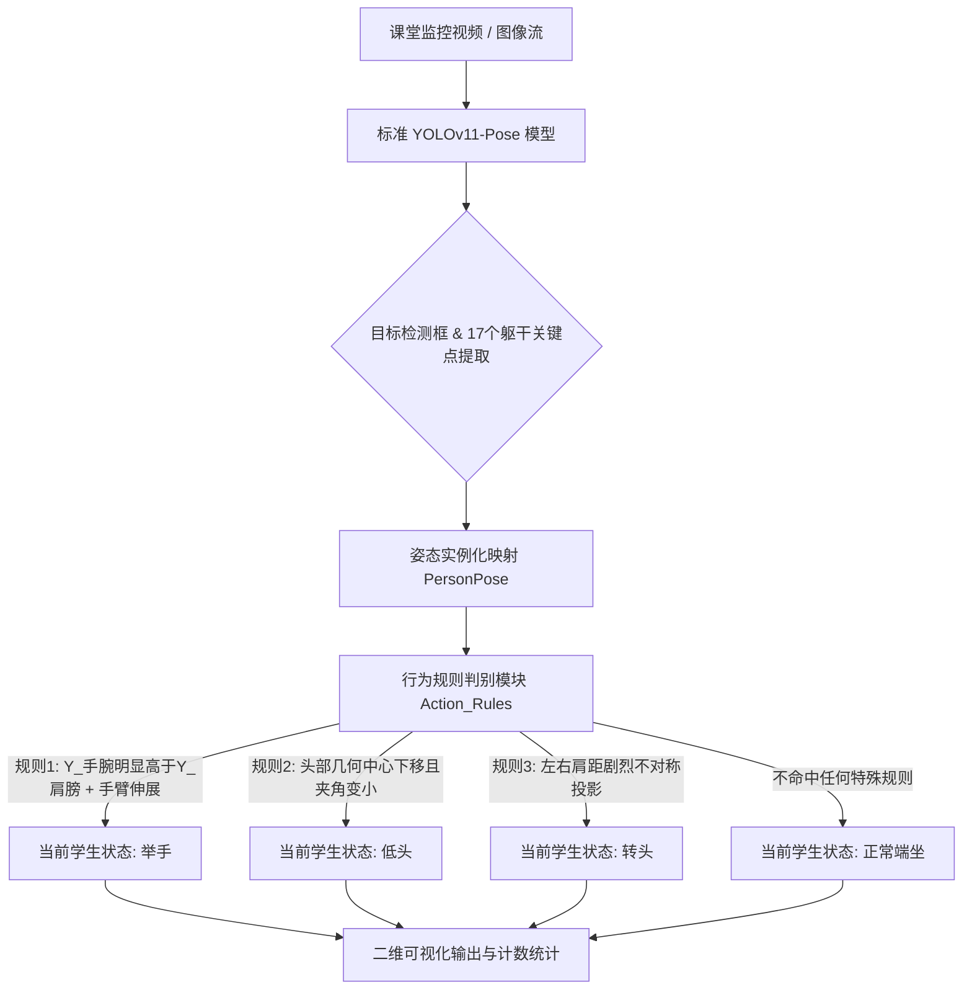

# 课堂行为与交互分析系统 - 版本升级汇报

## 1. 升级背景与核心改进诉求
原系统（main基线版本）基于标准的预训练YOLOv11-Pose模型提取出课堂场景中学生的2D关键点，完全依赖编写人工几何规则（如计算手腕与肩部的高度差、眼睛重心的垂直变化等）来判定学生的动作（如“举手”、“低头”、“趴桌”）。此基线版本在实际复杂课堂环境下面临严重瓶颈：
1. **单体孤立，忽视全局关联**：仅将每个人当作孤立个体，未能建立多人间“同桌讨论”、“集体注视”等复杂群体的交互逻辑。
2. **硬编码规则僵化，易受干扰**：严重依赖相机固定视角下生成的僵化坐标规则，遭遇遮挡或角度微调极易触发误判。
3. **特征单一，缺乏语义理解**：仅停留在几何坐标层面，未提取高级语义表征。

为此，**目前系统进行了全面深度的算法架构重构：**不仅强化了底层的视觉表征能力，更在中上层全面引入图神经网络（Graph Neural Networks）与多模态大语言模型（MLLM）。

---

## 2. 核心架构流程对比

### 2.1 以前：main基线版本流程图

> **设计思路：** “检测+单人动作规则”，纯业务逻辑匹配过程。



### 2.2 现在：全面升级后的架构流程图

> **设计思路：** “特征增强检测 + 时空图拓扑推理 + 跨周围语境约束 + 大语言模型多模态解码”，真正的一体化智能感知分析。

```mermaid
graph TD
    A[课堂复杂场景视图流] --> B[强化版 YOLOv11 底层网络]
    
    subgraph (1) 基础检测特征表征层强化
        B -.-> B1[ASPN空间聚合提取隐式特征]
        B -.-> B2[DySnakeConv获取形变肢体/遮挡特征]
        B -.-> B3[GLIDE Loss优化重叠遮挡边界预测]
    end
    
    B --> C{高精度实例特征映射池与感知关键点}
    
    C --> D[多人体时空交互图构建 Graph Nodes/Edges]
    
    subgraph (2) 时空群体交互与语境对齐层
        D --> E[ST-GCN / IGFormer 交互拓扑提炼序列演变]
        E <--> F[Peer-Aware Context 同伴自适应语境校准]
    end
    
    E --> G[富含环境关系的高级语义交互流]
    
    subgraph (3) 顶层意图驱动与校验层 (MLLM)
        G --> H[多模态大模型语义解码]
        H -.-> H1[Cascaded Cross-Attention 文本-视觉交叉融合]
        H -.-> H2[Dynamic Query Driving 动态搜索目标验证]
    end
    
    H --> J((输出综合场景事件: 群体互动/复杂异常行为告警))
    
    style B fill:#e1f5fe,stroke:#01579b,stroke-width:2px
    style E fill:#e8f5e9,stroke:#2e7d32,stroke-width:2px
    style H fill:#fff3e0,stroke:#e65100,stroke-width:2px
```

---

## 3. 核心升级模块详细技术内涵

针对之前的流程瓶颈，我们在新版工程中实装了四大块核心升级方案：

### 1. 从“单人孤立规则”向“多人交互拓扑模型 (ST-GCN/IGFormer)”跃迁
- **之前的局限**：动作判定仅在一个`action_rules.py`的单人循环中执行。即使两名学生面对面，系统只会生硬地分别识别出两个“转头”。
- **当前突破**：我们建立并将视觉数据构建为交互拓扑图，通过**空间-时间图卷积网络(ST-GCN)**和**注意力交互图变换器(IGFormer)**，系统可以捕捉点与点、人与人之间的空间拓扑传播信息，实现了对“小组讨论”、“私下交谈”、“集体互动”等群体层面概念的时序识别。

### 2. 引入防误判的约束机制：同伴感知上下文 (Peer-Aware Context)
- **之前的局限**：如果一位同学低下头，系统基于“鼻尖下落”规则立刻判定“游离/走神”。
- **当前突破**：同伴语境机制生效。如果系统在图中发现当前目标节点周围节点的共同趋势均是低头（正在记笔记，或遇到低头做卷子的普遍场景），系统进行动态校准，将原有的硬编码误判推翻，使得场景适应能力有了质的飞跃。

### 3. 多模态大模型顶层融合体系 (MLLM + CCA + DQD)
- **之前的局限**：无法接收和验证语义级别的上层指令。视角的处理仅停留在局部像素。
- **当前突破**：结合了最前沿的大范围语言视界大模型策略。
  - 运用**动态查询驱动（Dynamic Query Driving, DQD）**寻找与当前检测行为最优耦合的关键帧线索。
  - 通过**级联交叉注意力（Cascaded Cross-Attention, CCA）**将教师口述文本指令特征图和课堂视觉特征图在高维空间中深度融合，使得系统不仅能解答“在这个画面里谁在低头”，还能解答“在老师要求思考问题时，这组学生是在积极讨论还是在闲聊”的深层语义问题。

### 4. 底干网络检测器物理特征增强 (ASPN, DySnakeConv, GLIDE Loss)
- **之前的局限**：传统版本直接拿标准COCO训练出的YOLOv11在被重重课桌分割遮掩的密集教室强行推理，置信度差、关键点跳变极其严重。
- **当前突破**：深度解构YOLOv11的主干与层结构：
  - 接入 **DySnakeConv (动态管状卷积)** 解决管状手部伸展的精细捕捉难题；
  - 结合 **ASPN (自适应空间池化网络)** 使空间结构表征更为鲁棒；
  - 置换原版损失函数为 **GLIDE Loss** 深度解决桌椅和人体重叠边界框飘移的问题。极大提高了在拥挤、严重遮挡情形下的源数据精度基盘。

