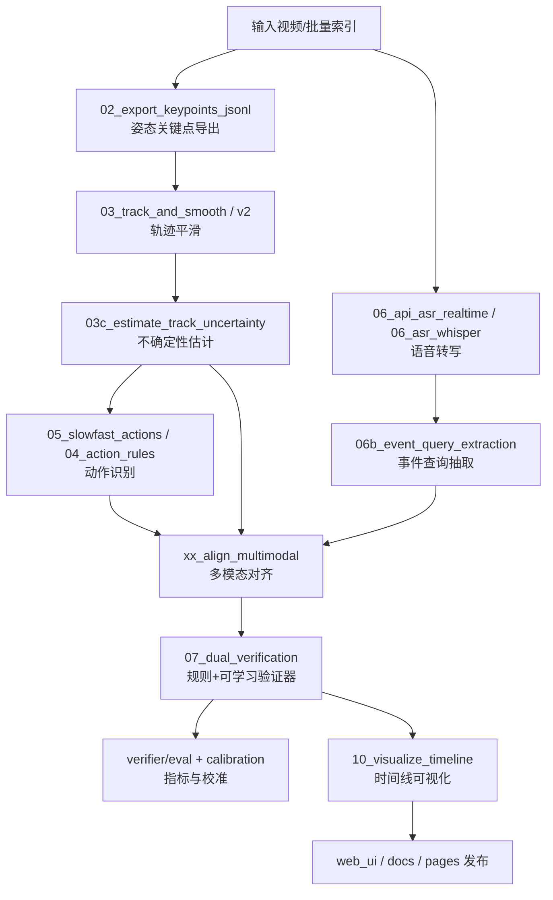

# 报告.md：主线脚本全面审阅与清理建议
> 审阅时间：2026-04-10（UTC）
> 审阅范围：`scripts/` 目录下全部 `.py`（含所有子目录）+ 主线联动的 `verifier/`、`integration/`、`server/`。
## 1. 我对“主线”的定义
- **主线 A（正式合同链路）**：`scripts/09_run_pipeline.py` 为入口，串联 Pose → Track/UQ → Action → ASR → Event Query → Multimodal Align → Dual Verifier → Timeline。
- **主线 B（智慧课堂产品链路）**：`scripts/intelligence_class/pipeline/01_run_single_video.py` + `02_batch_run.py` 为工程化入口，服务多视角批处理与前端消费。
- **主线 C（可训练验证器）**：`verifier/train.py`、`eval.py`、`calibration.py` 组成可学习“二次校验”环。
## 2. 代码总体体量与结构
- `scripts/` 下 Python 脚本总数：**162**。
- 主要子树分布：
  - `scripts/ultralytics/utils`：41 个脚本。
  - `scripts/ultralytics/solutions`：20 个脚本。
  - `scripts/intelligence_class/pipeline`：14 个脚本。
  - `scripts/intelligence_class/tools`：11 个脚本。
  - `scripts/ultralytics/nn`：11 个脚本。
  - `scripts/ultralytics/trackers`：9 个脚本。
  - `scripts/ultralytics/engine`：8 个脚本。
  - `scripts/ultralytics/hub`：5 个脚本。
  - `scripts/intelligence_class/training`：3 个脚本。
  - `scripts/intelligence_class/_utils`：2 个脚本。
  - `scripts/000.py`：1 个脚本。
  - `scripts/01_pose_video_demo.py`：1 个脚本。

## 3. 主线执行流程图（合并 A+B）

## 4. 关键观察（读码后结论）
1. **存在“双入口并存”**：根目录 `scripts/09_run_pipeline.py` 与 `intelligence_class/pipeline/01_run_single_video.py` 都在做 orchestration，功能有重叠但输出目标不同。
2. **存在重复实现**：`02_export_keypoints_jsonl.py`、`04_action_rules.py`、`000.py`、`xx_align_multimodal.py` 在不同目录有同名/近同名版本。
3. **ultralytics 为大体量 vendored 代码**：`scripts/ultralytics/**` 合计 95 个脚本，真实业务仅使用其中一小部分能力（检测、姿态、跟踪、工具函数）。
4. **低价值脚本可识别模式明显**：`debug_*`、`xx_*`、`99_*`、legacy wrapper（如 `09b_run_pipeline.py`）大多是阶段性脚本。
## 5. 三类归档建议（你要求的分类）
### 用得上（主线核心）
- 数量：**22**
  - `scripts/02_export_keypoints_jsonl.py`
  - `scripts/03_track_and_smooth.py`
  - `scripts/03c_estimate_track_uncertainty.py`
  - `scripts/05_slowfast_actions.py`
  - `scripts/06_api_asr_realtime.py`
  - `scripts/06_asr_whisper_to_jsonl.py`
  - `scripts/06b_event_query_extraction.py`
  - `scripts/07_dual_verification.py`
  - `scripts/09_run_pipeline.py`
  - `scripts/10_visualize_timeline.py`
  - `scripts/intelligence_class/pipeline/01_run_single_video.py`
  - `scripts/intelligence_class/pipeline/02_batch_run.py`
  - `scripts/intelligence_class/pipeline/03_track_and_smooth_v2.py`
  - `scripts/intelligence_class/pipeline/04_action_rules.py`
  - `scripts/intelligence_class/pipeline/06_run_whisper_asr.py`
  - `scripts/intelligence_class/tools/dataset_service.py`
  - `scripts/intelligence_class/training/01_dataset_convert_case_to_yolo.py`
  - `scripts/intelligence_class/training/02_dataset_augment_yolo_labels.py`
  - `scripts/intelligence_class/training/03_train_case_yolo.py`
  - `scripts/intelligence_class/web_ui/app.py`
  - `scripts/training/train_classroom_yolo.py`
  - `scripts/xx_align_multimodal.py`

### 可以用上（辅助/扩展）
- 数量：**124**
  - `scripts/01_pose_video_demo.py`
  - `scripts/02b_check_jsonl_schema.py`
  - `scripts/02b_export_objects_jsonl.py`
  - `scripts/02c_export_objects_jsonl_custom.py`
  - `scripts/02c_objects_video_demo.py`
  - `scripts/03b_objects_video_demo.py`
  - `scripts/04_action_rules.py`
  - `scripts/04_complex_logic.py`
  - `scripts/05_overlay_action_video.py`
  - `scripts/05b_fuse_actions_with_objects.py`
  - `scripts/08_overlay_sequences.py`
  - `scripts/09c_refresh_case_outputs.py`
  - `scripts/11_group_stgcn.py`
  - `scripts/12_export_features.py`
  - `scripts/13_semantic_projection.py`
  - `scripts/14_mllm_semantic_verify.py`
  - `scripts/intelligence_class/_utils/action_map.py`
  - `scripts/intelligence_class/_utils/pathing.py`
  - `scripts/intelligence_class/pipeline/02_export_keypoints_jsonl.py`
  - `scripts/intelligence_class/pipeline/03b_attach_keypoints.py`
  - `scripts/intelligence_class/pipeline/03b_run_tracks_smooth_all.py`
  - `scripts/intelligence_class/pipeline/batch_process_videos.py`
  - `scripts/intelligence_class/pipeline/make_index_6_per_view.py`
  - `scripts/intelligence_class/pipeline/run_batch_all.py`
  - `scripts/intelligence_class/tools/00_collect_code_for_ai.py`
  - `scripts/intelligence_class/tools/summarize_results.py`
  - `scripts/modules/__init__.py`
  - `scripts/modules/peer_context.py`
  - `scripts/ultralytics/__init__.py`
  - `scripts/ultralytics/cfg/__init__.py`
  - `scripts/ultralytics/engine/__init__.py`
  - `scripts/ultralytics/engine/exporter.py`
  - `scripts/ultralytics/engine/model.py`
  - `scripts/ultralytics/engine/predictor.py`
  - `scripts/ultralytics/engine/results.py`
  - `scripts/ultralytics/engine/trainer.py`
  - `scripts/ultralytics/engine/tuner.py`
  - `scripts/ultralytics/engine/validator.py`
  - `scripts/ultralytics/hub/__init__.py`
  - `scripts/ultralytics/hub/auth.py`
  - `scripts/ultralytics/hub/google/__init__.py`
  - `scripts/ultralytics/hub/session.py`
  - `scripts/ultralytics/hub/utils.py`
  - `scripts/ultralytics/nn/__init__.py`
  - `scripts/ultralytics/nn/autobackend.py`
  - `scripts/ultralytics/nn/modules/__init__.py`
  - `scripts/ultralytics/nn/modules/activation.py`
  - `scripts/ultralytics/nn/modules/block.py`
  - `scripts/ultralytics/nn/modules/conv.py`
  - `scripts/ultralytics/nn/modules/head.py`
  - `scripts/ultralytics/nn/modules/transformer.py`
  - `scripts/ultralytics/nn/modules/utils.py`
  - `scripts/ultralytics/nn/tasks.py`
  - `scripts/ultralytics/nn/text_model.py`
  - `scripts/ultralytics/solutions/__init__.py`
  - `scripts/ultralytics/solutions/ai_gym.py`
  - `scripts/ultralytics/solutions/analytics.py`
  - `scripts/ultralytics/solutions/config.py`
  - `scripts/ultralytics/solutions/distance_calculation.py`
  - `scripts/ultralytics/solutions/heatmap.py`
  - `scripts/ultralytics/solutions/instance_segmentation.py`
  - `scripts/ultralytics/solutions/object_blurrer.py`
  - `scripts/ultralytics/solutions/object_counter.py`
  - `scripts/ultralytics/solutions/object_cropper.py`
  - `scripts/ultralytics/solutions/parking_management.py`
  - `scripts/ultralytics/solutions/queue_management.py`
  - `scripts/ultralytics/solutions/region_counter.py`
  - `scripts/ultralytics/solutions/security_alarm.py`
  - `scripts/ultralytics/solutions/similarity_search.py`
  - `scripts/ultralytics/solutions/solutions.py`
  - `scripts/ultralytics/solutions/speed_estimation.py`
  - `scripts/ultralytics/solutions/streamlit_inference.py`
  - `scripts/ultralytics/solutions/trackzone.py`
  - `scripts/ultralytics/solutions/vision_eye.py`
  - `scripts/ultralytics/trackers/__init__.py`
  - `scripts/ultralytics/trackers/basetrack.py`
  - `scripts/ultralytics/trackers/bot_sort.py`
  - `scripts/ultralytics/trackers/byte_tracker.py`
  - `scripts/ultralytics/trackers/track.py`
  - `scripts/ultralytics/trackers/utils/__init__.py`
  - `scripts/ultralytics/trackers/utils/gmc.py`
  - `scripts/ultralytics/trackers/utils/kalman_filter.py`
  - `scripts/ultralytics/trackers/utils/matching.py`
  - `scripts/ultralytics/utils/__init__.py`
  - `scripts/ultralytics/utils/autobatch.py`
  - `scripts/ultralytics/utils/autodevice.py`
  - `scripts/ultralytics/utils/benchmarks.py`
  - `scripts/ultralytics/utils/callbacks/__init__.py`
  - `scripts/ultralytics/utils/callbacks/base.py`
  - `scripts/ultralytics/utils/callbacks/clearml.py`
  - `scripts/ultralytics/utils/callbacks/comet.py`
  - `scripts/ultralytics/utils/callbacks/dvc.py`
  - `scripts/ultralytics/utils/callbacks/hub.py`
  - `scripts/ultralytics/utils/callbacks/mlflow.py`
  - `scripts/ultralytics/utils/callbacks/neptune.py`
  - `scripts/ultralytics/utils/callbacks/platform.py`
  - `scripts/ultralytics/utils/callbacks/raytune.py`
  - `scripts/ultralytics/utils/callbacks/tensorboard.py`
  - `scripts/ultralytics/utils/callbacks/wb.py`
  - `scripts/ultralytics/utils/checks.py`
  - `scripts/ultralytics/utils/cpu.py`
  - `scripts/ultralytics/utils/dist.py`
  - `scripts/ultralytics/utils/downloads.py`
  - `scripts/ultralytics/utils/errors.py`
  - `scripts/ultralytics/utils/events.py`
  - `scripts/ultralytics/utils/export/__init__.py`
  - `scripts/ultralytics/utils/export/engine.py`
  - `scripts/ultralytics/utils/export/imx.py`
  - `scripts/ultralytics/utils/export/tensorflow.py`
  - `scripts/ultralytics/utils/files.py`
  - `scripts/ultralytics/utils/git.py`
  - `scripts/ultralytics/utils/instance.py`
  - `scripts/ultralytics/utils/logger.py`
  - `scripts/ultralytics/utils/loss.py`
  - `scripts/ultralytics/utils/metrics.py`
  - `scripts/ultralytics/utils/nms.py`
  - `scripts/ultralytics/utils/ops.py`
  - `scripts/ultralytics/utils/patches.py`
  - `scripts/ultralytics/utils/plotting.py`
  - `scripts/ultralytics/utils/tal.py`
  - `scripts/ultralytics/utils/torch_utils.py`
  - `scripts/ultralytics/utils/tqdm.py`
  - `scripts/ultralytics/utils/triton.py`
  - `scripts/ultralytics/utils/tuner.py`

### 用处不大可删（实验/兼容/调试）
- 数量：**16**
  - `scripts/000.py`
  - `scripts/09b_run_pipeline.py`
  - `scripts/11_debug_pipeline_check.py`
  - `scripts/99_debug_objects_stats.py`
  - `scripts/export_code.py`
  - `scripts/intelligence_class/pipeline/000.py`
  - `scripts/intelligence_class/pipeline/debug_pose_chain.py`
  - `scripts/intelligence_class/pipeline/debug_pose_tracks.py`
  - `scripts/intelligence_class/tools/01_dump_py_only.py`
  - `scripts/intelligence_class/tools/check.py`
  - `scripts/intelligence_class/tools/move.py`
  - `scripts/intelligence_class/tools/xx_aggregate_dataset_report.py`
  - `scripts/intelligence_class/tools/xx_align_multimodal.py`
  - `scripts/intelligence_class/tools/xx_generate_static_projections.py`
  - `scripts/intelligence_class/tools/xx_generate_timeline_viz.py`
  - `scripts/intelligence_class/tools/xx_summarize_case.py`

## 6. 主线外但应纳入治理的脚本
- `integration/run_pipeline.py`
- `integration/run_server.py`
- `server/app.py`
- `verifier/train.py`
- `verifier/eval.py`
- `verifier/calibration.py`
- `verifier/infer.py`

## 7. 建议的“精简落地方案”（可执行）
1. **冻结主线入口**：二选一保留统一入口（推荐保留 `scripts/09_run_pipeline.py` 作为算法入口，`integration/run_pipeline.py` 作为对外隔离入口）。
2. **兼容脚本下沉**：把 `09b_*`、`000.py`、`debug_*`、`xx_*` 统一迁入 `scripts/_attic/`，避免污染生产目录。
3. **重复脚本收敛**：对同名脚本建立映射，保留一个实现，其他改为薄封装或删除。
4. **ultralytics 子集化**：若后续只需推理，可只保留 `engine/nn/trackers/utils` 相关子集并改为 pip 依赖。
5. **建立脚本分级标签**：建议在文件头增加 `@tier: core|optional|experimental`，后续 CI 可自动阻止 experimental 进入主链。
