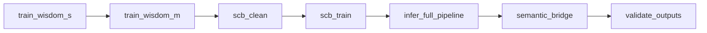
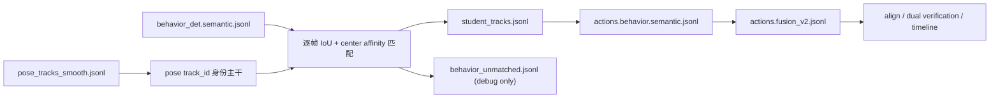
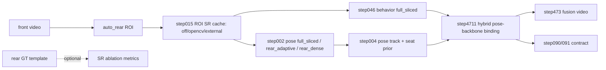

# 01 运行流程总图

## Orchestrator 主编排


## 09_run_pipeline 主步骤
```mermaid
flowchart TB
```

## hybrid 身份与行为语义链路


## 后排低分辨率与遮挡增强链路


## 09_run_pipeline 步骤表（按代码执行顺序）
| order | step | name | script |
| --- | --- | --- | --- |
