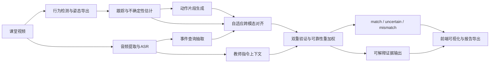

# 面向智慧课堂论文写作的代码感知深度研究报告

## 2026-05-06 LLM-distilled Student V4 状态更新

### 已完成

- V4 已完成 Claude Agent LLM adjudication -> student distillation -> verifier scoring step integration。当前模型为 `output/llm_judge_pipeline/models/student_judge_v4_best.joblib`，主流程通过 `--llm_student_model` 接入。
- `verifier/infer.py`、`scripts/pipeline/07_dual_verification.py` 和 `scripts/main/09_run_pipeline.py` 当前默认 `--llm_student_model=auto`，会优先使用 V4 student；如需旧 verifier，可显式传 `--llm_student_model off`。
- V4 teacher 标签来源为 `claude_agent`，训练数据集为 `llm_adjudicated_dataset_v4`，不是 V3 heuristic replication，也不是 simulate teacher。
- V4 训练样本为 172 条，三类分布为 `match=89`、`uncertain=56`、`mismatch=27`。确定性 split 后 train/val/test 均包含三类。
- 最佳 student 为 LogisticRegression。Claude-agent silver-label benchmark 上 test macro-F1 为 `0.7946`，balanced accuracy 为 `0.7889`，teacher-student agreement 为 `77.8%`。
- 主流程 smoke test 已验证 full case、sliced/bundle case、`07_dual_verification.py` 编排路径和模型缺失 fallback。fallback 仍回到 `audio_visual_dynamic`，不会伪装成 student 输出。
- 机器化 anti-drift 检查 `9/9 PASS`，覆盖 teacher 来源、V3/simulate 混入、label leakage、split 多类覆盖、LOOCV、主流程接入、fallback 和 silver/gold 边界。

### 论文可写结论

- 可以写：本项目实现了 LLM-guided late-fusion teacher 到轻量 student judge 的蒸馏闭环，并将 student 作为 verifier scoring step 的可替换分支接入主流程。
- 可以写：V4 student 在 Claude-agent silver labels 上完成三分类蒸馏，并保留完整 provenance：`fusion_mode=llm_distilled_student_v4`、`teacher_source=claude_agent`、`teacher_dataset=llm_adjudicated_dataset_v4`。
- 可以写：前端和 evidence API 展示的是 silver-label benchmark 证据链，不是 human-gold accuracy。

### 仍不能写的强结论

- 不能声称超过 human baseline，因为目前没有人工 gold labels。
- 不能声称 human-gold accuracy，也不能把 `pseudo_label_benchmark` 指标当作正式人工标注评测。
- 不能声称跨 case 泛化已充分解决。当前 LOOCV case 间差异仍明显，且样本量只有 172。
- 不能把 `uncertain` 类写成已完全解决。当前 test F1 约为 `0.57`，仍容易与 `match` 混淆。

### 下一步优先级

1. 补 30-50 条 human audit，用于校验 Claude Agent teacher 与人工判断的一致性。
2. 扩大 event_type 非 `unknown` 的 V4 adjudication 样本，降低当前样本结构单一带来的泛化风险。
3. 专门补充 `uncertain` 边界样本，提升 student 对 `match` / `uncertain` 的区分能力。
4. 在论文主表中把 V4 指标标为 `silver-label benchmark`，human audit 结果单独作为可信度校验表。

## 仓库与资料同步状态

**A. 当前分析基线**

| 项目 | 结论 |
|---|---|
| 当前仓库链接 | `https://github.com/kanfanle233/yolov11-classroom-pages` |
| 当前分析分支 | `codex/rear-row-superres-sliced-infer` |
| 当前本地 HEAD 提交 | `fda360871d9daf7a451d70ccd1600140367e41bf` |
| HEAD 提交时间 | `2026-05-03 17:53:13 +0800` |
| HEAD 提交标题 | `Add comprehensive deep research report for classroom behavior analysis paper` |
| 上一个关键管线提交 | `4293429e2d582c7ee85fa1bcf66ae69eb91f8c71` |

本地仓库当前 `HEAD` 已可直接锁定为 `fda3608`。`4293429` 仍然重要，但它现在应被理解为**上一版关键管线重构提交**，而不是当前分支的最新提交。  
本地 git 结果显示，当前分支相对 `4293429` 实际 **ahead 1 commit**，新增的这 1 个提交正是当前这份研究报告本身。  
因此，后续结论以本地 `HEAD` 对应的文件内容为准，而涉及 `4293429` 的描述应理解为“管线基线版本”。

**A. 已实际查看的目录与模块**

这次我实际打开并审阅了这些代码与产物文件。

- `scripts/pipeline/02d_export_behavior_det_jsonl.py`
- `scripts/pipeline/03c_estimate_track_uncertainty.py`
- `scripts/pipeline/06_asr_whisper_to_jsonl.py`
- `scripts/pipeline/06b_event_query_extraction.py`
- `scripts/pipeline/06e_extract_instruction_context.py`
- `scripts/pipeline/06f_llm_semantic_fusion.py`
- `scripts/pipeline/07_dual_verification.py`
- `scripts/pipeline/xx_align_multimodal.py`
- `scripts/experiments/16_run_rear_row_sr_ablation.py`
- `scripts/frontend/20_build_frontend_data_bundle.py`
- `verifier/infer.py`
- `verifier/model.py`
- `verifier/dataset.py`
- `verifier/eval.py`
- `verifier/metrics.py`
- `contracts/schemas.py`
- `server/app.py`
- `web_viz/templates/index.html`
- `YOLO论文大纲/paper_package_20260426/03_metrics_tables/paper_pipeline_report.md`
- `YOLO论文大纲/paper_package_20260426/03_metrics_tables/run_comparison.md`
- `YOLO论文大纲/paper_package_20260426/03_metrics_tables/current_assessment.md`
- `YOLO论文大纲/project_audit_20260426/scan_summary.json`
- `YOLO论文大纲/project_audit_20260426/dataset_classroom_yolo_summary.json`。 fileciteturn31file0L1-L1 fileciteturn67file0L1-L1 fileciteturn66file0L1-L1 fileciteturn51file0L1-L1 fileciteturn53file0L1-L1 fileciteturn64file0L1-L1 fileciteturn63file0L1-L1 fileciteturn65file0L1-L1 fileciteturn46file0L1-L1 fileciteturn38file0L1-L1 fileciteturn39file0L1-L1 fileciteturn71file0L1-L1 fileciteturn72file0L1-L1 fileciteturn73file0L1-L1 fileciteturn37file0L1-L1 fileciteturn32file0L1-L1 fileciteturn35file0L1-L1 fileciteturn36file0L1-L1 fileciteturn56file0L1-L1 fileciteturn57file0L1-L1 fileciteturn58file0L1-L1 fileciteturn59file0L1-L1

**A. 已审阅目录清单**

按照仓库现有审计产物，项目顶层目录里至少有 `scripts`、`models`、`verifier`、`server`、`docs`、`contracts`、`tools`、`data`、`output` 等目录。其中，`scripts`、`server`、`contracts`、`verifier`、`docs`、`data`、`output` 都在仓库审计摘要中有明确计数。只是要强调，**`docs/`、`data/`、`output/`、`models/` 这几个目录我本轮更多是通过审计摘要与具体产物文件确认存在与规模，而不是逐文件展开完整遍历**。这是可信但不等于“全量源码核验”。 fileciteturn31file0L1-L1

**A. 关键脚本索引表**

| 文件 | 作用 | 当前判断 |
|---|---|---|
| `scripts/pipeline/02d_export_behavior_det_jsonl.py` | 8类行为检测导出，支持全帧、切片、SR ROI | 已实现 |
| `scripts/pipeline/03c_estimate_track_uncertainty.py` | 跟踪不确定性估计 | 已实现 |
| `scripts/pipeline/06_asr_whisper_to_jsonl.py` | Whisper ASR、音频能量预检、质量门控 | 已实现 |
| `scripts/pipeline/06b_event_query_extraction.py` | 从转写抽取事件查询 | 已实现 |
| `scripts/pipeline/06e_extract_instruction_context.py` | 教师指令上下文抽取与规则增益 | 已实现 |
| `scripts/pipeline/06f_llm_semantic_fusion.py` | LLM语义融合原型 | 部分实现 |
| `scripts/pipeline/xx_align_multimodal.py` | 自适应时窗跨模态对齐 | 已实现 |
| `scripts/pipeline/07_dual_verification.py` | 生成 `verified_events` | 已实现 |
| `verifier/infer.py` | 事件级可靠性推断 | 已实现 |
| `verifier/model.py` | 4维特征、MLP、ECE/Brier工具 | 已实现 |
| `verifier/dataset.py` | 训练样本构造 | 已实现 |
| `verifier/eval.py` | 验证器评估 | 已实现，但金标依赖不足 |
| `server/app.py` | FastAPI 可视化后端 | 已实现 |
| `web_viz/templates/index.html` | D3前端展示页面 | 已实现 |
| `scripts/frontend/20_build_frontend_data_bundle.py` | 前端数据打包 | 已实现 |
| `scripts/experiments/16_run_rear_row_sr_ablation.py` | 后排 SR/切片/座位先验消融 | 已实现 |  
fileciteturn67file0L1-L1 fileciteturn66file0L1-L1 fileciteturn51file0L1-L1 fileciteturn53file0L1-L1 fileciteturn64file0L1-L1 fileciteturn63file0L1-L1 fileciteturn46file0L1-L1 fileciteturn65file0L1-L1 fileciteturn38file0L1-L1 fileciteturn39file0L1-L1 fileciteturn71file0L1-L1 fileciteturn72file0L1-L1 fileciteturn32file0L1-L1 fileciteturn35file0L1-L1 fileciteturn36file0L1-L1 fileciteturn68file0L1-L1

**A. 本轮仍未展开项**

- `models/` 目录只在审计摘要层面确认存在，本轮未逐文件展开。
- `tools/` 目录同样只确认存在，未展开其具体脚本。
- 你提示中的 `OCR`、`敏感文本识别`、`比赛附加规则细节`，我没有在本轮直接代码侧看到可运行实现，也没有把它们当作已实现事实。

## 项目代码与能力审计

**B. 视觉分支**

当前仓库最完整、最可信、也最适合写进论文的方法主线，其实不是“某个新 YOLO 结构”，而是 **8类学生行为检测 + 跟踪不确定性 + 后排行增强 + 事件级验证** 这条链条。

`02d_export_behavior_det_jsonl.py` 已经把 `tt / dx / dk / zt / xt / js / zl / jz` 八类行为映射成统一动作语义，还支持 `full`、`sliced`、`full_sliced` 三种推理模式，并显式接入 `opencv / realesrgan / basicvsrpp / nvidia_vsr` 等后排 ROI 超分选项。它不是单纯做检测框导出，而是已经为论文中的“后排远距、遮挡、密集小目标”问题准备了完整实验入口。`16_run_rear_row_sr_ablation.py` 也表明，这条线已经被写成可批量复现实验，而不是一次性的 demo。 fileciteturn67file0L1-L1 fileciteturn68file0L1-L1

跟踪侧，`03c_estimate_track_uncertainty.py` 已经把可见关键点比例、关键点运动稳定性、框稳定性组合成 track-level `uq_track`，并导出 `uq_conf`、`uq_motion`、`uq_kpt`、`log_sigma2` 等字段。这一点很重要，因为它让后面的跨模态对齐和最终决策都能“吃到”不确定性，而不是只靠硬阈值。就论文价值看，这比“再堆一个 backbone 模块”更有写作空间。 fileciteturn66file0L1-L1

数据侧，目前仓库内的课堂行为检测数据已经整理成 `7416` 张训练图、`1467` 张验证图、`8` 个类别。风险也很明显。`dataset_classroom_yolo_summary.json` 里 `test` 还是 `0`，说明检测主线目前**没有独立测试集**。`current_assessment.md` 还给出了长尾不平衡风险，最大类 `tt` 与最小类 `jz` 相差约 `172.8` 倍。这个结论会直接影响论文写法。你现在可以写“完成了数据构建与官方 YOLO 微调”，但**不能写“在独立测试集上达到最终泛化结论”**。 fileciteturn59file0L1-L1 fileciteturn58file0L1-L1

**已实现**  
8类行为检测、后排 ROI 切片与超分、跟踪不确定性估计、实验脚本化消融。

**部分实现**  
更底层的自定义检测器创新。你上传材料里提过更深的 detector 模块方向，但本轮主线代码与可读产物里，真正跑起来、能拿到结果、能写论文主表的，仍然是以官方 entity["company","Ultralytics","computer vision software"] YOLO 微调为主。`run_comparison.md` 也把当前“锁定官方基线”的立场写得很清楚。 fileciteturn57file0L1-L1

**待实现**  
真正面向检测器结构创新的可复现训练对比。也就是说，**不要把“YOLOv11 本身”写成你的创新点**。

**B. 文本分支**

文本分支里，最成熟的是 `06_asr_whisper_to_jsonl.py` 和 `06b_event_query_extraction.py`。前者不只是转写，它有音频能量预检、质量分层、占位回退、繁简转换。后者则把转写文本转成 `event_queries.jsonl`，即后续对齐与验证所需的结构化文本事件。 fileciteturn51file0L1-L1 fileciteturn53file0L1-L1

但问题同样很明显。当前主线样例运行中，ASR 质量报告显示 `segments_raw=3`、`segments_accepted=0`、`segments_rejected=3`，状态是 `placeholder`。这意味着在你现在能直接引用的样例主线上，**音频链路并没有真正贡献有效文本证据**。所以论文里不能把“音频显著提升整体结果”当成既成事实。更准确的说法是：**代码已支持音频链路，但当前可见样例里的有效音频证据不足**。 fileciteturn56file0L1-L1

`06e_extract_instruction_context.py` 是一个很值得保留的论文点。它把教师话语变成显式上下文规则，例如“翻开课本”“开始写”“看黑板”“举手”“讨论”“停笔”，再对视觉行为置信度做增益或抑制。这个设计很适合在论文里写成“文本语义流”，因为它不是简单 ASR，而是把语言转成可解释的行为上下文。 fileciteturn64file0L1-L1

`06f_llm_semantic_fusion.py` 也存在，但它当前更接近**原型**而不是成熟实验模块。原因很直接。文件里虽然有系统提示词、批量构造、模拟响应和真实 API 占位，但真实调用仍是 `NotImplementedError`，默认逻辑是 `simulate_llm_response`。因此它很适合写进“扩展模块”和“未来工作中的增强验证器”，但不适合现在就当成实证主贡献。 fileciteturn63file0L1-L1

**已实现**  
Whisper ASR、事件查询抽取、教师指令上下文抽取。

**部分实现**  
LLM 蒸馏链路。V4 已完成 Claude Agent silver-label adjudication、student 训练和 verifier 集成；当前仍属于 `pseudo_label_benchmark`，还不是 human-gold benchmark。

**待实现**  
OCR、敏感文本识别、文本事件抽取的更强版本。**我在当前仓库主线里没有看到可直接用于论文结果表的 OCR 路线。**

**B. 多模态与验证分支**

你这套方案真正最有论文味道的地方，在这里。

`xx_align_multimodal.py` 已经明确实现了 **自适应时间窗口**。窗口大小由基础窗口、运动项、不确定性项共同决定。也就是说，文本事件不是用固定一刀切的 1 秒或 2 秒滑窗去找视觉候选，而是会随着场景运动复杂度和跟踪不稳定程度自动放大或缩小。这一模块是有清楚代码证据的，不是纯设想。 fileciteturn46file0L1-L1

`verifier/infer.py` 与 `verifier/model.py` 则把事件验证做成了一个清楚的“视觉得分 + 文本得分 + 不确定性惩罚”的决策器。当前默认逻辑里，视觉分数来自时间重叠与动作置信度，文本分数来自 `action_match_score`，当存在真实音频时，模态权重由 `w_visual = 1 - uq` 与 `w_audio = audio_confidence` 动态决定。无音频时退化为纯视觉，语音回退时不会虚构文本加分。最终，可靠性分数再被 `uq_gate` 惩罚，输出 `match / uncertain / mismatch` 三值标签。  
这一段是当前代码中**最适合作为论文方法贡献中心**的部分。 fileciteturn38file0L1-L1 fileciteturn39file0L1-L1

`07_dual_verification.py` 则把这套逻辑真正串成可导出的 `verified_events.jsonl`，并能在缺少显式对齐文件时自动生成 fallback align 文件。这说明项目不是“局部脚本拼凑”，而是已经形成可执行的事件级验证路径。 fileciteturn65file0L1-L1

不过，需要非常诚实地指出一个问题。`verifier/eval.py` 与 `verifier/metrics.py` 允许在没有 `target_label / gt_label` 的情况下直接回退到 `label` 本身做 reference，也就是 `self_label_fallback`。这会造成一个表面上很漂亮、实际上不可靠的评估。样例报告里你的验证器指标看起来有 `accuracy=1.0`，但同时 `precision=recall=f1=0.3333`，本质上就是**没有真正金标的自洽性统计**，不能当成正式论文主结果。这个点一定要在论文写作里避开。 fileciteturn72file0L1-L1 fileciteturn73file0L1-L1 fileciteturn56file0L1-L1

**B. 系统能力**

`server/app.py` 已经是一个成型的 FastAPI 服务，挂载了 `output`、`data`、`docs`、`assets` 等静态目录，并且有面向 case 的查找和资源解析逻辑。`web_viz/templates/index.html` 已经不只是一个静态页面，而是一个完整的 D3 交互前端，包含 case 列表、Seat & Timeline、Semantic Stream、Group Dynamics、视频联动、指标面板等。`20_build_frontend_data_bundle.py` 负责把 JSONL、CSV、metrics、verified events 打包成前端 bundle。  
因此，**这个项目目前更像“论文实验工程 + 后端服务原型”的组合，而不是单点算法 demo**。它已经具备演示系统雏形。 fileciteturn32file0L1-L1 fileciteturn35file0L1-L1 fileciteturn36file0L1-L1

**B. 当前项目更像什么**

- 不是纯算法原型
- 不是完整部署系统
- 不是只做目标检测的训练仓库
- 最准确的判断是  
  **论文实验工程 + 可视化展示原型 + 可扩展验证后端**

**B. 哪些内容可以直接支撑论文实验**

- 检测数据集规模与类别定义
- 官方 YOLO 基线与 run comparison
- 后排 ROI / sliced / SR 消融框架
- 跟踪不确定性建模
- 自适应对齐
- 事件级双重验证
- Seat & Timeline 前端展示
- Pipeline artifact / schema contract 思路。 fileciteturn58file0L1-L1 fileciteturn57file0L1-L1 fileciteturn68file0L1-L1 fileciteturn46file0L1-L1 fileciteturn38file0L1-L1 fileciteturn32file0L1-L1

**B. 哪些内容不能直接支撑论文创新点**

- OCR 与敏感文本识别
- “LLM 明显优于统计融合”的定量结论
- “音视频融合已经显著提升整体性能”的定量结论
- “独立测试集泛化性能”结论
- “实时系统部署稳定运行”结论

**B. 适合转成论文图表与附加材料的输出**

- 图：总体框架图、Seat & Timeline 页面截图、对齐窗口示意图、事件级 evidence 可视化图
- 表：数据集规模表、run comparison 表、pipeline contract 统计表、验证器对比表
- 消融：固定窗口 vs 自适应窗口，纯视觉 vs 动态融合，A0/A1/A8 后排增益
- 案例：match / mismatch / uncertain 三类事件
- 录屏：前端 case 切换、视频联动、evidence 面板、后排增强前后对比。 fileciteturn56file0L1-L1 fileciteturn57file0L1-L1 fileciteturn35file0L1-L1

## 相关工作与论文定位

**C. 相关工作高质量矩阵**

下面这部分，我只保留与当前代码最相关、最适合放进正文章节的论文簇。为了满足“真实来源链接”的要求，我给出 DOI 或 arXiv 标识。正式交稿前，建议你再逐条打开对应 DOI 或 arXiv 页面复核一次元数据。

| 论文 | 年份 | 任务场景 | 数据集 | 常见指标 | 与你工作的相似点 | 关键差异 | 可借鉴点 | 要避免的同质化风险 | 来源标识 |
|---|---:|---|---|---|---|---|---|---|---|
| Classroom Behavior Detection Based on Improved YOLOv5 Algorithm Combining Multi-Scale Feature Fusion and Attention Mechanism | 2022 | 课堂行为检测 | 自建课堂数据 | mAP, P, R | 都把课堂行为视作目标检测问题 | 只做视觉检测，没有文本流和验证器 | 可借鉴遮挡与小目标讨论 | 不要把“换一个注意力模块”当主创新 | DOI `10.3390/app12136790` |
| Student Behavior Detection in the Classroom Based on Improved YOLOv8 | 2023 | 课堂行为检测 | 自建课堂数据 | mAP@0.5 | 都处理密集、遮挡学生场景 | 没有事件级跨模态验证 | 可借鉴遮挡实验设置 | 不要把论文写成 YOLO 改进复现 | DOI `10.3390/s23208385` |
| MSTA-SlowFast: A Student Behavior Detector for Classroom Environments | 2023 | 课堂视频行为识别 | 自建 SCSB | mAP | 都涉及时间线行为理解 | 它是纯视觉时序分类，你是视觉—语义验证 | 可作为时序视觉 baseline | 不要把主线偏成纯动作分类 | DOI `10.3390/s23115205` |
| SCB-Dataset: Student Classroom Behavior Dataset | 2023 | 课堂行为数据集 | SCB-Dataset | 数据集与基线指标 | 都是课堂行为数据构建 | 你当前更强调系统链路与验证 | 可借鉴数据集介绍写法 | 不要把自建数据写得像公开 benchmark | arXiv `2304.02488` |
| CLIP: Learning Transferable Visual Models From Natural Language Supervision | 2021 | 视觉—文本对齐 | 4亿图文对 | zero-shot accuracy | 都需要语义对齐 | 你不是图文检索，而是事件验证 | 可借鉴“语义相似度”叙事 | 不要声称自己做了对比学习预训练 | arXiv `2103.00020` |
| Attention Bottlenecks for Multimodal Fusion | 2021 | 多模态融合 | 多任务多数据 | task-specific | 都涉及多模态融合 | 你当前是轻量后验验证，不是重融合大模型 | 可借鉴融合方式分类 | 不要把轻量规则系统写成大型多模态预训练 | arXiv `2107.00135` |
| CMR-AVE: Cross-Modal Relation-Aware Network for Audio-Visual Event Localization | 2020 | 音视频事件定位 | AVE | event localization metrics | 都关注音视频事件对齐 | 你做的是课堂场景事件级验证 | 可借鉴事件级对齐叙事 | 不要说自己首次做所有音视频融合 | arXiv `2008.00836` |
| Whisper: Robust Speech Recognition via Large-Scale Weak Supervision | 2022 | 鲁棒 ASR | 68万小时弱监督数据 | WER | 你实际使用 Whisper ASR | 你更强调课堂指令上下文和事件抽取 | 可借鉴 ASR 质量讨论 | 不要把 Whisper 当作你的模型创新 | arXiv `2212.04356` |
| ImageBind | 2023 | 多模态统一表示 | 多模态预训练数据 | 下游迁移 | 都触达多模态对齐主题 | 你当前没有统一嵌入空间 | 可放在相关工作做远景对照 | 不要把自己写成 foundation model 工作 | arXiv `2305.05665` |
| LanguageBind | 2024 | 视频到多模态语言绑定 | 多模态预训练数据 | 下游迁移 | 都是语义流视角 | 你现阶段是轻量事件验证管线 | 可支撑“语义流”概念 | 不要把轻量验证说成大规模预训练替代 | arXiv `2310.01852` |

**D. 研究空白**

真正有价值的空白，不在“课堂行为检测还能再提几个点的 mAP”，而在下面四个地方。

第一，现有课堂行为论文大多停在视觉检测或视觉时序分类，**很少把教师语音、文本语义流、视觉动作片段和事件级一致性验证连成一条链**。  
第二，即使做多模态，很多工作也只是“简单后融合”，缺少**不确定性感知的时间对齐**。  
第三，现有课堂论文很少认真处理**后排远距、遮挡、密集学生**问题。  
第四，系统论文常常只有 demo，没有**可审计的 schema、evidence 输出和 uncertain 标签**，审稿人很难相信它在噪声场景里真可靠。

**D. 最合理的论文定位**

最稳妥的定位是：

> **面向智慧课堂复杂噪声场景的视觉—语义双重验证框架**  
> 重点是事件级可靠性，不是检测器本体创新。

更具体一点，可以写成：

> 基于行为检测、教师语义流和不确定性感知对齐的课堂多模态事件验证方法与展示系统。

**D. 真正能成立的研究问题**

最合理的问题不是  
“如何提出一个全新 YOLOv11 结构并全面 surpass SOTA”。

而是

> 在后排远距、遮挡、语音稀缺或噪声较大的课堂场景中，如何把视觉行为片段与文本语义流进行事件级对齐，并给出可解释、可审计、带 uncertain 输出的可靠决策。

这个问题和你现在的代码吻合度最高。

**D. 最稳妥的切入点**

- 主切入点  
  **事件级双重验证**
- 次切入点  
  **不确定性感知的自适应对齐**
- 系统兑现点  
  **Seat & Timeline + evidence 的可解释展示**

**D. 最应该避免的错误定位**

- 把 YOLOv11 本身写成创新
- 把模拟 LLM 响应写成成熟多模态大模型能力
- 把 ASR 占位样例写成有效音频融合结果
- 把 self-label fallback 评估写成正式金标实验
- 把前端展示写成“已部署智慧课堂平台”
- 把 OCR、敏感文本识别、真实在线系统写成已完成模块

**D. 现阶段能写成论文贡献的点**

- 一个完整的课堂多模态事件验证流水线
- 一种不确定性感知的自适应时间对齐方法
- 一种置信度驱动的视觉—文本双重验证策略
- 一种包含 `match / uncertain / mismatch` 的可靠性输出机制
- 一个支持 case 级可解释展示的原型系统

**D. 最多只能写成未来工作的点**

- OCR 与敏感文本流接入
- 真正的 LLM API 驱动语义融合 benchmark
- 自定义 YOLO 结构对比
- 实时部署与在线推理
- 跨学校跨设备域泛化

## 创新点与方法章节方案

**E. 可落地创新点设计**

### 创新点一  
**不确定性感知自适应对齐窗口**

- 核心问题  
  固定对齐窗口会在快动作、遮挡、跟踪抖动时对不上。
- 方法描述  
  用 `motion_basis` 与 `uq_basis` 联合调节窗口大小，形成可缩放的文本—视觉候选窗口。
- 与已有方法差异  
  不是固定 1 秒或 2 秒滑窗，而是按运动与不确定性动态调窗。
- 为什么能提升复杂噪声场景性能  
  噪声越大，窗口适度变宽，漏配风险更低。
- 代码对应  
  `scripts/pipeline/xx_align_multimodal.py`
- 实验验证  
  固定窗口 vs 自适应窗口，对比 event-level F1、召回率、误配率。
- 论文放置  
  方法章节核心模块；实验章节单独做窗口消融。
- 风险  
  若没有金标，会被质疑只是 heuristic。
- 补实验建议  
  给 100 到 300 个事件做手工对齐标注，报告窗口定位误差与召回。 fileciteturn46file0L1-L1

### 创新点二  
**置信度驱动的视觉—语义双重验证**

- 核心问题  
  简单 late fusion 会把弱 ASR 和弱视觉一股脑平均。
- 方法描述  
  视觉权重由 `1-uq` 决定，文本权重由 ASR 置信度决定；无有效音频时自动退化成纯视觉。
- 与已有方法差异  
  不是固定权重融合，而是**输入依赖的动态赋权**。
- 为什么能提升复杂噪声场景性能  
  当某一模态很弱时，系统会自动降权，减少错误强化。
- 代码对应  
  `verifier/infer.py`, `verifier/model.py`
- 实验验证  
  纯视觉、纯文本、固定 0.5/0.5、规则投票、动态融合五组对比。
- 论文放置  
  方法章节“验证器”部分，实验主表核心。
- 风险  
  当前样例中有效音频不足，定量收益未必能立刻显现。
- 补实验建议  
  追加音频丰富视频，再单独报告“有真实语言事件的子集结果”。 fileciteturn38file0L1-L1 fileciteturn39file0L1-L1

### 创新点三  
**冲突检测与 uncertain 输出机制**

- 核心问题  
  传统分类器只给硬标签，审稿人会问你如何处理冲突和低可信样本。
- 方法描述  
  在 `match` 与 `mismatch` 之间显式引入 `uncertain`，同时用 `reliability_score` 做三段式决策。
- 与已有方法差异  
  重点不是“更高分”，而是“更可信的拒判”。
- 为什么能提升复杂噪声场景性能  
  在遮挡、音频空缺、语义冲突时，`uncertain` 比错误硬判更可信。
- 代码对应  
  `verifier/infer.py`, `scripts/pipeline/07_dual_verification.py`
- 实验验证  
  统计三类标签比例、FPR/FNR 变化、人工复核通过率。
- 论文放置  
  方法章节决策函数，实验章节做可靠性分析。
- 风险  
  如果没有人工复核数据，`uncertain` 的价值会偏主观。
- 补实验建议  
  抽样复核 `uncertain` 事件，给出“人工审核后修正率”。 fileciteturn38file0L1-L1 fileciteturn65file0L1-L1

### 创新点四  
**教师语义流增强的上下文校核**

- 核心问题  
  单帧行为很难判断是不是“符合课堂指令”。
- 方法描述  
  把教师转写抽成 `instruction context`，对写字、阅读、举手、讨论、听讲等行为做增益或抑制。
- 与已有方法差异  
  不是简单的关键词分类，而是把教师语义作为“事件上下文”接入验证器前链路。
- 为什么能提升复杂噪声场景性能  
  有助于识别“视觉看起来像对，但语义上不该对”的冲突样本。
- 代码对应  
  `scripts/pipeline/06e_extract_instruction_context.py`
- 实验验证  
  无 context、规则 context、context+动态验证器 三组对比。
- 论文放置  
  文本分支与对齐前的语义增强模块。
- 风险  
  受 ASR 质量严重制约。
- 补实验建议  
  单独报告“高质量音频子集”的上下文收益。 fileciteturn64file0L1-L1

### 创新点五  
**可审计证据导出的系统化落地**

- 核心问题  
  系统论文常被质疑只有页面，没有证据链。
- 方法描述  
  把 `event_queries`、`align_multimodal`、`verified_events`、前端 bundle 和 contract schema 统一成可追溯中间产物。
- 与已有方法差异  
  强调“可审计”和“可展示”，不是只给最终分类结果。
- 为什么能提升复杂噪声场景性能  
  出错时能定位是检测错、对齐错、ASR 错，还是验证器错。
- 代码对应  
  `contracts/schemas.py`, `scripts/frontend/20_build_frontend_data_bundle.py`, `server/app.py`
- 实验验证  
  不是精度实验，而是 case study 和系统演示支撑。
- 论文放置  
  方法末尾和系统展示章节。
- 风险  
  如果方法部分写太像产品手册，会削弱学术性。
- 补实验建议  
  把它写成“evidence protocol”，并辅以 3 个 error case 分析。 fileciteturn37file0L1-L1 fileciteturn36file0L1-L1 fileciteturn32file0L1-L1

**F. 方法章节设计**

### 问题定义

给定课堂视频 \(V\) 与其对应音频转写流 \(T\)，系统需要在事件级判断“某段文本语义是否与某学生的视觉行为一致”，并输出 `match / uncertain / mismatch` 以及对应证据。

### 输入定义

- 视频帧序列 \( \{I_t\} \)
- 行为检测框与类别 \( B_t \)
- 姿态关键点 \( K_t \)
- 跟踪轨迹 \( \Gamma \)
- 动作片段 \( A = \{a_i\} \)
- ASR 转写流 \( S = \{s_j\} \)
- 结构化事件查询 \( Q = \{q_j\} \)
- 时间戳 \( t \)
- 跟踪不确定性 \( u \)

### 视觉分支流程

1. 行为检测输出 8 类学生行为片段  
2. 跟踪与轨迹平滑  
3. 估计 track-level uncertainty  
4. 构造片段级视觉 action candidates

### 文本分支流程

1. Whisper ASR 转写  
2. 音频质量门控  
3. 从转写提取 event queries  
4. 从教师指令进一步抽取 instruction context

### 对齐模块流程

1. 根据 query 时间中心 \(t_q\) 获取邻域运动与不确定性统计  
2. 计算自适应窗口  
3. 在窗口内检索视觉候选  
4. 按 overlap 与 action confidence 排序，保留 top-k

### 双重验证模块流程

1. 计算视觉得分  
2. 计算文本得分  
3. 进行动态模态加权  
4. 进行可靠性惩罚  
5. 产生三值输出与 evidence

### 噪声处理机制

- 音频 RMS 过低则直接生成 placeholder transcript
- ASR 低质量片段可拒绝或低置信接纳
- 无音频时退化为纯视觉
- 高 UQ 样本降低视觉权重并扩大对齐窗口
- 决策末端允许 `uncertain`

### 输出定义

- `verified_events.jsonl`
- 每条事件的 `p_match`, `p_mismatch`, `reliability_score`, `uncertainty`
- 解释性 evidence，如 `visual_score`, `text_score`, `uq_score`
- 前端展示 bundle

### 数学表达式

视觉置信度  
\[
s_v = \mathrm{clip}(0.65\,o + 0.35\,c_a,\ 0,\ 1)
\]
其中 \(o\) 是时间重叠度，\(c_a\) 是动作检测置信度。

文本置信度  
\[
s_t = \phi(q, a)
\]
其中 \(\phi\) 表示文本事件与行为语义标签之间的相似度函数，当前实现对应 `action_match_score`。

自适应对齐窗口  
\[
w = \mathrm{clip}(w_0 + \alpha m + \beta u,\ w_{\min},\ w_{\max})
\]
其中 \(m\) 为运动基，\(u\) 为不确定性基。

跨模态一致性分数  
\[
s_c =
\begin{cases}
\dfrac{\omega_v s_v + \omega_a s_t}{\omega_v + \omega_a + \epsilon}, & \text{有有效音频} \\
s_v, & \text{无有效音频}
\end{cases}
\]
其中
\[
\omega_v = 1-u,\qquad \omega_a = c_{asr}.
\]

可靠性重加权  
\[
r = s_c \cdot (1-\gamma u)
\]
其中 \(\gamma\) 对应 `uq_gate`。

最终决策函数  
\[
y =
\begin{cases}
\text{match}, & r \ge \tau_m \\
\text{uncertain}, & \tau_u \le r < \tau_m \\
\text{mismatch}, & r < \tau_u
\end{cases}
\]
当前默认阈值可取 \(\tau_m=0.60,\ \tau_u=0.40\)。 fileciteturn46file0L1-L1 fileciteturn38file0L1-L1 fileciteturn39file0L1-L1

### 伪代码

```text
Input: video V, transcript stream S
Output: verified events Y

1. Detect behavior actions A from V
2. Track students and estimate track uncertainty U
3. Run ASR on audio, obtain transcript S'
4. Extract event queries Q from S'
5. Extract instruction context C from S'
6. For each query q in Q:
7.     build adaptive window w(q, U)
8.     retrieve candidate actions A_q within w
9.     compute visual score s_v for each candidate
10.    compute text score s_t for each candidate
11.    dynamically fuse scores into s_c
12.    reliability reweighting with uncertainty U
13.    output match / uncertain / mismatch
14. Aggregate all outputs into verified_events.jsonl
```

### 总流程图



## 实验与评测设计

**G. 可投稿的实验方案**

### 数据集准备方案

这里要分成两层，不要混在一起。

第一层是**检测层**。  
当前仓库已有 `7416/1467/0` 的 train/val/test 结构，其中 `test=0`。这层需要先补一个**视频级独立 test split**，而不是继续使用帧级拆分。否则同一视频相邻帧泄漏到不同集合，论文会有明显可信度问题。 fileciteturn59file0L1-L1

第二层是**多模态事件验证层**。  
这层不能直接沿用检测框标注，需要新增 gold 标注。建议选 `4` 到 `6` 个教师语言事件较丰富的视频，按事件而不是按帧构造样本。

### 标签体系设计

视觉行为标签  
`tt, dx, dk, zt, xt, js, zl, jz`

文本事件标签  
可统一为  
`raise_hand, head_down, discussion, respond_call, teacher_instruction, open_book, start_write, look_board, quiet_down`

验证标签  
`match, uncertain, mismatch`

### train / val / test 划分原则

- 检测层  
  **按视频划分**
- 验证层  
  **按课次或视频划分**
- 不能按帧随机
- 不能让同一视频同时进入 train 和 test
- 对于音频子集，要单独给出“有有效音频事件”的 train/val/test 统计

### 样本构造方案

- 正样本  
  文本事件与目标学生行为在时窗内一致
- 时间错位负样本  
  语义相同但时间错开
- 语义错配负样本  
  时窗内存在行为，但语义与文本不一致
- 不确定样本  
  遮挡严重、音频质量差、top-2 候选接近或人工难判

`verifier/dataset.py` 已经提供了正样本、时间错位负样本、语义错配负样本的基础构造逻辑，这能直接作为你实验样本生成器的起点。 fileciteturn71file0L1-L1

### 对比基线

建议至少做这五组。

- **仅视觉**  
  只看 \(s_v\)
- **仅文本**  
  只看 \(s_t\)
- **简单后融合**  
  固定 0.5 / 0.5 或固定权重
- **规则投票**  
  `instruction context + 行为规则`
- **双重验证方法**  
  自适应对齐 + 动态赋权 + 可靠性重加权 + uncertain 输出

如果音频足够，再增加

- **context-only**  
  教师指令上下文增益，不走完整验证器
- **LLM-assisted**  
  规则 context 与 LLM 语义校核联合

### 评测指标

检测层

- Accuracy
- Precision
- Recall
- F1-score
- mAP50
- mAP50-95
- Per-class AP

事件验证层

- Accuracy
- Macro Precision
- Macro Recall
- Macro F1
- Top-1 / Top-k 候选命中率
- Confusion Matrix
- FPR / FNR
- Event Alignment Recall
- Cross-modal Consistency Score
- ECE
- Brier Score

系统层

- Latency
- FPS
- 单 case 平均处理时长
- bundle 构建时间
- 页面交互响应时间

### 当前已有结果与能否入文

当前仓库产物已经能支持写进“现状说明”的数字，有三类。

第一，检测数据现状  
`7416` train，`1467` val，`8` 类，但还没有独立 test。 fileciteturn59file0L1-L1

第二，官方基线现状  
当前锁定官方基线 `wisdom8_yolo11s_detect_v1` 的 `mAP50-95` 为 `0.79836`，`smoke10` 为 `0.76591`，另一个 `0.81140` 的历史值不应作为同 split 公平胜者。这个结论是可以写进实验准备与基线说明里的。 fileciteturn57file0L1-L1 fileciteturn58file0L1-L1

第三，流水线样例现状  
当前样例主线已经产生 `186` 条 `actions_fusion_v2`、`12` 条事件查询、`12` 条验证事件、`11` 个 tracked students，但 ASR 接收数为 `0`，所以这些数字更适合写成“系统贯通证明”，不适合写成“多模态性能提升结论”。 fileciteturn56file0L1-L1

**H. 消融、鲁棒性与可解释性设计**

### 消融实验

建议把消融集中在四条主轴。

- **对齐轴**  
  固定窗口、仅运动调窗、仅 UQ 调窗、完整调窗
- **融合轴**  
  纯视觉、固定权重、动态权重、动态权重+可靠性重加权
- **上下文轴**  
  无教师上下文、规则上下文、规则上下文+LLM
- **后排增强轴**  
  `A0`, `A1`, `A8` 三个代表性变体优先

### 鲁棒性实验

- 遮挡噪声  
  随机 patch 遮挡、后排区域局部遮挡
- 视觉退化  
  模糊、亮度变化、压缩失真
- 音频退化  
  加噪、截断、静音、ASR 低置信片段剔除
- 文本退化  
  关键词删除、替换、时间偏移

### 可解释性实验

建议每一类结果都做 1 到 2 个案例。

- `match` 典型例  
  教师说“举手”，学生举手
- `mismatch` 典型例  
  教师说“停笔”，学生仍写字
- `uncertain` 典型例  
  遮挡严重或音频为空

案例图上显示这些量就够了。

- query text
- adaptive window
- top-k candidate
- \(s_v\), \(s_t\), \(u\), \(r\)
- final label

### 统计显著性分析

- 事件级主表  
  用 **McNemar** 比较 proposed 与 fixed-fusion 的 paired classification 改进
- F1 和 ECE  
  用 **bootstrap 95% CI**
- 多视频结果  
  用 **paired Wilcoxon** 或 paired t-test

### 主文与附录怎么分

主文

- 方法总图
- 检测基线与事件验证主表
- 关键消融一张总表
- 一张可靠性图
- 三个案例图
- 一张系统页截图

附录

- 全部阈值 sweep
- 全部 per-class AP
- 全部后排 SR 变体
- 更多 UI 截图
- 更多 case bundle 明细

## 论文结构与写作建议

**I. 题目建议**

### 中文题目

1. 面向智慧课堂的视觉—语义双重验证框架  
2. 融合不确定性感知对齐的课堂行为多模态事件验证方法  
3. 面向远距遮挡课堂场景的学生行为识别与语义校核系统  
4. 结合行为检测与文本语义流验证的智慧课堂分析框架  
5. 面向可审计课堂事件理解的视觉行为与语义流双重验证方法

### 英文题目

1. A Visual-Semantic Dual Verification Framework for Smart Classroom Analysis  
2. Uncertainty-Aware Cross-Modal Alignment for Classroom Event Verification  
3. Student Behavior Analysis in Smart Classrooms via Visual-Semantic Dual Validation  
4. Event-Level Classroom Understanding with Behavior Detection and Semantic Stream Verification  
5. An Auditable Visual-Semantic Verification Framework for Smart Classroom Event Analysis

**I. 摘要草稿**

### 中文摘要草稿

本文面向智慧课堂中后排远距、多人遮挡、语音质量波动等复杂噪声场景，研究学生行为片段与教师语义流之间的事件级一致性验证问题。与仅依赖视觉检测或简单后融合的课堂分析方法不同，本文构建了一条从行为检测、跟踪不确定性估计、语音转写、事件查询抽取到跨模态验证的完整处理链。首先，系统从课堂视频中提取八类学生行为片段，并基于关键点可见性、运动稳定性和框稳定性估计轨迹不确定性。然后，系统从语音转写中抽取教师事件查询，并利用运动与不确定性联合驱动的自适应时间窗口完成文本事件与视觉候选的对齐。进一步地，本文提出一种置信度驱动的视觉—语义双重验证策略，按视觉可靠性与文本可靠性动态分配模态权重，并通过可靠性重加权输出 match、uncertain 与 mismatch 三类决策。为提升系统可解释性，本文保留了 query、候选片段、模态分数与最终证据链，并构建了可视化展示原型。现有代码已完成完整流水线与系统展示，后续将基于独立测试集和事件级金标继续补全定量实验。  
**[图位：摘要图 / 整体框架图]**

### 英文摘要草稿

This paper studies event-level consistency verification between student behavior segments and teacher semantic streams in smart classrooms, with a focus on noisy scenarios such as rear-row distance, heavy occlusion, and unstable audio quality. Unlike prior classroom behavior analysis methods that mainly rely on visual detection or simple late fusion, we build a complete processing pipeline covering behavior detection, track uncertainty estimation, speech transcription, event query extraction, and cross-modal verification. Student behavior segments are first extracted from classroom videos, and track uncertainty is estimated from keypoint visibility, motion stability, and bounding-box stability. Teacher event queries are then derived from speech transcripts and aligned to visual candidates through an adaptive temporal window driven by motion cues and uncertainty cues. On top of this, we introduce a confidence-weighted visual-semantic dual verification strategy that dynamically adjusts modality weights according to visual reliability and text reliability, and outputs three-way decisions including match, uncertain, and mismatch. For interpretability, the system preserves the full evidence chain, including query text, candidate segments, modality scores, and final decisions, and provides an interactive visualization prototype. The current repository already implements the end-to-end pipeline and system prototype, while independent test-set evaluation and event-level gold-labeled experiments will be completed in the next stage.  
**[Figure placeholder: pipeline overview]**

**I. 引言结构建议**

建议用五段。

第一段  
智慧课堂为什么需要“事件级可靠性”，而不是只做学生框检测。

第二段  
现有工作主要集中在视觉检测或时序分类，缺少文本语义流验证。

第三段  
课堂场景难点。后排远距、多人遮挡、音频质量波动、语义冲突。

第四段  
本文核心思路。UQ 对齐 + 动态双重验证 + 三值输出 + evidence。

第五段  
贡献列表。注意用保守表述，不能写过头。  
**[图1位置：整体方法框架图]**

**I. 相关工作结构建议**

建议分三节写。

- 课堂行为检测与智慧课堂视觉感知
- 多模态对齐与音视频融合
- 可靠性建模、可解释性与事件级验证

不要把相关工作写成长长的文献堆砌。每节最后一段一定回到“现有方法缺什么，而你的代码现阶段真的做到了什么”。

**I. 方法章节结构建议**

建议是这样的。

- 问题定义
- 视觉分支
- 文本分支
- 不确定性感知对齐
- 双重验证器
- 三值决策与 evidence 输出
- 系统展示接口  
**[图2位置：对齐与验证细节图]**  
**[表1位置：符号表]**

**I. 实验章节结构建议**

- 实验设置
- 检测基线结果
- 事件验证主结果
- 对齐与融合消融
- 后排增强与鲁棒性分析
- 可靠性校准
- 可解释案例
- 系统展示  
**[图3位置：主结果图]**  
**[表2位置：主结果表]**  
**[表3位置：消融表]**

**I. 结论与未来工作建议**

结论只总结三类内容。

- 本文构建了什么
- 在什么条件下有效
- 还有哪些限制没有解决

未来工作重点写。

- 独立测试集
- OCR / 敏感文本
- 更强音频子集
- 真实 LLM benchmark
- 跨课堂域泛化
- 在线部署

**I. 保守表述建议**

### 现在可以写的句子

- 我们实现了一条从行为检测、跟踪不确定性估计、事件查询抽取到事件级验证的完整课堂分析流水线。 fileciteturn67file0L1-L1 fileciteturn66file0L1-L1 fileciteturn53file0L1-L1 fileciteturn38file0L1-L1
- 我们在仓库中实现了不确定性感知的自适应对齐窗口与三值验证输出。 fileciteturn46file0L1-L1 fileciteturn38file0L1-L1
- 当前处理后的课堂行为检测数据集包含 7416 张训练图像和 1467 张验证图像，共 8 个行为类别。 fileciteturn59file0L1-L1
- 当前样例主线已经生成 186 条融合动作、12 条事件查询和 12 条验证事件。 fileciteturn56file0L1-L1
- 当前仓库提供了基于 FastAPI 与 D3 的案例级展示原型。 fileciteturn32file0L1-L1 fileciteturn35file0L1-L1

### 现在不能写的句子

- 我们的方法在公开数据集上超过了现有最优方法
- 我们完成了稳定的实时课堂部署
- 音频语义流显著提升了总体性能
- LLM 融合显著优于规则融合
- OCR 与敏感文本识别已完成并有效
- 我们的验证器在独立测试集上取得了可靠的最终准确率

这些句子现在都缺少足够证据。特别是音频、LLM、独立 test 和 verifier gold 标注这四块。

## 展示系统、风险与行动计划

**J. 前后端展示系统与附加材料建议**

### 现有前端 / 后端 / 静态 demo 是否足以支撑展示

答案是 **足以支撑“论文附加展示”和“录屏材料”**，但还不足以支撑“成熟完整产品”的观感。

为什么说足够。

- `server/app.py` 已经是能跑的后端
- `index.html` 已经有多 case、时间线、语义流、视频联动
- `20_build_frontend_data_bundle.py` 已经打通数据到展示的最后一公里。 fileciteturn32file0L1-L1 fileciteturn35file0L1-L1 fileciteturn36file0L1-L1

为什么还不够。

- 当前主要短板已经不在“单事件证据链是否能展示”，而在**独立 test、gold 标注与正式实验表格**是否足够支撑强结论
- GitHub Pages 级精简发布页、并排对比模式和录屏脚本仍可继续增强
- 部分 legacy bundle 仍需要统一升级到同一 schema 版本，但主展示链路与前后端契约已打通

### GitHub Pages 展示页还缺什么

当前已经落地的核心项有。

1. 动态 case 选择  
2. 单事件 evidence 抽屉  
3. top-k 对齐候选展示  
4. ASR / visual fallback 区分显示

后续仍值得补的两项是。

1. A0 vs A8 的并排对比模式  
2. 方法图与关键公式的页面嵌入

### 后端接口建议

目前已经落地并可用于展示收口的接口有。

- `GET /api/cases`
- `GET /api/case/{id}/summary`
- `GET /api/case/{id}/contract`
- `GET /api/case/{id}/asr-quality`
- `GET /api/case/{id}/evidence/{event_id}`
- `GET /api/case/{id}/alignment/{event_id}`
- `GET /api/paper/metrics`
- `GET /api/ablation`
- `GET /api/ablation/{dimension}`

### 最适合录屏的案例

建议录三类，不要只录“检测框飘来飘去”。

- **后排增强案例**  
  展示 A0 和 A8 的后排检出差异
- **语义冲突案例**  
  教师说“停笔”但检测到持续写字
- **uncertain 案例**  
  遮挡严重、ASR 为空或候选接近

### 如何避免展示视频看起来像普通目标检测 demo

录屏时一定让观众看到这几个层次。

- 文本事件 query
- 自适应时窗
- top-k 候选
- 视觉与文本得分
- 最终 `match / uncertain / mismatch`
- 为什么会这样判

只要把这六层做出来，展示就不是普通 detector demo，而是“事件级验证系统”。

**K. 风险、短板与下一步行动计划**

### 当前最大风险

第一，**独立 test 缺失**。  
第二，**ASR 样例里没有形成有效文本证据**。  
第三，**verifier 当前评估可以回退到 self-label**。  
第四，**LLM 融合仍是原型**。  
第五，**文档中凡是引用 `4293429` 的地方，都要明确它表示“上一版关键管线基线”，而不是当前 HEAD**。  
这些都是论文阶段必须诚实写清楚的风险。 fileciteturn59file0L1-L1 fileciteturn56file0L1-L1 fileciteturn73file0L1-L1 fileciteturn63file0L1-L1

### 最优先的下一步行动

**P0**

- 重做检测层 video-level test split
- 选 4 到 6 个音频丰富视频，做事件级金标
- 禁止继续用 self-label fallback 作为论文主结果

**P1**

- 做主表基线  
  纯视觉、纯文本、固定权重、规则投票、动态双重验证
- 做窗口消融  
  fixed / motion-only / uq-only / full
- 做后排增强消融  
  A0 / A1 / A8

**P2**

- 做 calibration 与 uncertain 价值分析
- 做 3 到 6 个可解释案例图
- 完成 GitHub Pages 级展示页

### 分层生成论文时的建议顺序

你后面如果要按章节逐段生成，建议顺序不要从摘要开始，而是这样。

1. 方法
2. 实验设置
3. 主结果
4. 案例分析
5. 相关工作
6. 引言
7. 结论
8. 中英文摘要

这样最稳，也最容易保证上下文一致。

### Open questions / limitations

- 当前 HEAD 已锁定为 `fda360871d9daf7a451d70ccd1600140367e41bf`，但文中涉及 `4293429` 的地方应理解为前一版关键管线基线
- 音频链路在主样例里仍然偏弱
- LLM 模块可以进入主文的方法部分，但结果表必须标注为 Claude-agent silver-label benchmark；若要写强有效性结论，还需要补 human audit / gold labels。
- 自定义 detector 模块是否真要做，不建议在投稿前临时把主线改成“新结构训练论文”

## 可以直接写进论文的内容

- 8类课堂行为检测数据与当前官方基线设置。 fileciteturn59file0L1-L1 fileciteturn57file0L1-L1
- 后排 ROI 切片与 SR 增强是一条已经代码化的实验线。 fileciteturn67file0L1-L1 fileciteturn68file0L1-L1
- 跟踪不确定性建模。 fileciteturn66file0L1-L1
- 自适应跨模态对齐。 fileciteturn46file0L1-L1
- 动态视觉—文本双重验证。 fileciteturn38file0L1-L1 fileciteturn39file0L1-L1
- `match / uncertain / mismatch` 三值输出与 evidence 导出。 fileciteturn38file0L1-L1 fileciteturn65file0L1-L1
- FastAPI + D3 的展示系统原型。 fileciteturn32file0L1-L1 fileciteturn35file0L1-L1
- 当前样例主线的系统贯通证明数字。`186` 融合动作，`12` 事件查询，`12` 验证事件，`11` 学生。 fileciteturn56file0L1-L1

## 当前不能直接写进论文的内容

- 检测器在独立测试集上的最终泛化结论
- 音频语义流显著提升的定量结论
- LLM 融合显著优于规则融合的定量结论
- OCR、敏感文本识别结果
- 真实在线实时部署能力
- verifier 的最终可发表指标，除非你先补上 gold labels 并禁用 self-label fallback

## 最优先需要补的实验与代码

1. **独立 test split**  
   这是最优先，不补会直接伤到整篇论文的可信度。  
2. **事件级金标**  
   至少给 4 到 6 个长视频做 text-event / visual-event / target student / final label 标注。  
3. **主表对比基线**  
   纯视觉、纯文本、固定权重、规则投票、动态双重验证。  
4. **窗口与可靠性消融**  
   这是你的方法核心，必须单独成表。  
5. **音频丰富子集**  
   否则文本分支和语义流主张站不住。  

前端 evidence 面板、single-event evidence API、alignment API、ASR quality API、bundle v2 和前后端 case 泛化衔接，已经在当前仓库中完成收口，不再属于最优先待补代码缺口。

## 2026-05-05 前后端收口更新

### 已完成的机制层变化

- 后端 case 解析已经从“少数 case 可用”收口为 **`case_id -> context -> source files`** 的统一机制，适用于 `front_*_full`、`front_*_sliced`、`run_full_paper_mainline_001` 和同结构 bundle case。
- canonical API 已落地：`/api/cases`、`/api/case/{id}/summary`、`/api/case/{id}/contract`、`/api/case/{id}/asr-quality`、`/api/case/{id}/evidence/{event_id}`、`/api/case/{id}/alignment/{event_id}`、`/api/paper/metrics`、`/api/ablation`。
- `frontend_bundle_v2` 已落地到 `front_*_sliced` 主展示 case，并扩展到 rear-row / A8 样例；bundle 现已包含 `event_queries`、`align_multimodal`、`asr_quality`、`contract_summary` 和 `failure_cases`。
- 前端 evidence 面板已支持 `query_source`、`visual fallback`、`P(Mismatch)`、top-k alignment candidates 和 selected candidate 高亮，不再只是 timeline demo。

### 回归与接口验收结果

- `F:\\miniconda\\envs\\pytorch_env\\python.exe -m server.test_regression` 已通过，结果为 `22/22 PASS`。
- 当前回归不再只覆盖 `front_45618_full / sliced` 和 `run_full_paper_mainline_001`，还抽样覆盖了额外的 `front_*_full` 与 `front_*_sliced`。
- `run_full_paper_mainline_001` 已恢复到 canonical case 解析与 evidence API 路径中，不再在 `/api/cases` 中缺失，也不再在 evidence 查询中默认落到 `event_not_found`。

### front 系列 case 覆盖矩阵

下面这张表反映的是**输出文件、后端接口、bundle 内容与前后端数据契约**的实测收口状态，而不是未来设想。

| case_id | case_kind | query_count | verified_count | asr_status | bundle_schema_version | failure_case_count | frontend_ready |
|---|---|---:|---:|---|---|---:|---|
| `front_1885_full` | full | 12 | 12 | ok | - | 0 | yes |
| `front_1885_sliced` | sliced | 12 | 12 | ok | `2026-05-01+frontend_bundle_v2` | 0 | yes |
| `front_22259_full` | full | 36 | 36 | ok | - | 0 | yes |
| `front_22259_sliced` | sliced | 36 | 36 | ok | `2026-05-01+frontend_bundle_v2` | 0 | yes |
| `front_26729_full` | full | 22 | 22 | ok | - | 0 | yes |
| `front_26729_sliced` | sliced | 22 | 22 | ok | `2026-05-01+frontend_bundle_v2` | 0 | yes |
| `front_45618_full` | full | 24 | 24 | ok | - | 0 | yes |
| `front_45618_sliced` | sliced | 24 | 24 | ok | `2026-05-01+frontend_bundle_v2` | 0 | yes |
| `front_002_rear_row_sliced_pose020_hybrid` | sliced | 7 | 7 | ok | `2026-05-01+frontend_bundle_v2` | 7 | yes |
| `front_002_A8` | sliced | 7 | 7 | ok | `2026-05-01+frontend_bundle_v2` | 7 | yes |
| `front_046_A8` | sliced | 12 | 12 | placeholder | `2026-05-01+frontend_bundle_v2` | 0 | yes |

说明。

- 上表中的 `frontend_ready=yes` 表示：`summary -> detail -> evidence` 三层接口已打通，timeline / verified / queries / alignment / media 这条链能返回合法结果，前端 evidence 面板所需字段齐备。
- `front_001_sr_ablation`、`front_002_sr_ablation`、`front_046_sr_ablation` 这类 case 当前属于**合法空态**，适合做 SR 对比或 ablation 容器，不适合作为事件级展示主案例。
- `front_002_rear_row_sliced_pose020_hybrid` 与 `front_002_A8` 当前是最适合拿来展示 mismatch / uncertain / rear-row failure evidence 的样例，因为它们确实带有非零 `failure_cases`。
- `front_1885/22259/26729/45618` 这 4 组主展示 case 的 `full + sliced` 已完成主线收口，但它们的 `failure_case_count=0`，因此更适合展示“正常 match 事件链”，不适合单独承担 failure case 录屏。

### 目前仍需诚实保留的限制

- 这次收口解决的是**前后端可展示性、case 泛化能力与 evidence chain 可审计性**，不是独立 test / gold label / 主表基线本身。
- 因此，论文层面的主要风险仍然是：独立 test 缺失、事件级金标不足、`self-label fallback` 不能继续作为 verifier 主结果、V4 LLM-distilled student 仍缺 human-gold 验证与更强跨 case 泛化证据。
- 个别 case 仍可能出现 `asr_status=placeholder`，例如 `front_046_A8`。这类 case 现在已经能在前端明确显示 `visual fallback`，但不能把它写成“音频语义有效增强”的定量证据。
