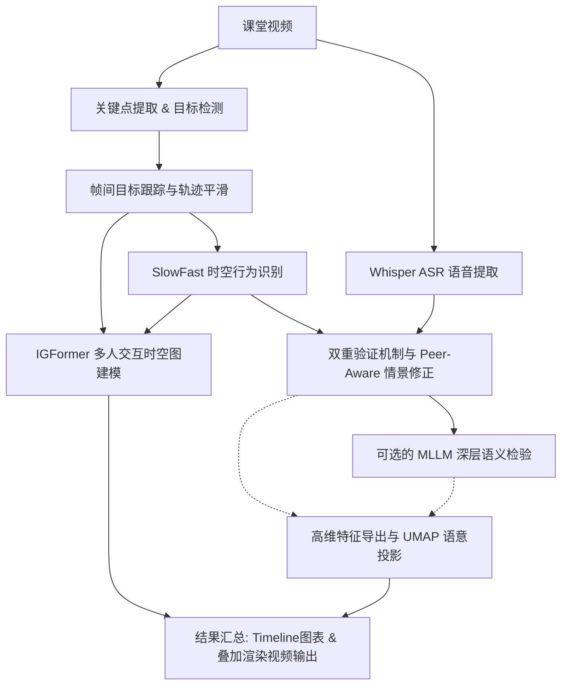

# 课堂行为分析项目结构与背景说明（教师版）

## 1. 项目背景与研究定位

本项目围绕“课堂学生行为自动分析”展开，核心任务是从课堂视频中识别学生行为，并结合语音文本进行多模态验证。  
项目当前可分为两条并行路线：

- **主研究流水线（`scripts/09_run_pipeline.py`）**：面向论文型算法验证，强调从关键点、行为识别、群体交互到语义校验的完整链路。支持对单个长视频进行深入的多模态/大模型端到端分析。
- **课堂数据集工程线（`scripts/intelligence_class/`）**：面向真实多视角数据的批处理与交付，强调批量调度、容错追踪、多视角聚合报告、以及基于 Web 的动态展示交互。

从演进角度看：
- 基线：YOLOv11-Pose + 几何规则。
- 升级：加入同伴语境、群体图建模 (IGFormer)、语音对齐与可选 MLLM (如 Qwen2.5-VL) 校验。

## 2. 完整项目目录分布与结构

项目根目录 `YOLOv11/` 的核心结构如下：

```text
YOLOv11/
├─ data/
│  ├─ videos/                            # 主线单视频测试数据 (如 demo1.mp4)
│  └─ 智慧课堂学生行为数据集/              # 工程线多视角真实业务数据集
├─ models/                               # 模型权重存储区 (如 yolo11s.pt, yolo11s-pose.pt)
│  └─ yolov11_classroom/                 # 改进的 YOLO 模型模块（ASPN / DySnakeConv / GLIDE 等）
├─ output/                               # 结构化输出存储区
│  ├─ <video_name>/                      # 主线流水线结果目录
│  └─ 智慧课堂学生行为数据集/_demo_web/    # 工程线批处理与Web前端读取的根目录
├─ scripts/                              # 主测试与运行脚本
│  ├─ 09_run_pipeline.py                 # 主研究流水线入口（单视频端到端管控）
│  ├─ models/                            # 自定义行为与交互模型包 (IGFormer / CCA / MLLM 等)
│  ├─ modules/                           # Peer-Aware 等相关核心计算模块
│  ├─ training/                          # YOLO与主线模型训练脚本
│  └─ intelligence_class/                # 课堂数据集工程子系统（独立高内聚模块）
│     ├─ pipeline/                       # 数据集流水线调度核心
│     │  ├─ 000.py                       # 多视角数据扫描与全局索引生成
│     │  ├─ 01_run_single_video.py       # （核心）单视频详细流水子进程执行器
│     │  └─ 02_batch_run.py              # 批量调度器（遍历索引调用 01，按视角分发）
│     ├─ tools/                          # 独立分析与聚合工具
│     │  ├─ xx_align_multimodal.py       # 视觉-语音时间序列对齐
│     │  ├─ xx_summarize_case.py         # 单案例分析摘要生成
│     │  ├─ xx_aggregate_dataset_report.py # 视角级/数据集级聚合全景报告
│     │  ├─ xx_generate_static_projections.py # 语意空间静态投影 (PCA/t-SNE/MDS)
│     │  └─ xx_generate_timeline_viz.py  # 压缩离散动作的时间轴可视化抽象
│     ├─ training/                       # 工程类专属 YOLO 训练脚本
│     │  └─ 01~03_...                    # 框级案例标注转 YOLO / 增强 / 微调训练(生成 best.pt)
│     ├─ web_ui/                         # 工程级可视化系统
│     │  ├─ app.py                       # 独立 FastAPI 后端服务 (提供 Timeline/Projection 等接口)
│     │  └─ index.html                   # 纯前端交互面板（支持多指标高维投影与时间轴回退）
│     └─ _utils/                         # 路径解析与公用字典模块
├─ server/
│  └─ app.py                             # 主线简易 FastAPI 展示服务
└─ web_viz/                              # 主线传统 Web 展示前端与模板
```

## 3. 主研究流水线（`scripts/09_run_pipeline.py`）

> 基本定位：面向科研打点与算法深度实验。  
> 运行机制：接受输入视频，配置对应模型文件（det/pose/slowfast/stgcn/mllm），采用“分离步骤 + 缓存复用”策略，可用 `--from_step` 与 `--force` 精准控制避免重复计算。

### 3.1 核心步骤与输入/输出流

1. **Step02：关键点导出 (Pose)**  
   - 输入: `<video>.mp4`, `yolo11s-pose.pt`
   - 输出: `pose_keypoints_v2.jsonl`
2. **Step21：姿态演示视频**  
   - 输出: `pose_demo_out.mp4`
3. **Step03：目标检测 (Objects)**  
   - 输出: `objects.jsonl`
4. **Step04：跟踪平滑 (Track)**  
   - 输出: `pose_tracks_smooth.jsonl`
5. **Step05：SlowFast 行为识别 + embedding**  
   - 输出: `actions.jsonl`, `embeddings.pkl` (+ 可选切片关键帧 `keyframes/`)
6. **Step06：ASR 系统调优**  
   - 输出: `transcript.jsonl`
7. **Step07：双重验证融合 (视觉-语音) + Peer-Aware 修正**  
   - 输入: actions, transcript, pose_tracks
   - 输出: `per_person_sequences.json`
8. **Step14（可选）：MLLM 语义复核**（如 Qwen2.5-VL）  
   - 输出: `mllm_verified_sequences.json`
9. **Step11：群体交互建模（IGFormer/Legacy ST-GCN）**  
   - 输出: `group_events.jsonl`
10. **Step12：特征空间特征导出**  
    - 输出: `student_features.json`
11. **Step13：语义投影 (UMAP 等)**  
    - 输出: `student_projection.json`
12. **Step08：综合叠加可视化视频**  
    - 输出: `<name>_overlay.mp4`
13. **Step09：目标检测演示视频**  
    - 输出: `objects_demo_out.mp4`
14. **Step10：时间轴图表化可视**  
    - 输出: `timeline_chart.png` / `timeline_chart.json`

### 3.2 主线流程图



## 4. `intelligence_class` 独立子系统背景与深度结构

### 4.1 背景与系统级定位

由于主线流程重在算法严谨，直接批量运行真实大规模分视角数据集极易引起 I/O 紊乱与崩溃。`intelligence_class` 子系统是为了“**大规模多视角真实数据的高健壮性批处理与高交互 Web 交付**”单独架构的生产引擎。

**三大核心能力**：
- **批流融合**：不仅有 `02_batch_run.py` 从视角到视频遍历的宏观容错管控，底层视频执行单帧精细拦截。
- **高阶报表抽象**：产出不再只是底层坐标 JSON，而是自带语义提炼的案例摘要（Summary）和数据集聚合报告。
- **动态 Web API 支撑**：生成产物直接与 `web_ui/app.py` 无缝衔接。

### 4.2 子进程链路机制及流向（核心流程）

调度链路为 `000.py (生成全集索引)` -> `02_batch_run.py (分配执行单元)` -> Subprocess -> `01_run_single_video.py (针对单视频执行全量算法)`。

**01_run_single_video.py 内部流与产出：**
1. **Step 0: Case 行为检测** (调用经 `training/` 微调的 `best.pt`) -> 生成 `case_det.jsonl`
2. **Step 1: Pose 导出** -> `pose_keypoints_v2.jsonl`
3. **Step 2/2.5: Track 平滑与关键点绑定** -> `pose_tracks_smooth_kpts.jsonl`
4. **Step 3: 动作规则识别** (站立 / 举手 / 低头) -> `actions.jsonl`
5. **Step 4: Whisper ASR** -> `transcript.jsonl`
6. **动态打包与导出 (Export)** -> 基于新旧需要，生成 `<case_id>.meta.json`, `<case_id>_behavior.jsonl` 并通过 FFMpeg H.264 重新编码 Web 兼容版视频。
7. **Step 5: 多模态序列对齐** (`xx_align_multimodal.py`)
8. **Step 6: 单案例宏观摘要** (`xx_summarize_case.py`) -> `<case_id>_summary.json`
9. **Step 7: 视角/数据集级视图聚合** (`xx_aggregate_dataset_report.py`) -> `summary_report_v2.json`
10. **Step 8: 静态空间投影降维** (`xx_generate_static_projections.py`) -> `static_projection.json`
11. **Step 9: 高级语义时间轴压缩抽象** (`xx_generate_timeline_viz.py`) -> `timeline_viz.json`

### 4.3 训练子链路背景（`intelligence_class/training`）

专用于为工程流水线 Step 0 提供轻量级精细检测模型（8 类基础课堂动作）：
1. 脚本将原有学术标注系映射为专属 YOLO 框标注格式。
2. 加入旋转、亮度等数据增强。
3. 训练产生的高可靠权重文件(`best.pt`)作为 `01_run_single_video.py` 的首发模型启动项，确保对于远景视角的检出稳定性。

### 4.4 Web 子系统（`intelligence_class/web_ui/app.py`）

该后端摒弃传统静态渲染，采取 **FastAPI** 高响应机制，专门支撑 `_demo_web` 级别的成果展示：
- **全动态高维空间投影 API**：支持动态通过序列距离 (Levenshtein) 或 向量距离 (Euclidean) 结合 PCA / MDS / t-SNE 进行前端实时学生群像聚合展示。
- **Timeline Backend**：实时按需融合行为、目标框，生成兼容前台互动点击的时间轴组件配置格式。
- **案例无缝穿透**：通过动态解析目录(`API /list_cases`, `/list_views`)实现新数据集直接挂载无须重启服务。
- 直接包含了容错视频编码逻辑（H.264 / FastStart），确保前端在任意浏览器流畅回放分析结果。

## 5. 关键落地输出与阶段检验指标

### 5.1 主线结果簇（如 `output/demo1/`）
涵盖9类核心行为（listen/distract/phone/doze/chat/note/raise_hand/stand/read），强调全链条学术输出：
- 坐标层：`pose_tracks_smooth.jsonl`, `objects.jsonl`
- 计算层：`embeddings.pkl`, `per_person_sequences.json`, `mllm_verified_sequences.json`, `group_events.jsonl`
- 展示层：`timeline_chart.png`, `timeline_chart.json`, `*_overlay.mp4`, `pose_demo_out.mp4`, `objects_demo_out.mp4`

### 5.2 工程线结果簇（如 `output/智慧课堂学生行为数据集/_demo_web/...`）
强调语义封装、多视角汇总、面向前端交付的可视化组件配置包：
- 原子数据层：`actions.jsonl`, `case_det.jsonl`, `transcript.jsonl`
- 组装配置层：`align.json`, `timeline_viz.json`, `static_projection.json`, `*behavior.jsonl` / `.meta.json` 
- 高维报告层：`*_summary.json` (单案例剖析), `summary_report_v2.json` (全局大盘透视)
- 可播放媒体层：转推过的 `.mp4` 回放文件与前端可视化配套资产

## 6. 当前研发阶段与次世代演进规划

**当前已成功交付：**
- **双模隔离系统**：完美划定实验主干（深广度导向）与数据集处理子线（并行工程容错导向）。
- **流程闭环**：多视角批处理管控建立，具备防宕机智能断点续传。
- **全模态整合**：完成图像姿态、声纹ASR与LLM校队的端到端通路，并上线多高阶可视化服务。

**下一阶段攻坚重点：**
1. 深入提升 IGFormer 群体图谱与 Qwen2.5-VL 大模型在非结构化复杂课堂纠缠中的实证表现。
2. 在工程端持续补充多维质量评估指标，建立自动化验收数据回流飞轮。
3. 进一步抽象中间件接口，实现主线深层语意推理模块在工程全景下的零成本灰度挂载与拔插。
