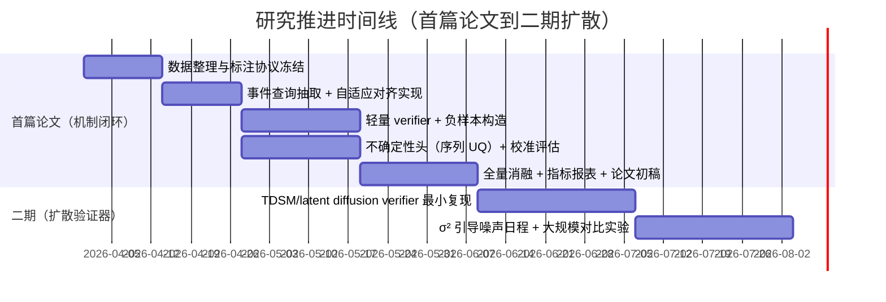

# YOLOv11 课堂双重验证框架的仓库剖析与可行性落地报告

## 执行摘要

你的总目标（“视觉姿态序列 × 实时文本语义流”的**双重验证**，在复杂物理环境下让系统“减少误判并学会自我怀疑”）本质上是在做**可信度/一致性验证（reliability & verification）**，而不是再做一个“多模态大系统”。这与导师“论文要专注 1–2 个问题并研究深一点”的建议高度一致：第一篇论文的最硬问题可以收敛为——**系统能否知道自己何时可能错？**（“uncertainty-aware verification”）。这条主线能自然容纳你目前路线图里的三个关键模块：不确定性姿态头（产生怀疑）→ 自适应时间窗（对齐怀疑）→ 跨模态验证器（用外部语义信号验证怀疑）。citeturn5view1turn12search2

对你提供的 GitHub 仓库 `kanfanle233/yolov11-classroom-pages` 的检视结论如下（基于当前 main 分支代码与目录结构）：

- 仓库并不只是“pages”，而是**包含一条可运行的端到端 pipeline + 两套可视化前端**：  
  1）`scripts/09_run_pipeline.py` 为主的脚本式流水线（姿态→跟踪平滑→规则动作→叠加视频→ASR→“双重验证”合并→时间线→群体图→特征/投影）；  
  2）`server/app.py` 的 FastAPI 可视化服务器；  
  3）`docs/` 下则是 GitHub Pages 的静态演示站（支持 static manifest 或连本地 API）。  

- **姿态前端**目前调用的是 entity["company","Ultralytics","computer vision company"] 的 entity["company","ultralytics/ultralytics","github repo"]（Python 包）直接推理 YOLO11-pose 权重（如 `yolo11s-pose.pt`），输出关键点坐标与 keypoint conf；并没有真正“可学习的不确定性头”。citeturn7view0turn8view0  
- **文本前端**既支持在线实时 ASR（DashScope paraformer-realtime-v1），也支持离线 faster-whisper；输出 `transcript.jsonl`（包含 start/end/text）。  
- **对齐与验证**：仓库存在对齐工具（`scripts/intelligence_class/tools/xx_align_multimodal.py`），但核心仍是**固定时间窗**；`scripts/07_dual_verification.py` 当前更多是“把视觉片段和文本片段组合进 per-person json”，并未形成你论文所需的**验证学习目标、负样本构造、可靠分数输出与标定评估**。  
- **Pages 演示的关键风险**：静态站点 `docs/` 默认从 `docs/assets/videos/<case_id>.mp4` 读取视频，但 `.gitignore` 忽略 `*.mp4`，导致 demo 视频很可能不会被提交；你已经提供了 `tools/build_pages_demo.py` 来生成静态包，但它同样会尝试复制 mp4 到 `docs/assets/videos/`——若不处理 gitignore/LFS，线上 Pages 会出现“时间线有、视频缺”的断裂体验。  

推荐结论（对应“应该听谁”这个分歧点）：**第一篇论文应听“先把 cross-attention verifier + temporal-shift negatives 做扎实，再二期升级扩散（TDSM/latent DiT）”这一派。**原因是它更契合导师与顶会审稿的“单点深挖 + 可解释消融路径”：验证器先用轻量方法把机制跑通，再用扩散升级为更强的“生成式一致性度量”。扩散验证器作为第一篇的中心贡献，通常会把论文重心推向“生成式匹配/扩散建模”，要求更强的数学与实验闭环（数据、训练成本、稳定性、对比 SOTA），风险显著更高；把它放二期更稳健。citeturn5view1turn0search6turn1search12

---

## 仓库结构与关键模块定位

### 总体目录分区与数据流

仓库可以按“**运行流水线** / **在线可视化** / **静态演示** / **历史兼容**”四块理解：

- 运行流水线：`scripts/`  
  主入口：`scripts/09_run_pipeline.py`（串联各步骤，产物写入 `output/<video_id>/...`）。  
- 在线可视化：`server/` + `web_viz/`  
  主入口：`server/app.py`（扫描 `output/`，提供 `/api/*` 接口与页面渲染）。  
- 静态演示：`docs/` + `tools/build_pages_demo.py`  
  `docs/index.html` 可在“static 模式（manifest）/ api 模式（本地 server）”间切换；`docs/data/manifest.json` 描述 demo case 清单与资源路径。  
- 历史兼容与更重的“智慧课堂数据集”运行方式：`scripts/intelligence_class/`（包含另一套 pipeline/web_ui/training/tools，和主 `scripts/` 有一定重复，属于可保留但不建议在首篇论文继续扩写的区域）。

**关键数据路径（默认约定）**：

- 原视频：`data/videos/*.mp4`（或 `data/智慧课堂学生行为数据集/<view>/<case>.mp4`）  
- 中间与结果：`output/<video_id>/...`（FastAPI server 会扫描这个目录并渲染 timeline、tracks、transcript 等）

### 关键能力“在哪里实现”的定位表

下表按“你的论文首篇主线（不确定性→对齐→验证）”为导向，将仓库文件映射到功能，并给出改造优先级（P0=首篇必须动；P1=强烈建议；P2=可后置；P3=二期/展示层）：

| 路径 | 当前功能 | 与论文主线的关系 | 修改优先级 |
|---|---|---|---|
| `scripts/09_run_pipeline.py` | 串联全流程 step02–13 | 你的“实验系统”入口；需插入事件查询、验证器训练/推理、可靠分数导出 | P0 |
| `scripts/02_export_keypoints_jsonl.py` | YOLO11-pose 推理→关键点 JSONL | 姿态前端；目前只有 keypoint conf，无 σ² | P0 |
| `scripts/03_track_and_smooth.py` | 基于 bbox/位置先验的 track + EMA 平滑关键点 | 可作为稳定序列生成器；后续可引入 σ² 参与匹配/平滑权重 | P1 |
| `scripts/04_action_rules.py` | 基于关键点几何的一套规则动作（举手/低头/站立…） | 先验 baseline；可用作弱标签与候选事件用于训练 verifier | P1 |
| `scripts/06_api_asr_realtime.py` / `scripts/06_asr_whisper_to_jsonl.py` | ASR→`transcript.jsonl` | 文本语义流来源；下一步需要事件化（event query） | P0 |
| `scripts/intelligence_class/tools/xx_align_multimodal.py` | 固定窗口对齐动作段与转写片段 | “自适应时间窗”实现的最佳落点（在此基础上改） | P0 |
| `scripts/07_dual_verification.py` | 合并视觉序列与文本段到 per-person json | 目前缺“验证学习”；应升级为真正 verifier 的数据构造与推理输出 | P0 |
| `server/app.py` | FastAPI：list_cases/media/timeline/transcript/tracks/projection | 评测与展示入口；需要展示 `reliability_score`、`verified`、校准图等 | P1 |
| `scripts/10_visualize_timeline.py` | 产出 timeline png + `timeline_chart.json` | 可视化载体；建议加入 verified/unverified 颜色或纹理编码 | P1 |
| `scripts/11_group_stgcn.py` | 群体交互（ST-GCN/启发式） | 不属于首篇核心贡献；可作为扩展实验或 demo | P2 |
| `scripts/12_export_features.py` / `scripts/13_semantic_projection.py` | 特征统计/降维聚类 | 叙事上的“系统级洞察”展示层，不宜抢主贡献篇幅 | P3 |
| `docs/*` + `tools/build_pages_demo.py` | GitHub Pages 静态 demo | 强展示价值；但不是学术贡献点，避免在论文里占篇幅 | P3 |
| `scripts/intelligence_class/*` | 另一条 pipeline/web_ui/training | 历史/备份；建议首篇论文冻结，避免“分叉维护” | P2 |

---

## GitHub Pages 演示包机制与缺失资产风险

### 静态站点如何工作的

`docs/index.html` 的数据源逻辑是：  
- 先尝试读取 `docs/data/manifest.json`（static 模式）；如果成功，就从 `./data/cases/<video_id>/...` 和 `./assets/videos/<video_id>.mp4` 读取时间线/轨迹/转写/视频；  
- 否则切到 API 模式，访问本地 `server/app.py` 提供的 `/api/*`。  

这与 entity["company","Ultralytics","computer vision company"] 的“模型推理/训练”无关，纯粹是可视化与数据打包策略。

### 当前最大风险：视频资产（mp4）难以被提交到 Pages

你已经有 `tools/build_pages_demo.py`，会把 `_demo_web` 下的 case 复制到 `docs/data/cases/` 并把视频复制到 `docs/assets/videos/`，生成 `docs/data/manifest.json`。但如果仓库 `.gitignore` 忽略 `*.mp4`，则：

- 本地 demo 没问题（文件在磁盘上）；  
- GitHub Pages 上会出现：manifest 存在、timeline/track/transcript 存在、**视频 404**。  

**建议的工程级处理（不影响论文主线，但影响演示效果）**：

1) 选项 A：对 `docs/assets/videos/` 目录做 gitignore 例外（推荐做法，最简单）
```gitignore
*.mp4
!docs/assets/videos/*.mp4
```

2) 选项 B：改用 Git LFS 存储 demo mp4（更标准，但要处理 LFS 配置与配额）

3) 选项 C：不提交视频，只提交时间线等结果，把 `video_original` 指向外部可访问 URL（例如对象存储），保证 Pages 可播放（论文/开源更干净，但要维护外链）

此外，`tools/build_pages_demo.py` 的 `REQUIRED_JSON_FILES` 不包含 `timeline_chart_stats.json`，但 manifest 又尝试填写 stats 路径；若你要在 demo 里展示“右侧统计/insight”，应将它也纳入 required 列表或删掉 stats 入口，避免静态 demo 不一致。

---

## 相关学术方法深度调研与接口契合度

这一节只保留与你“首篇论文三件套（不确定性、对齐、验证）”严格相关的方法，并用“输入/输出/损失/数据格式/如何接入本仓库”来讲清楚。

### YOLO11-pose 作为视觉前端的现实约束

entity["company","Ultralytics","computer vision company"] 官方文档表明，YOLO11 支持 pose/keypoints 任务，并提供如 `yolo11s-pose.pt` 的预训练权重，支持训练与导出。citeturn7view0turn8view0  
你的仓库当前是“直接用 ultralytics 推理输出坐标+conf”，这决定了：

- 要做“**可学习的 σ² 不确定性输出**”，必须走两条路之一：  
  1）**fork/patch ultralytics**：在 YOLO11-pose head 增加方差分支并训练；  
  2）保持 YOLO11 做检测/粗姿态，把“不确定性头”放到另一个网络（例如在关键点序列上训练一个 uncertainty regressor）。  

在“首篇论文要专注”原则下，我建议：**不要同时改 ultralytics 底层和 verifier**。更稳的路径是：先用**序列不确定性头（轻量网络）**把 σ² 学出来，等 verifier 与实验闭环跑通，再决定是否深改 YOLO11 head（作为加强版实验/二期）。这也符合导师“研究深一点、不要铺太多面”。

---

### RTMO（坐标分类 + YOLO式一阶段姿态）能带来什么

RTMO 的核心贡献是把关键点表示成“坐标分类”（dual 1-D heatmaps）并在 YOLO 框架下实现实时多人的高精度姿态，同时设计了动态坐标分类器与适配 dense prediction 的损失。官方项目页明确代码在 entity["organization","OpenMMLab","open source ai org"] 的 entity["company","open-mmlab/mmpose","github repo"] `projects/rtmo`。citeturn9search1turn9search2  

**对你的启发（可落地但别做成“我改进姿态模型”的论文）**：

- RTMO 提供了“**把关键点从 point regression 变成分布预测**”的范式，天然适合导出不确定性（例如分布熵、方差）。  
- 但若首篇论文把主要篇幅放在 RTMO/姿态框架改造，审稿人容易把你归类到“姿态估计改进”，稀释“跨模态验证”的叙事高度。

**接入本仓库的最小方式（只借思想，不改框架）**：  
把 YOLO11-pose 的关键点序列当做观测，额外训练一个小网络预测 σ²（或分布熵），并在 verifier 中把 σ² 用作 gating/加权（见下节“首篇落地路线”）。

Mermaid（视觉不确定性作为 verifier 输入的最小链路）：

```mermaid
flowchart LR
  V[Video frames] --> Y[YOLO11-pose inference]
  Y --> K[Keypoints seq (x,y,conf)]
  K --> U[Uncertainty head (sigma^2 per kpt)]
  K --> A[Action segments (rules/ST-GCN)]
  U --> Ver[Cross-modal verifier]
  A --> Ver
  T[ASR transcript] --> Q[Event query extractor]
  Q --> Ver
  Ver --> R[Reliability score + verified/uncertain/mismatch]
```

---

### ProbPose（presence probability / Ex-OKS）对“遮挡与假阳性”的直接价值

ProbPose（CVPR 2025）明确指出：SOTA 姿态方法往往忽略 out-of-image keypoints，并把未校准 heatmap 当成可靠概率；它提出为每个关键点预测 **presence probability（是否在激活窗口内）**，并引入 Ex-OKS 与 CropCOCO 评估假阳性。官网与 arXiv 页面写得非常清晰，且已开源代码与权重。citeturn5view0turn10view0turn11view0  

**对你最“划算”的吸收点**（强烈推荐写进论文相关工作/方法动机）：

- 你的问题是“遮挡导致视觉误判”，ProbPose 的叙事几乎是同一件事：用 presence 概念把“模型瞎猜但很自信”的假阳性拉回可控范围。citeturn5view0turn10view0  
- 你无需复刻 ProbPose 的 top-down 框架；你可以把它抽象成：  
  - `presence` ≈ 关键点“可见性/存在性”的概率；  
  - `sigma^2` ≈ 位置不确定性；  
  - 二者都可以作为 verifier 的“怀疑强度”输入。

**接入数据格式（建议）**：对每帧每人每关键点扩展字段：
```json
{
  "frame": 123,
  "persons": [{
    "track_id": 7,
    "keypoints": [{"x":..., "y":..., "c":...}, ...],
    "sigma2":    [{"sx":..., "sy":...}, ...],
    "presence":  [0.0-1.0, ...]
  }]
}
```
其中 `sigma2/presence` 可来自你新增的不确定性头（不必一开始就改 YOLO11 head）。

---

### VTune / “Temporal Consistency + Verification Tuning”如何服务你的“验证器评价体系”

VTune（CVPR 2025 接收）系统研究了 Video-LLM 的 temporal grounding 在视频内容、语言 query、任务设置变化下的一致性问题，并提出 “event temporal verification tuning” 用于显式提升一致性与 grounding 表现。论文与代码在 arXiv 与 GitHub 均公开。citeturn5view1turn0search6turn0search8  

**你该怎么用它**：

- 不是把 Video-LLM 搬进课堂系统，而是把它当作**“审稿人认可的评价坐标系”**：  
  你的 verifier 输出的不只是匹配分数，还要衡量在扰动下是否稳定（例如同一句话的同义改写、时间轻微漂移、遮挡导致视觉噪声）。这就是“verification-consistency”。

**建议你在首篇论文引入的指标集**（与 VTune 叙事对齐）：

- Grounding：`R@1, IoU>m` / `mIoU`（标准 temporal grounding 指标）。citeturn13search0turn15view0  
- Consistency：同一事件 query 在扰动集合上的得分方差、预测区间 IoU 一致性、verified label 的翻转率（flip rate）。citeturn5view1turn0search6  
- Calibration（可信度标定）：ECE、Brier score（与你“系统学会怀疑自己”完全同频）。citeturn12search2turn12search14  

---

### Grounding-MD：你要的是“事件化文本”，不是“整段转写融合”

Grounding-MD（arXiv:2504.14553）属于开放世界 moment detection/grounding 方向，强调通过更结构化的训练与语义对齐提升开放世界定位能力。citeturn4view0  

对你而言，Grounding-MD 最关键的不是具体网络细节，而是其隐含范式：**把文本从“长段 ASR”变成“事件查询（event queries）”**。这正是你当前仓库最缺的一步：`transcript.jsonl` 已经有了，但缺 `event_query.jsonl`（含触发词、语义类型、时间戳/时间窗）。

你可以用一个非常克制的实现把这件事做得“论文级”：

- 先规则/小模型抽取课堂指令与敏感事件词（举手、安静、回答、不要玩手机…）；  
- 再用“自适应时间窗”把 query 对齐到候选视觉片段；  
- 把这个机制作为 verifier 的输入，而不是把文本特征早期融合进视觉 backbone。

---

### AVDR/说话人相关：建议作为“边界外扩展”，不要进首篇核心

MISP 2025 Challenge 明确覆盖 Audio-Visual Diarization and Recognition（AVDR）等任务。citeturn5view2  
但它会把你的论文推向“谁在说话、说话归属、音画对齐”的另一条主线，论文贡献很容易涣散。我的建议是：

- 首篇论文只把 ASR 当“语义事件流”，默认单说话人（老师）或不做严格 diarization；  
- AVDR 放在 future work / appendix（或二篇论文），且你可以引用 MISP 作为“标准任务背景”而不必做完整参赛级系统。citeturn5view2  

---

## 首篇论文落地路线：从“双重验证系统”收敛为“可信度验证机制”

下面严格按你要求的 (a)(b)(c) 三步给出：**文件级改动点、模型建议、损失公式、训练超参、数据标注需求、评测协议与基线**。未指定的数据规模/算力我会明确写“未指定”。

### 视觉端：从 YOLO11-pose 输出走向 uncertainty（σ²）与 MLE/NLL

#### 目标定义

对于每个关键点，除了输出坐标 \(\mu=(x,y)\)，还输出方差 \(\sigma^2=(\sigma_x^2,\sigma_y^2)\)。训练时最常用的是对角高斯负对数似然（NLL）：

\[
\mathcal{L}_{\text{NLL}} = \sum_{k}\Big(\frac{(x_k-\mu_{x,k})^2}{2\sigma_{x,k}^2} + \frac{(y_k-\mu_{y,k})^2}{2\sigma_{y,k}^2} + \frac{1}{2}\log\sigma_{x,k}^2 + \frac{1}{2}\log\sigma_{y,k}^2\Big)
\]

工程上用 \(\log\sigma^2\) 做输出以保证正数并稳定训练。

#### 现实可行的两条实现路径（建议先走路径 1）

**路径 1（推荐，P0 可落地）：不改 YOLO11 head，新增“序列不确定性头”**  
- 输入：`pose_tracks_smooth.jsonl` 中每帧每人的关键点序列（x,y,conf）  
- 模型：轻量 1D-Temporal Conv / BiGRU / Transformer encoder（长度 T=未指定）  
- 输出：每关键点的 \(\log\sigma^2\) 或每帧整体 σ²（视你的标注能力而定）  
- 标签：来自“遮挡/可见性/关键点误差”的监督信号（见下方标注建议）  
- 优势：不需要 fork ultralytics，研发成本低，最符合“先把 verifier 做扎实”的策略。  

**路径 2（更纯粹但更重）：fork ultralytics，在 YOLO11-pose head 增加 σ² 分支**  
- 需要：维护一份 ultralytics 代码、训练 keypoint 数据集、再导出权重。  
- 风险：首篇论文容易变成“我改了 YOLO11”，且工程工作量大。

#### 与当前仓库的代码级对接（路径 1）

新增/修改的文件建议：

- **新增** `scripts/02d_export_keypoints_with_uncertainty.py`（或在 `02_export_keypoints_jsonl.py` 后追加一步）  
  - 读取 `pose_tracks_smooth.jsonl`  
  - 调用 uncertainty head 推理输出 `sigma2`  
  - 写出 `pose_tracks_smooth_uq.jsonl`（后续动作规则、对齐、验证都优先读这个）

- **修改** `scripts/09_run_pipeline.py`  
  - 在 step03（平滑后）插入 step03.5：uncertainty 推理导出

命令行示例（建议）：
```bash
python scripts/02_export_keypoints_jsonl.py --video data/videos/demo1.mp4 --out output/demo1/pose_keypoints_v2.jsonl
python scripts/03_track_and_smooth.py --in output/demo1/pose_keypoints_v2.jsonl --out output/demo1/pose_tracks_smooth.jsonl --video data/videos/demo1.mp4
python scripts/03c_uncertainty_head.py --in output/demo1/pose_tracks_smooth.jsonl --out output/demo1/pose_tracks_smooth_uq.jsonl
```

#### 标注/监督建议（未指定数据规模下的最小闭环）

你不一定有逐关键点 GT。可以先用“弱监督 → 校准评估”的策略：

- 弱标签 1：用 keypoint conf 低、bbox/关键点突变、长时间丢失恢复等事件构造“高不确定性”标签  
- 弱标签 2：多视角/多模型一致性（同一帧用两种 pose 模型推理，差异大视为高 σ²）  
- 强标签（若可得）：抽样人工标注少量关键点 GT，用于验证 σ² 是否与误差相关（校准）

校准评估指标：ECE（Expected Calibration Error）与温度缩放等，是“可信度论文”常见组合。citeturn12search2  

---

### 文本端：从 transcript.jsonl 到 event queries + 自适应时间窗对齐

#### 为什么必须“事件化”

直接把长段 ASR 与视觉融合，噪声大且难以构造负样本与评测。你需要的输入形态是：

```json
{"t": 12.4, "event": "raise_hand", "query": "举手回答", "polarity": "positive", "source": "asr"}
```

其中 `event/query` 是 verifier 的 Query，`t` 决定对齐窗口中心。

#### 代码落点

- **新增** `scripts/06b_event_query_extraction.py`  
  输入：`transcript.jsonl`  
  输出：`event_queries.jsonl`（每条含 event_type、timestamp、span、query_text、confidence）

- **改造** `scripts/intelligence_class/tools/xx_align_multimodal.py`（P0）  
  当前是固定 `window_sec`，你要改成 **adaptive window**：  
  - 依据 motion gradient（姿态速度/加速度）或视觉不确定性 σ² 来调窗：  
    - 动作变化快、σ² 高 → 窗口更大（给对齐更多容错）  
    - 动作稳定、σ² 低 → 窗口更小（减少误对齐）

自适应窗口示例公式（可写进方法部分）：

\[
w = \text{clip}(w_0 + \alpha \cdot \overline{\|\Delta \mathbf{k}\|} + \beta \cdot \overline{\sigma},\; w_{\min},\; w_{\max})
\]

其中 \(\overline{\|\Delta \mathbf{k}\|}\) 是关键点速度均值，\(\overline{\sigma}\) 是不确定性均值。

#### 负样本构造（为 verifier 服务）

必须把负样本写得“可复现”，否则审稿人认为你在拍脑袋：

- temporal-shift negatives：同一段文本 query，时间戳平移 ±Δ（例如 5–15s 随机），与视觉段构成负样本  
- semantic negatives：替换成冲突指令（例如“举手” vs “低头写字”），并保持视觉段不变  
- hard negatives：同一教室不同学生的视觉段与老师指令配对（模拟“老师指向某人，但系统认错人”）

这些策略与 VTune 的“temporal verification / consistency”评价叙事一致。citeturn5view1turn0search6  

---

### 跨模态验证器：轻量 cross-attention + σ² gating + 一致性/校准评估

#### 模型建议（首篇论文可控的“工程最小闭环”）

**输入**：
- 视觉：一个候选片段内的姿态序列 \(V\)（可用关键点序列编码成 token 序列）  
- 文本：一个 event query 的文本 embedding \(Q\)（可用冻结的中文句向量模型或小型 BERT；未指定）  
- 不确定性：σ²（同片段内聚合成一个标量或向量）

**结构**（推荐）：
- Visual encoder：Temporal Transformer / 1D CNN（输出 \(K,V\) tokens）  
- Text encoder：冻结 embedding（输出 query 向量）  
- Cross-attention：以文本为 Query，视觉为 Key/Value，得到匹配表征  
- σ² gating：用 σ² 调整注意权重或输出 logit 的温度（高不确定→更谨慎）

一个非常好写且好解释的 gating 方式：

\[
s = \frac{f_{\theta}(Q, V)}{\tau(\sigma)} \quad,\quad \tau(\sigma)=1+\gamma\cdot \overline{\sigma}
\]

其中 \(s\) 是 match logit，\(\tau\) 是随不确定性增大的“温度”，让系统在视觉不确定时天然更不自信。

#### 损失函数（必须清晰）

建议用 InfoNCE/对比学习式的二分类：

- 正样本：\((Q_i, V_i)\)  
- 负样本：\((Q_i, V_{i}^{\text{shift}})\)、\((Q_{j\neq i}, V_i)\)

\[
\mathcal{L}_{\text{verif}} = -\log \frac{\exp(s_{i,i})}{\exp(s_{i,i})+\sum_{j\in \mathcal{N}(i)}\exp(s_{i,j})}
\]

再加一致性正则（可选）：同一 query 的轻微扰动（同义改写/噪声插入）下，预测区间与分数的差异应受约束。citeturn5view1  

#### 评测协议（按你要求的指标集组织）

1) **Moment grounding 指标**：`R@1, IoU>m`（m=0.3/0.5/0.7）与 mIoU；这是 temporal grounding 社区标准写法。citeturn13search0turn15view0  

2) **Verification consistency**：  
- Score consistency：对同一事件 query 的扰动集合 \(\mathcal{A}\)，计算 \( \text{Var}(s)\) 或平均绝对差  
- Interval consistency：预测区间两两 IoU 的均值  
这些要在实验里明确“扰动集合怎么构造”，可参考 VTune 的 probing 思路。citeturn5view1turn0search6  

3) **Calibration（可信度标定）**：  
- ECE（Expected Calibration Error）作为主图之一；经典参考是 Guo et al.（ICML 2017），温度缩放也可作为后处理基线。citeturn12search2  
- Brier score 作为辅助（严格 proper scoring rule）。citeturn12search14  

#### 代码级改动清单（你可以直接照做）

- **新增** `verifier/` 模块（建议单独目录，避免 scripts 里继续堆逻辑）  
  - `verifier/model.py`：visual encoder、cross-attn、gating  
  - `verifier/dataset.py`：从 `per_person_sequences.json` + `event_queries.jsonl` + `pose_tracks_smooth_uq.jsonl` 构造训练样本  
  - `verifier/train.py`：训练入口，输出 `verifier.pt`  
  - `verifier/eval.py`：输出 R@1/mIoU/ECE/Brier/consistency 报表

- **升级** `scripts/07_dual_verification.py`（P0）  
  应改为：
  1）加载 verifier 模型  
  2）对每个候选视觉段与 event query 计算 `reliability_score`  
  3）输出 `verified_events.jsonl`（含 match/uncertain/mismatch 标签）

- **修改** `server/app.py`（P1）  
  - `/api/transcript/{video_id}` 输出里加入 `verified` 字段已经预留；你需要让它读 `verified_events.jsonl` 并映射回 transcript 行  
  - timeline JSON 加入 `reliability`，前端可以用透明度或边框表达“不确定”

---

## 实验计划、资源估算、消融矩阵与二期扩散迁移

### 现实的时间线（不承诺你的未指定算力，只给可执行拆解）



### 资源估算（以“未指定数据规模”为前提给出上界/下界）

- 推理生成姿态与轨迹：  
  - 若视频总时长 \(H\) 小时、FPS=25、YOLO11s-pose 单卡推理速度取决于分辨率；以常见中端 GPU（如 T4/3060）粗估：1×–3× 实时。  
- 训练轻量 verifier：  
  - 参数量通常 <50M；若样本数 \(N\)=未指定，单卡 24GB 通常可跑 batch 16–64。  
  - GPU hours：从 **数小时（小数据集）到数十小时（中等规模）**。  
- 训练“序列不确定性头”：  
  - 通常比 verifier 更轻，GPU hours 更低。  
- 若你坚持 fork ultralytics 训练 YOLO11-pose + σ²：  
  - 成本会跃迁到“检测/姿态训练级别”（更吃数据与算力），且需要严格 COCO-keypoints 格式标注；不建议放首篇核心。

### 消融实验矩阵（审稿人最想看的）

| 组别 | 变化点 | 预期现象（你应该能解释“为什么”） |
|---|---|---|
| Base | 固定窗对齐 + 无 verifier（只规则动作） | 误判多，无法输出可信度；校准指标不可谈 |
| +Verifier | 固定窗 + cross-attn verifier | R@1/mIoU 提升；对 temporal-shift 负样本更稳 |
| +SemanticNeg | 加 semantic negatives | 语义冲突拒绝能力提升；误报下降 |
| +AdaptiveWin | 自适应窗 | 对齐更稳，尤其 ASR 延迟/断句场景；一致性更好 |
| +UQ-Gating | 引入 σ² gating | 在遮挡/关键点抖动段，分数更保守；ECE/Brier 改善（更“会怀疑”）citeturn12search2turn12search14 |
| +TempScaling | 后处理温度缩放 | ECE 进一步下降，但若模型本身区分性不足可能伤精度（可引用校准文献讨论权衡）citeturn12search2 |

### 二期扩散验证器（TDSM）迁移计划：怎么做才“最小可复现”

TDSM（ICCV 2025）提出用扩散进行 skeleton-text 的模态对齐，并用重建/去噪误差作为一致性度量，论文与项目页/代码均公开。citeturn1search12turn2search0turn2search3  

你要把它安全地放进二期，而不是把首篇拖死。建议按“冻结什么、训练什么、σ² 怎么用”来设计：

- 冻结（freeze）：  
  - YOLO11-pose 推理链路（保持可复现）citeturn7view0  
  - 文本 encoder（先冻结，减少变量）  
  - 首篇的 event query 抽取与自适应对齐（作为稳定输入）

- 训练（train）：  
  - diffusion verifier（把视觉姿态序列 embedding 作为 \(x_0\)，文本 query embedding 作为条件 \(c\)）  
  - 目标：匹配对可去噪、冲突对去噪困难 → 重建误差高

- σ² 引导噪声日程（你提出的“方差引导扩散”应该这样落地）：  
  - 对高不确定关键点/帧注入更大噪声：\(\epsilon \sim \mathcal{N}(0, \sigma^2)\) 的尺度与 predicted σ² 挂钩  
  - 直觉：视觉越不可靠，扩散越依赖文本条件才能恢复；恢复不了就输出高误差，形成“验证拒绝”

最小训练伪代码（强调可复现而非炫技）：

```python
# x0: skeleton embedding (T x D)
# c : text embedding (D)
# uq: uncertainty scalar or vector
t = sample_timesteps()
noise_scale = base_scale * (1 + beta * uq)
xt = q_sample(x0, t, noise_scale)

eps_pred = denoiser(xt, t, cond=c)  # conditional diffusion
loss_pos = mse(eps_pred, noise)     # for matched pairs

# triplet / contrastive diffusion loss
loss = loss_pos + margin - loss_neg(mismatched_pair)
```

### 论文大纲、图与投稿方向（“专注一个挑战”的写法模板）

**标题候选（建议都包含 uncertainty-aware + verification）**：

- *Uncertainty-Aware Cross-Modal Verification for Classroom Pose–Text Alignment*  
- *Learning When to Doubt: Uncertainty-Aware Verification between Pose Sequences and Real-Time Semantic Streams*  
- *From Detection to Reliability: Uncertainty-Guided Pose–Text Verification in Complex Classroom Scenes*

**建议的章节骨架**（首篇论文只讲一个硬问题：可靠性）：

- Introduction：遮挡+噪声导致单模态误判 → 我们要让系统知道自己何时可能错  
- Related Work：pose uncertainty（RTMO/ProbPose）、temporal grounding consistency（VTune）、event-centric grounding（Grounding-MD）citeturn9search1turn5view0turn5view1turn4view0  
- Method：三件套（UQ head / adaptive window / cross-modal verifier + negatives）  
- Experiments：R@1/mIoU + Consistency + Calibration（ECE/Brier）citeturn13search0turn12search2turn12search14  
- Ablations：机制逐个打开，回答“到底哪个起作用”  
- Limitations & Future Work：扩散验证器（TDSM）与 AVDR（MISP 2025）放这里citeturn1search12turn5view2  

**你必须产出的关键图（决定论文说服力）**：

1) 方法总览图（你的“1+1 逻辑链”最终版）：两路输入→验证器→可靠分数。  
2) 自适应时间窗示意：固定窗 vs 自适应窗在 ASR 延迟/遮挡下的对齐差异。  
3) Reliability diagram（ECE 图）：证明“模型会怀疑”而不是“瞎自信”。citeturn12search2  
4) Consistency probing 图：同一句 query 的扰动下预测稳定性（呼应 VTune）。citeturn5view1turn0search6  

**投稿方向（按首篇贡献定位）**：

- 若你主打“跨模态验证 + 可信度/一致性评估体系”：倾向 CVPR/ICCV/ECCV 的 Multi-modal / Video Understanding / Trustworthy AI 方向；  
- 若版本更偏“系统级应用 + 可解释可信度”：也可考虑 ACM MM（若 novelty 主要在机制与评测而非大模型）。  

---

## 参考来源与优先阅读清单

- entity["company","Ultralytics","computer vision company"] YOLO11 模型与 pose 支持文档（含中文页，建议引用）：citeturn8view0turn7view0  
- RTMO（CVPR 2024）项目页与代码入口（entity["organization","OpenMMLab","open source ai org"] / entity["company","open-mmlab/mmpose","github repo"]）：citeturn9search1turn9search2  
- ProbPose（CVPR 2025）：arXiv + 项目页 + 代码：citeturn5view0turn10view0turn11view0  
- VTune / temporal consistency（CVPR 2025）：arXiv + CVF：citeturn5view1turn0search6  
- Grounding-MD（open-world moment detection）：arXiv：citeturn4view0  
- TDSM（ICCV 2025）扩散对齐验证器：CVF + GitHub：citeturn1search12turn2search0turn2search3  
- MISP 2025 Challenge（AVDR/diarization 背景）：citeturn5view2  
- 可信度标定（ECE/temperature scaling）的经典参考：Guo et al., ICML 2017：citeturn12search2  
- Temporal grounding 指标与评测偏差讨论（Charades-STA/ActivityNet，dR@n 等）：citeturn15view0